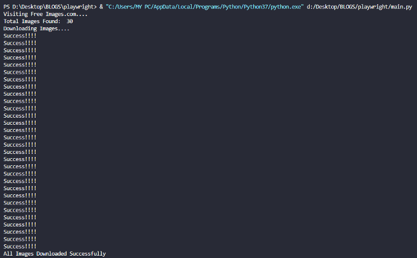
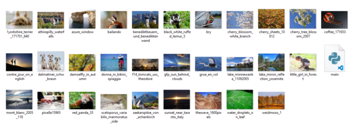

A playwright is a multipurpose tool to automate web browsers and scrape data and other kinds of automated stuff. I have already written a story about it.

In today's article, we are going deep into the usage of Playwright by downloading multiple images from a webpage. To speed up the process, I am going to use Python multithreading. I also have a story about multithreading and multiprocessing in Python.

Before going forward I suggest you go through both my stories to get an idea about Playwright and Multithreading. The link to those are :

*   Playwright: [https://medium.com/@animeshsingh161/getting-started-with-playwright-scraping-a-basic-webpage-with-playwright-in-python-53897cbce49](https://medium.com/@animeshsingh161/getting-started-with-playwright-scraping-a-basic-webpage-with-playwright-in-python-53897cbce49)
*   Multithreading: [https://medium.com/@animeshsingh161/data-scraping-time-comaprison-python-multiprocessing-vs-multithreading-ffdf990a6ba9](https://medium.com/@animeshsingh161/data-scraping-time-comaprison-python-multiprocessing-vs-multithreading-ffdf990a6ba9)

## Overview :

In this article we are going to :

*   Install Playwright
*   Visit the website [https://free-images.com/](https://free-images.com/) and download all images from the webpage.

## Prerequisite :

*   Python is installed on the system.
*   A Python virtual environment is activated in the folder

## Installing Playwright :

Installing Playwright is a two-step process. Just pip install it on the system.

```plain
pip install playwright
playwright install
```

## Importing required packages :

```plain
from playwright.sync_api import sync_playwright
from concurrent.futures import ThreadPoolExecutor
import requests
import io
from PIL import Image
```

First-line imports the Playwright library. Second-line imports multithreading. The third line is importing requests module. io module is imported to save the raw image in bytes. Pillow is used to save images in JPEG/JPG/PNG formats.

## Writing a “main” function :

```plain
def main():    with sync_playwright() as p:
    browser = p.chromium.launch()
    page = browser.new_page()
    base_url ='https://free-images.com/'
    page.goto(base_url)
    print("Visiting Free Images.com....")
    img_lst = []
    all_links = page.query_selector_all('img')
    for link in all_links:
        img_lst.append(base_url + link.get_attribute('src'))
    print("Total Images Found: ", len(img_lst))
    print("Downloading Images....")    return img_lst
```

The “main” function visits the URL and gathers all images src in a list and returns that list. One point to be noted is that we are doing this in a headless browser that's why we are printing some confirmation text to keep all things on track.

## Writing an “img\_down” function :

```plain
def img_down(link):
    response  = requests.get(link).content 
    image_file = io.BytesIO(response)
    image  = Image.open(image_file)
    with open(link.split('/')[-1] , "wb") as f:
          image.save(f , "JPEG")
          print("Success!!!!")
```

This function accepts a single image link, downloads it in a byte, converts it into JPEG and then saves it in the current working folder.

we are pretty much done with writing basic codes. Now it's time to set up a multithreading task.

## Running the script:

```plain
if __name__ == '__main__':
     all_images = main()
     with ThreadPoolExecutor(max_workers=10) as executor:
          executor.map(img_down , all_images)
     print("All Images Downloaded Successfully")
```

ThreadPoolExecutor accepts a max\_workers parameter. We are setting it to 10. all\_images is a iterable(list) and img\_down is a function. ThreadPoolExecutor runs the map function using multiple threads and after pulling out all images, we are printing a confirmation text.

## OUTPUT:

Console :






That's all from my side. If you find this article really helpful then don't forget to follow me to get more of these kinds of exciting and fresh stories.

Thanks and have a nice day!