以下内容是博主配了整整两天的结果，所有的建议都是自己亲身试验得到的最好结果，希望大家不要像我做这么多实验、走弯路，这两天真的很让人崩溃。

### 1、安装CUDA

查看自己的电脑是否支持CUDA，摁下windows键，按下图打开NVIDIA的控制面板  
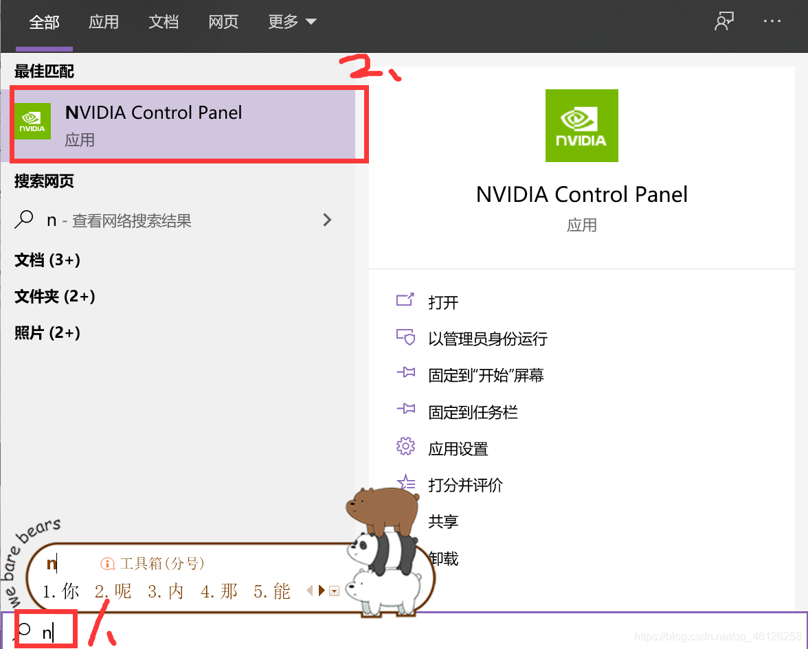  
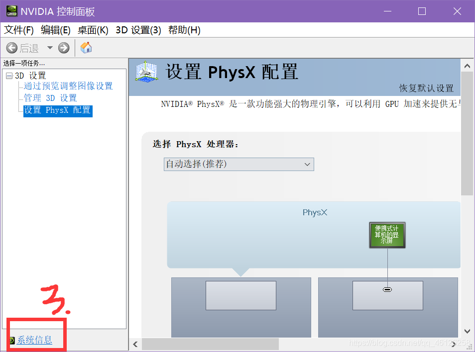  
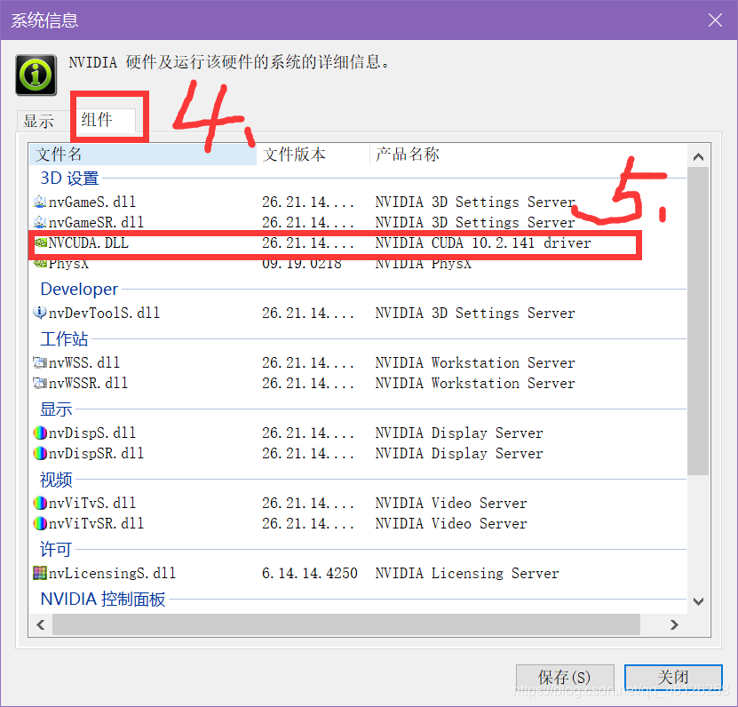  
可以看到我的是NVCUDA. DLL 26.21. 14… NVIDIA CUDA10. 2. 141 driver，那么我应该选CUDA10.2或者更低版本  
去官网[https://developer.nvidia.com/cuda-toolkit-archive](https://developer.nvidia.com/cuda-toolkit-archive) ，下载对应版本的CUDA（建议选择10.1，我在选择10.2后无法运行，版本号不匹配，在下载10.2版本之后是发现他是10. 2.8多，我的电脑是10. 2.141就没法运行了）  
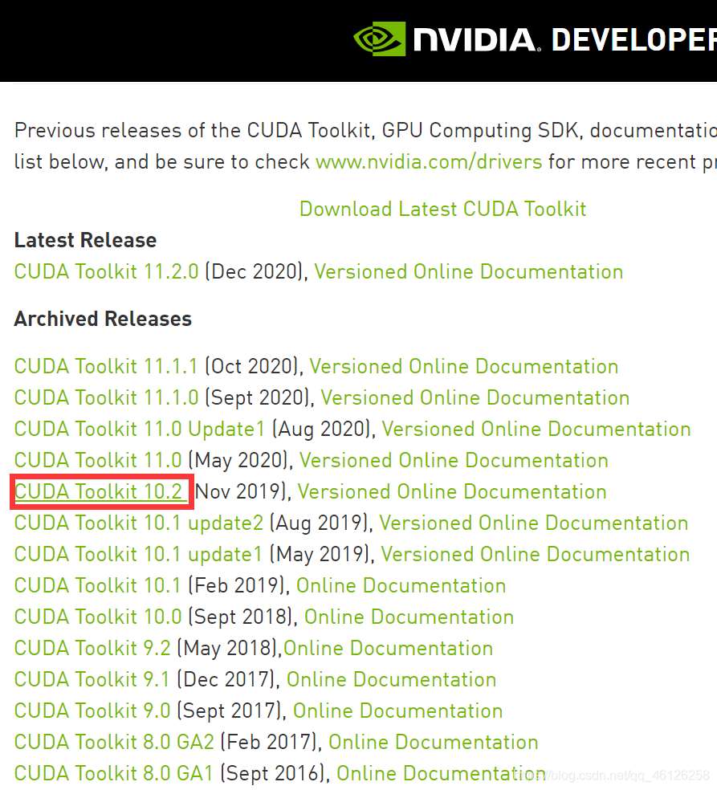  
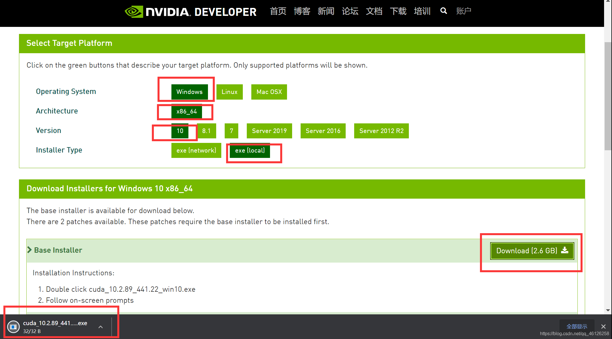  
下载完成！！！进行安装  
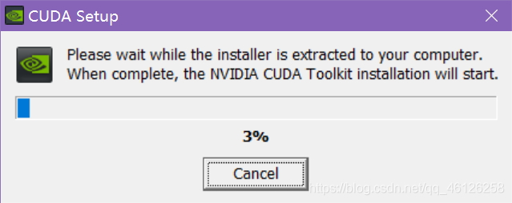  
**检查系统兼容ing**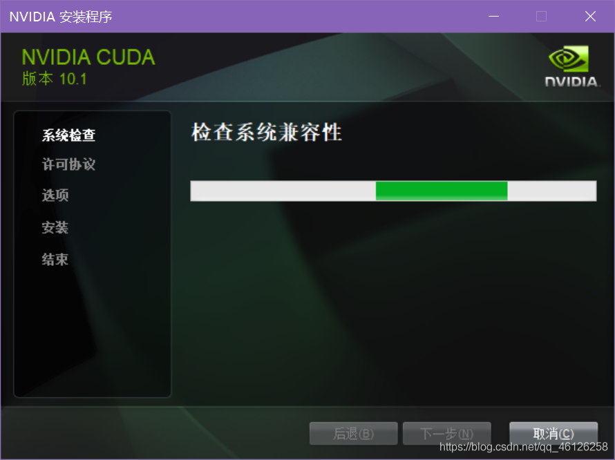  
**同意，并选择自定义安装**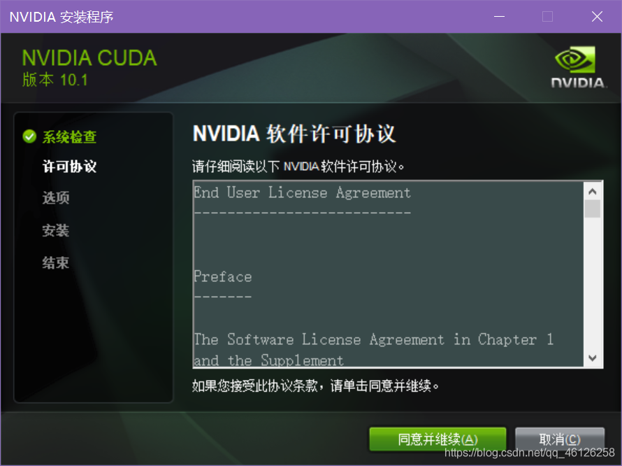  
**打开Driver components》Display Driver，看自己的当前版本，若大于等于新版本将 √ \\color{green}√ √ 去掉**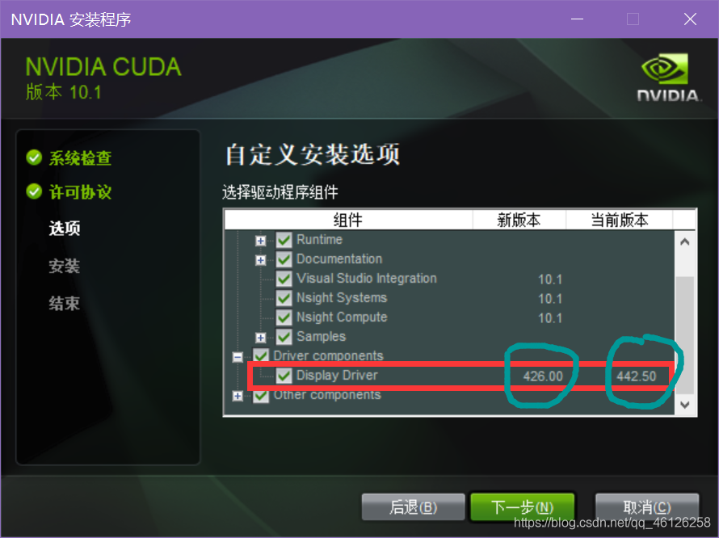  
**进行下一步，选择安装位置，一定选择默认位置！！！不要像我一样有强迫症非要改到别的地方！！！（下图为反例）**  
如果有人尝试下载到别的路径，那么过一会你就会发现CUDA在你的下载路径下消失了！回收站里也没有！amazing！  
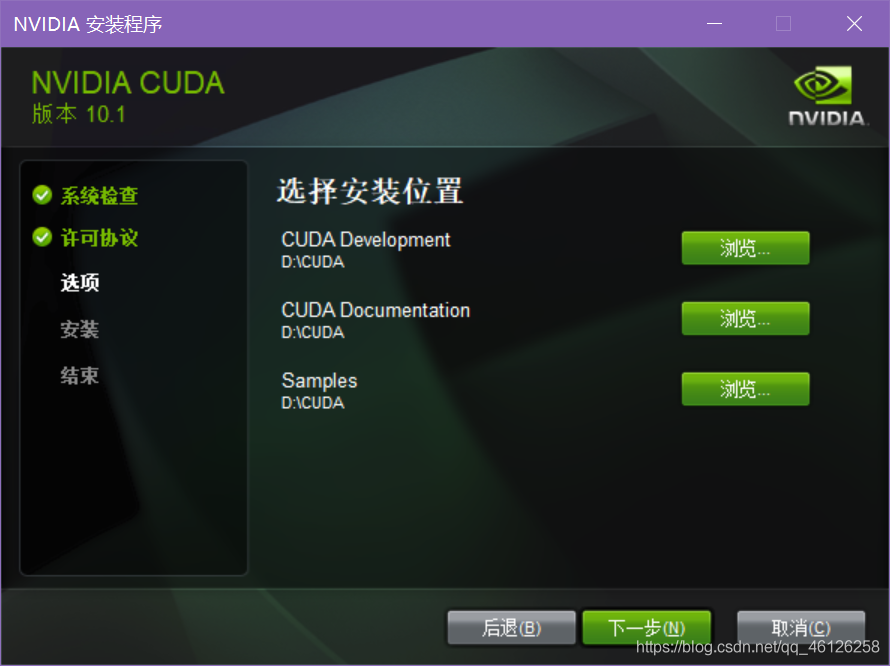  
**然后就是静静地等待**  
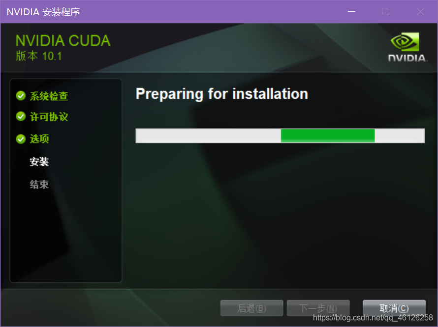  
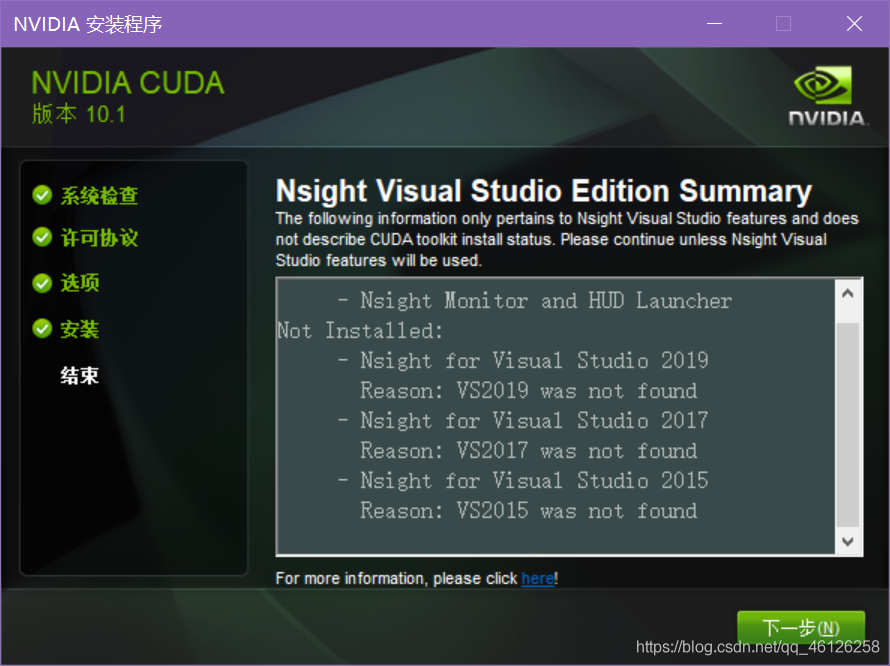

**检查是否安装成功：打开cmd，输入`nvcc -V`，能输出下图的版本号即安装成功**  


### 2、下载cuDNN

CUDNN下载官网：[https://developer.nvidia.com/rdp/cudnn-download](https://developer.nvidia.com/rdp/cudnn-download)  
进去之后 需要注册一个账号，并进行登录，按照提示进行即可（国外网站会有点慢，如果有VPN建议开启，会快一些，我用了20min左右）  
  


接下来就是无脑的submit，填信息  
  
登陆成功后终于可以开始下载了，勾选 **I agree** 选择**windows10**  
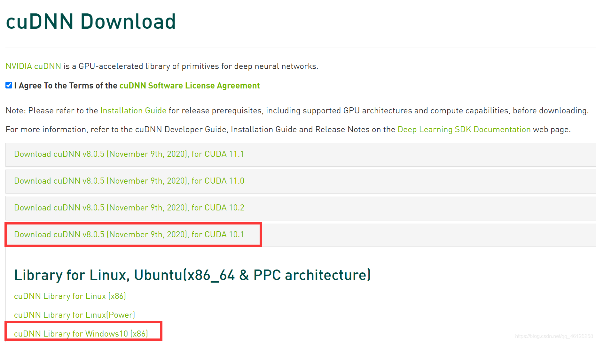  
**下载完成后解压**  
  
**解压之后打开文件夹，将他的第一个文件重命名为cudnn**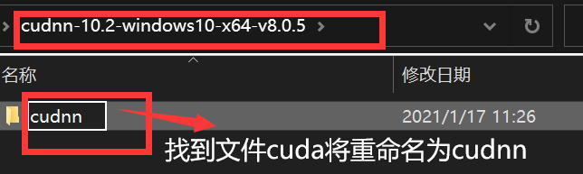  
**将cudnn文件复制，在c盘找到以下路径**`C:\Program Files\NVIDIA GPU Computing Toolkit\CUDA\v10.1`，**粘贴到这个根目录下**  
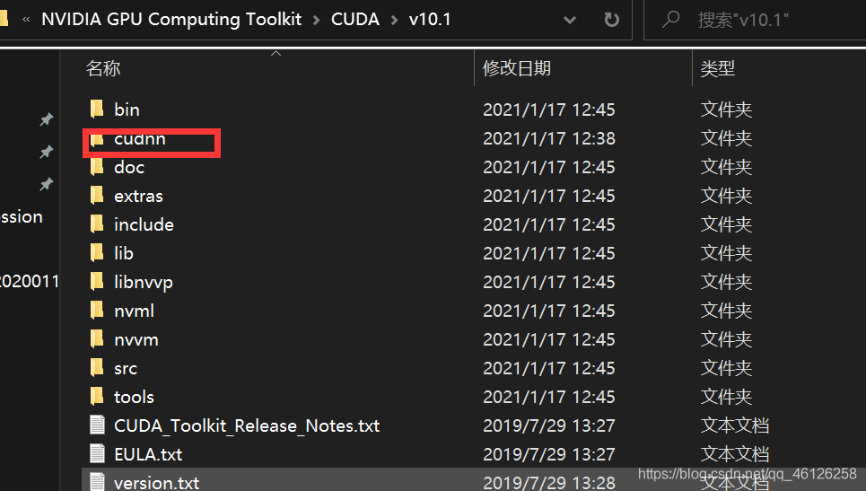  
**注意的是不要选成Program Files (x86)**  
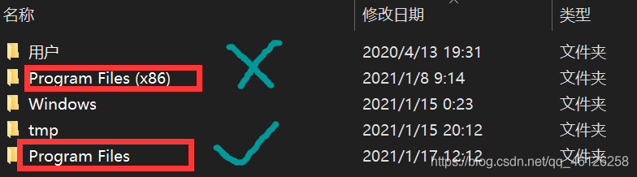  
现在开始配环境，找到这两个位置，在系统的path下添加这两个环境变量，具体方法不再赘述

```c
C:\Program Files\NVIDIA GPU Computing Toolkit\CUDA\v10.1\extras\CUPTI\lib64

C:\Program Files\NVIDIA GPU Computing Toolkit\CUDA\v10.1\cudnn\bin
```

### 3、安装[Pytorch](https://so.csdn.net/so/search?q=Pytorch&spm=1001.2101.3001.7020)

进入官网[https://pytorch.org/get-started/locally/#no-cuda-1](https://pytorch.org/get-started/locally/#no-cuda-1)  
**找到下图位置选择所需配置，注意：要用pip（后续会解释），且一定要和之前的10.1版本对应，否则又要重来了！！！**  
  
**将最下面的红框区域`pip install torch==1.7.1+cu101 torchvision==0.8.2+cu101 torchaudio===0.7.2 -f https://download.pytorch.org/whl/torch_stable.html`复制，这时候你可以在cmd下载Pytorch了，直接使用pip安装，但是你会发现太慢导致下载失败！！！**  
  
**如果这时候使用conda清华镜像安装，虽然会加快速度，但是下载后发现依次运行下列语句**  
（1）`python`  
（2）`import torch`  
（3）`torch.cuda.is_valible()`  
**显示false安装失败（结果显示Ture，安装成功）**  
**所以先打开pip后面的网页，直接进行下载**`https://download.pytorch.org/whl/torch_stable.html`  
**我们来分析下需要下载什么，去掉网址后剩下下面这些**

```c
pip install torch==1.7.1+cu101 torchvision==0.8.2+cu101 torchaudio===0.7.2
```

例如：cu101表示cuda10.1，那么需要下载这三项

```c
torch==1.7.1+cu101
torchvision==0.8.2+cu101
torchaudio===0.7.2
```

直接下载也是下载速度过慢，几kb/s，如果有VPN的小伙伴，可以打开VPN下载，没有的朋友们可以选中这一行，右键复制链接打开迅雷下载进行下图处的操作来下载（**最好是白天，晚上限速**），记住自己的下载路径（我的是在D:\\迅雷下载）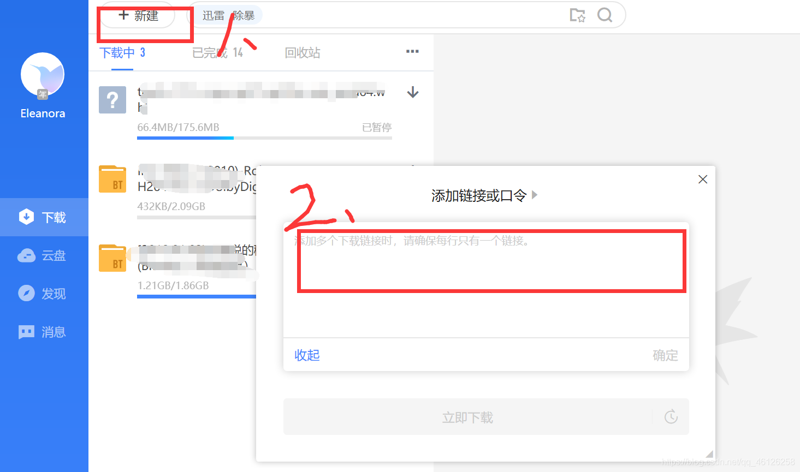  
（1）下载`torch==1.7.1+cu101`，至于为什么选择cp38的，因为我把cp39下载下来后发现不能运行  
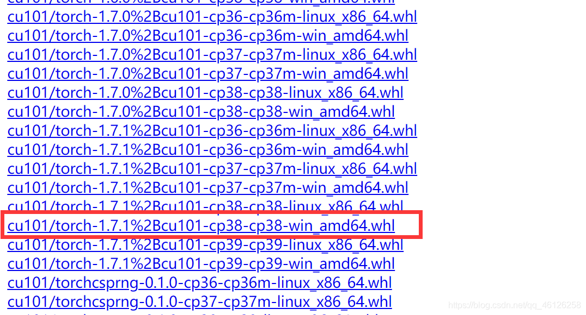  
（2）下载`torchvision==0.8.2+cu101`同理我选择cp38的（没想到真的对了）  
  
（3）下载`torchaudio===0.7.2`同理选择cp38的  
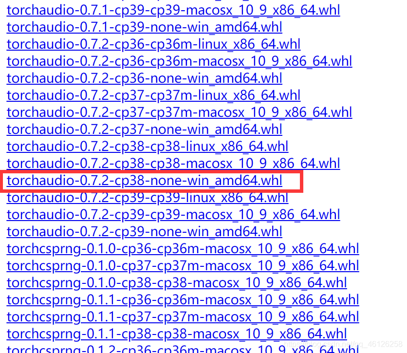  
下 载 完 成 后 ， 打 开 c m d ， 注 意 一 定 要 用 c m d ！ ！ ！ 不 要 打 开 a n a c o n d a p r o m p t \\color{red}下载完成后，打开cmd，注意一定要用cmd！！！不要打开anaconda prompt 下载完成后，打开cmd，注意一定要用cmd！！！不要打开anacondaprompt，**（因为我都试过，后者还是会因为超时下载而失败）如果你想在某特定的虚拟环境下使用Pytorch，也先这么做**  
进入之前下载他们三个的路径（我的是这样的）  
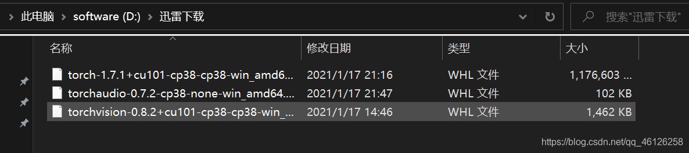  
然后分别在cmd中执行这三句（pip install + 名字，注意加上后缀.whl，先下载[torch](https://so.csdn.net/so/search?q=torch&spm=1001.2101.3001.7020)那个）

```c
pip install torch-1.7.1+cu101-cp38-cp38-win_amd64.whl
pip install torchvision-0.8.2+cu101-cp38-cp38-win_amd64.whl
pip install torchaudio-0.7.2-cp38-none-win_amd64.whl
```

依次输入这三句检验是否成功

```c
python
import torch
torch.cuda.is_available()
```

输出结果为True，那么到此恭喜你，你已经成功了！！！  
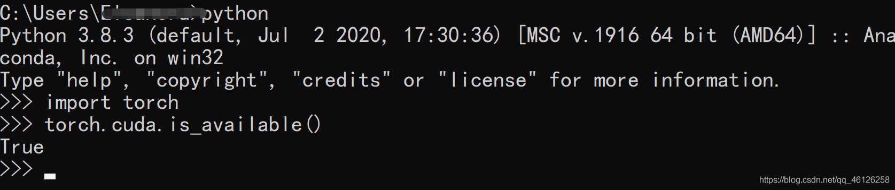  
如果你想在[anaconda](https://so.csdn.net/so/search?q=anaconda&spm=1001.2101.3001.7020)下的虚拟环境使用它，没问题，这里提供一个**投机取巧**的方法：  
找到刚才在cmd中下载成功的三个东西，他们在你的anaconda目录下的lib->site-packages，例如我的在`D:\anaconda\Lib\site-packages`，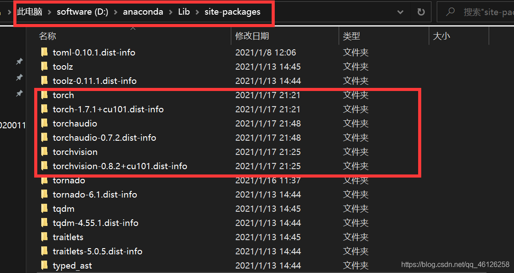  
将他们复制到虚拟环境的lib->site-packages中就可以直接用了（envs表示根目录，里面有你所有的虚拟环境），例如我的是`D:\anaconda\envs\Pytorch_excise\Lib\site-packages`  
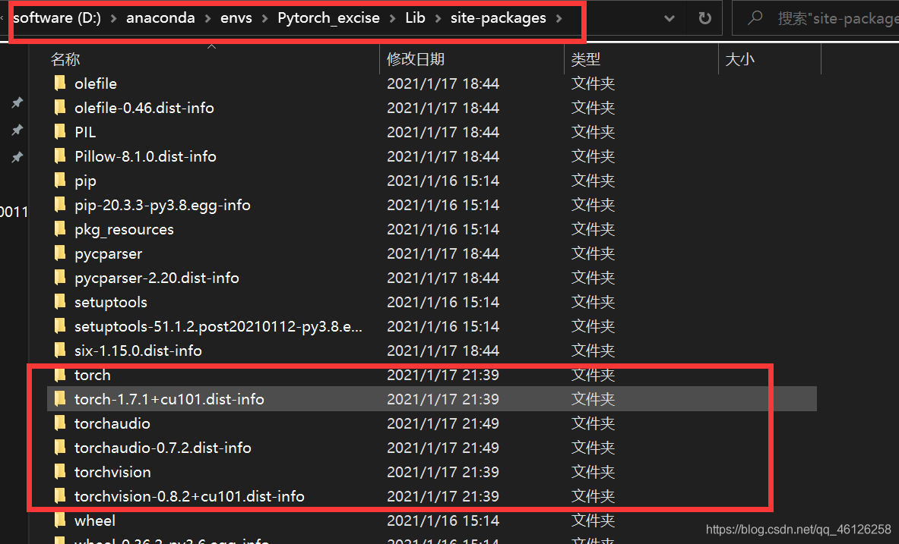  
同理检查是否正常工作，依次输入这三句

```c
python
import torch
torch.cuda.is_available()
```

结果返回True

参考：[博客1](https://blog.csdn.net/Flora_Olivia/article/details/104486548?ops_request_misc=%25257B%252522request%25255Fid%252522%25253A%252522161086613016780269835158%252522%25252C%252522scm%252522%25253A%25252220140713.130102334..%252522%25257D&request_id=161086613016780269835158&biz_id=0&utm_medium=distribute.pc_search_result.none-task-blog-2~all~first_rank_v2~rank_v29-8-104486548.pc_search_result_hbase_insert&utm_term=torch.cuda.is_available%28%29false)  
[点击这个博主的链接](https://blog.csdn.net/m511655654/article/details/88419965?utm_medium=distribute.pc_relevant.none-task-blog-BlogCommendFromBaidu-2.not_use_machine_learn_pai&depth_1-utm_source=distribute.pc_relevant.none-task-blog-BlogCommendFromBaidu-2.not_use_machine_learn_pai)判断自己的CUDA和cuDNN的版本