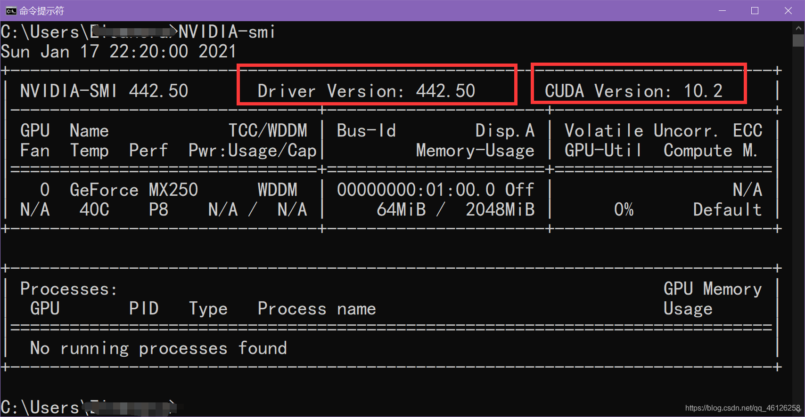
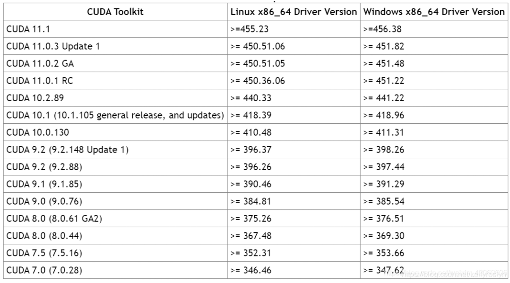
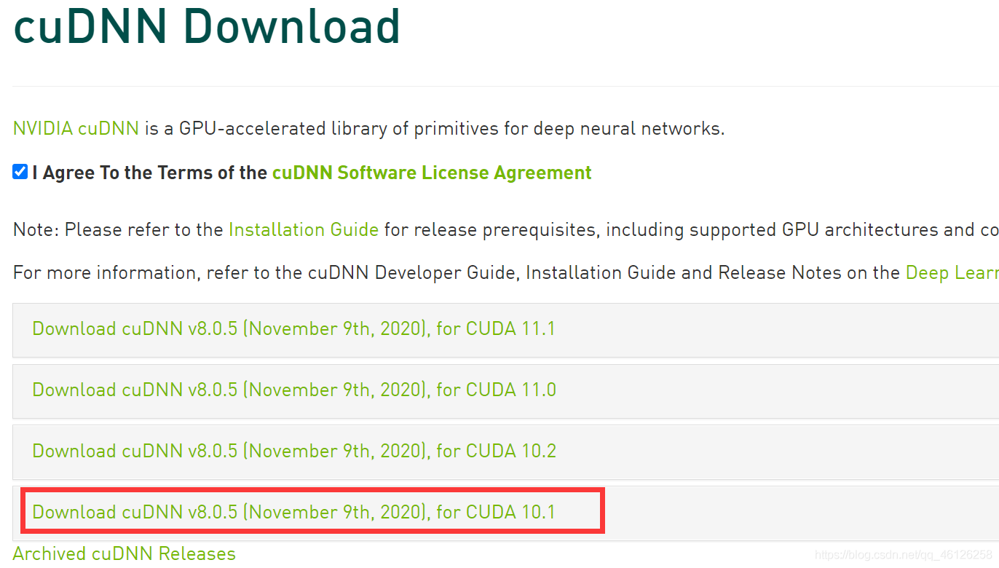
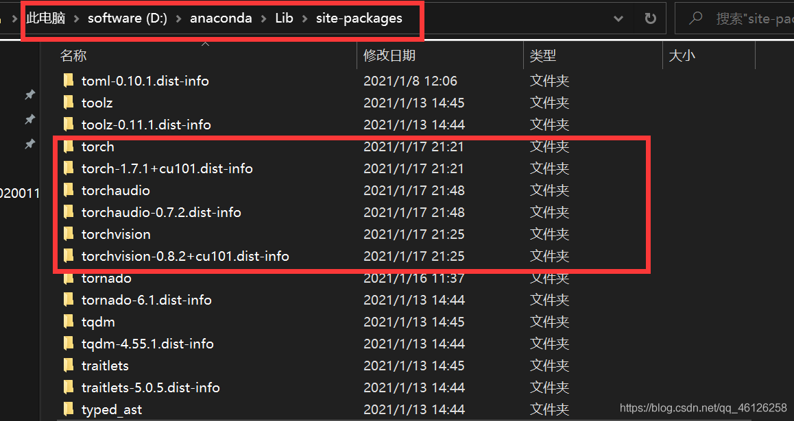
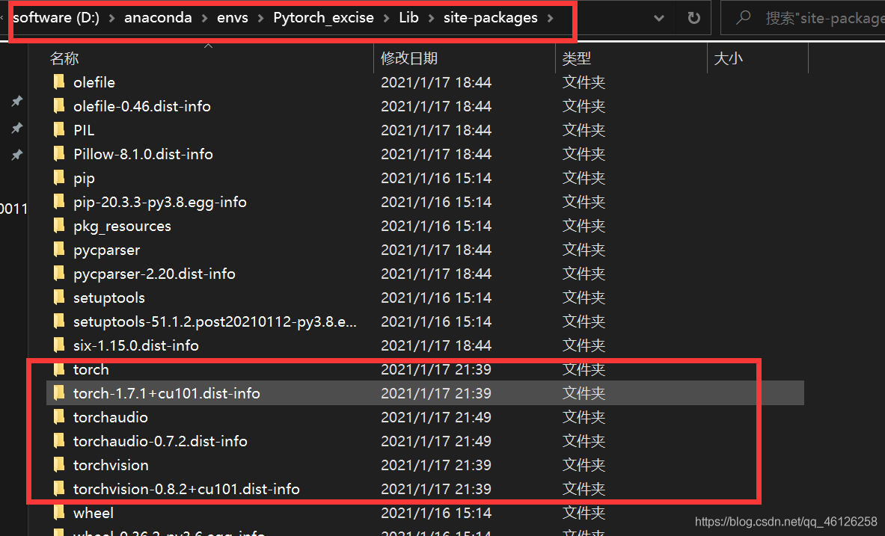
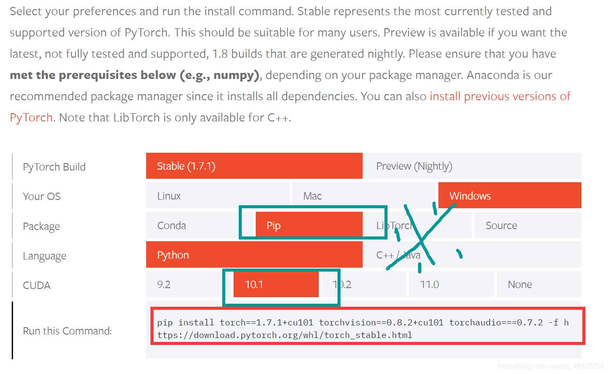
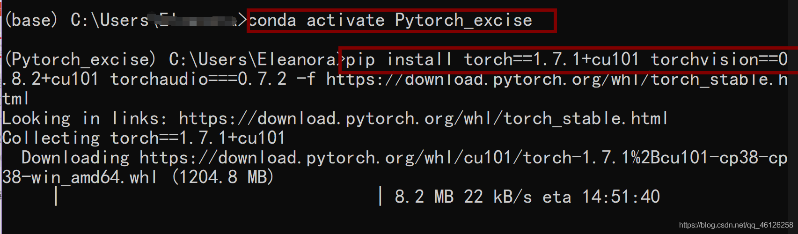
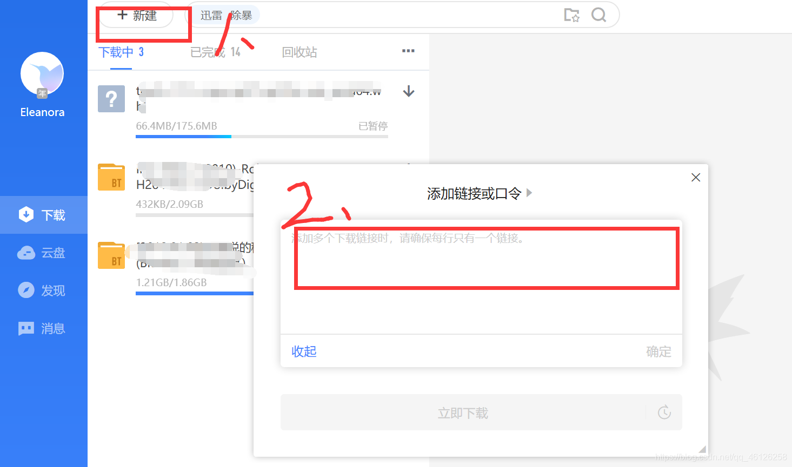
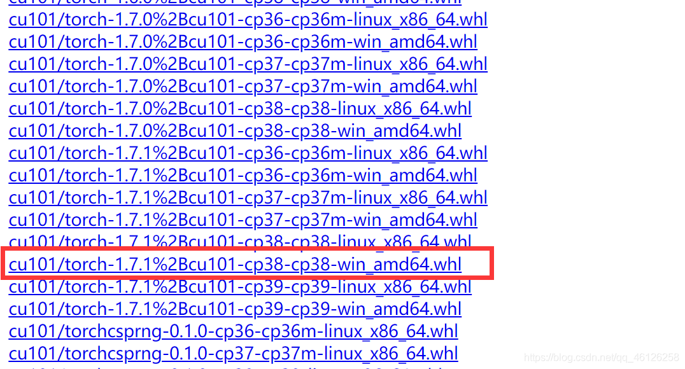
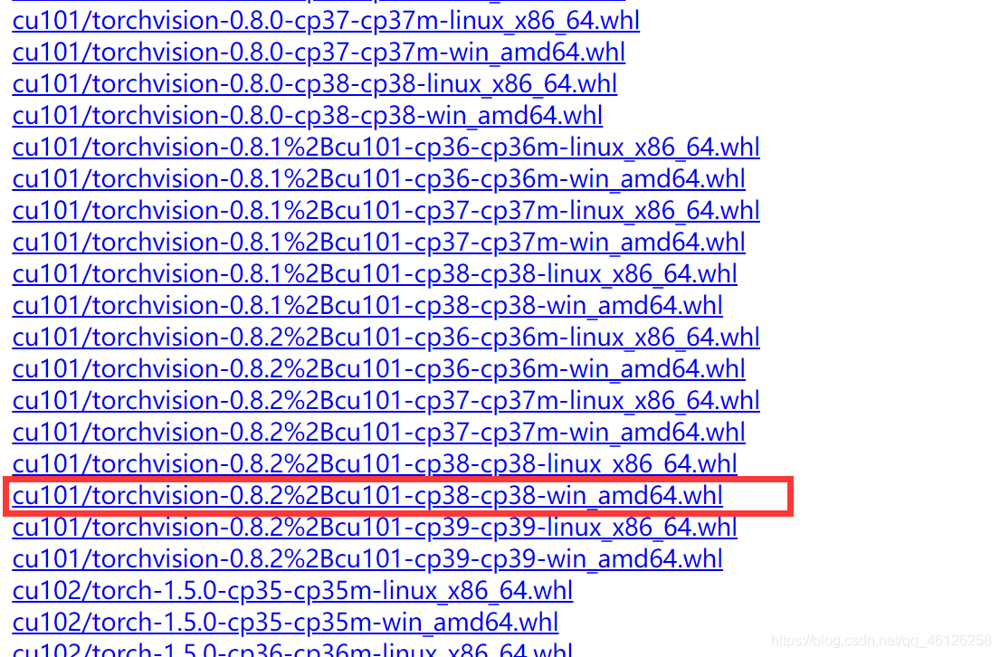

\------2021.7.27更新------ 针对cp38做了适当解释，其余未作修改

## （1）你的CUDA，cuDNN，[torch](https://so.csdn.net/so/search?q=torch&spm=1001.2101.3001.7020)版本是否对应？

首先判断自己是否适合使用GPU版本的torch，打开自己的cmd输入

```c
NVIDIA-smi
```

查看自己的Driver Version ，CUDA Version  
  
根据下图判断自己的CUDA版本是否符合要求（装的CUDA和cuDNN保持一致，版本号可以比10.2低）  
如果忘记自己的CUDA、cuDNN版本号，[按这个博主的办法](https://blog.csdn.net/m511655654/article/details/88419965?utm_medium=distribute.pc_relevant.none-task-blog-BlogCommendFromBaidu-2.not_use_machine_learn_pai&depth_1-utm_source=distribute.pc_relevant.none-task-blog-BlogCommendFromBaidu-2.not_use_machine_learn_pai)  
进入官网[https://developer.nvidia.com/rdp/cudnn-download](https://developer.nvidia.com/rdp/cudnn-download) ，先注册登录，查看自己的CUDA版本号对应自己的cuDNN，如下：我的是CUDA10.1，所以对应cuDNN8.0.5  
如果有对应不上的一个，先进行卸载，再安装新的。不着急的看B站视频从头安装  
[https://www.bilibili.com/video/BV1Rz411e7eJ?t=356](https://www.bilibili.com/video/BV1Rz411e7eJ?t=356)  
着急的小伙伴请看我的[上一篇博客](https://blog.csdn.net/qq_46126258/article/details/112698284)

## （2） 问一下你自己是不是在清华镜像加速下载的！

如果是，你是不是天真的以为把官网的下载链接放在prompt上去掉 -c [pytorch](https://so.csdn.net/so/search?q=pytorch&spm=1001.2101.3001.7020)去掉就走了捷径，能更快的安装了？

## No！无论你是重装多少次，都一样，torch.cuda.is\_available()返回false

如果你遇到这个问题，不用担心你的步骤是不是错了，因为你被[conda](https://so.csdn.net/so/search?q=conda&spm=1001.2101.3001.7020)镜像安装给坑了。**你以为下载的是GPU版本，其实镜像下载的是cpu版本你必须手动去官网用pip下载安装**

如果不信，可以打开cmd试试这几句

```c
python
import torch
print(torch.__version__)
```

运行结果

```c
1.7.1+cpu
```

呵呵，恭喜你中招了！我也是在参考[https://www.bilibili.com/video/bv1Rz411e7eJ](https://www.bilibili.com/video/bv1Rz411e7eJ)的评论区才发现的。那么如果你的CUDA，cuDNN版本都对，只有Pytorch安装成了CPU的，那么先对它进行卸载，然后再安装

卸载方法：  
找到刚才下载成功的三个东西，如果没在虚拟环境下下载Pytorch的话，他们在你的anaconda目录下的lib->site-packages，例如我的在`D:\anaconda\Lib\site-packages`，删除**torch和torch-1.1.1+cpu.dist.info（torch-1.7.1+cu101.dist-info中的 + c u 101 表 示 C U D A 10.1 ， + c p u 表 示 C P U 版 本 \\color{red}+cu101表示CUDA10.1，+cpu表示CPU版本 +cu101表示CUDA10.1，+cpu表示CPU版本）**  
如果是在虚拟幻境里，那么找到该虚拟环境的lib->site-packages（envs表示根目录，里面有你所有的虚拟环境），例如我的是`D:\anaconda\envs\Pytorch_excise\Lib\site-packages`，同理按照上述方法删除cpu版本的torch  


### Pytorch正确下载方法：

进入官网[https://pytorch.org/get-started/locally/#no-cuda-1](https://pytorch.org/get-started/locally/#no-cuda-1)  
**找到下图位置选择所需配置，注意：要用pip，且一定要和之前的10.1版本对应，否则又要重来了！！！**  
  
**将最下面的红框区域`pip install torch==1.7.1+cu101 torchvision==0.8.2+cu101 torchaudio===0.7.2 -f https://download.pytorch.org/whl/torch_stable.html`复制，这时候你可以在cmd下载Pytorch了，直接使用pip安装，但是你会发现太慢导致下载失败！！！**  
  
**所以先打开pip后面的网页，对.whl文件直接进行下载**[https://download.pytorch.org/whl/torch\_stable.html](https://download.pytorch.org/whl/torch_stable.html)  
我们来分析下需要下载什么，去掉网址后剩下下面这些

```c
pip install torch==1.7.1+cu101 torchvision==0.8.2+cu101 torchaudio===0.7.2
```

例如：cu101表示cuda10.1，那么需要下载这三项

```c
torch==1.7.1+cu101
torchvision==0.8.2+cu101
torchaudio===0.7.2
```

直接下载也是下载速度过慢，几kb/s，如果有VPN的小伙伴，可以打开VPN下载，没有的朋友们可以选中这一行，右键复制链接打开迅雷下载进行下图处的操作来下载（**最好是白天，晚上限速**），记住自己的下载路径（我的是在D:\\迅雷下载）  
（1）下载`torch==1.7.1+cu101`，可以观察到cu101/torch-1,7,1有很多的版本，cp38对应python3.8，win\_amd64对应windows的64位操作系统，根据自己的实际情况进行下载即可。  
  
（2）下载`torchvision==0.8.2+cu101`同理我选择cp38的  
  
（3）下载`torchaudio===0.7.2`同理选择cp38的  
  
下 载 完 成 后 ， 打 开 c m d ， 注 意 一 定 要 用 c m d ！ ！ ！ 不 要 打 开 a n a c o n d a p r o m p t \\color{red}下载完成后，打开cmd，注意一定要用cmd！！！不要打开anaconda prompt 下载完成后，打开cmd，注意一定要用cmd！！！不要打开anacondaprompt，**（因为我都试过，后者还是会因为超时下载而失败）如果你想在某特定的虚拟环境下使用Pytorch，也先这么做**  
进入之前下载他们三个的路径（我的是这样的）  
  
然后分别在cmd中执行这三句（pip install + 名字，注意加上后缀.whl，先下载torch那个）

```c
pip install torch-1.7.1+cu101-cp38-cp38-win_amd64.whl
pip install torchvision-0.8.2+cu101-cp38-cp38-win_amd64.whl
pip install torchaudio-0.7.2-cp38-none-win_amd64.whl
```

依次输入这三句检验是否成功

```c
python
import torch
torch.cuda.is_available()
```

输出结果为True，那么到此恭喜你，你已经成功了！！！

如果你想在anaconda下的虚拟环境使用它，没问题，这里提供一个**投机取巧**的方法：  
找到刚才在cmd中下载成功的三个东西，他们在你的anaconda目录下的lib->site-packages，例如我的在`D:\anaconda\Lib\site-packages`，  
将他们复制到虚拟环境的lib->site-packages中就可以直接用了，我的是`D:\anaconda\envs\Pytorch_excise\Lib\site-packages`  
  
同理检查是否正常工作，依次输入这三句

```c
python
import torch
torch.cuda.is_available()
```

结果返回True