### **免责声明：**

    ****由于按照本教程进行炼丹所产生的任何对显卡的伤害应当由您自身承担，由使用训练出来的模型**所产生的一切侵权**行为**及法律责任应当由您自身承担，您继续阅读本教程代表您已知悉炼丹行为有可能会对您的显卡造成伤害并愿意承担该责任。**

**风险提示：**  

    **炼丹**是一项利用**显卡**进行计算的工作，在**炼丹**的过程中您的**显卡核心**和**显存**会以**高功率运转**，请随时注意您的**显卡温度**和**显存****温度。您应注意：**炼丹对显卡的伤害**不小于挖矿。**

**小提示：**

    炼丹的时候**显卡要做好散热**，不要让显卡过热，比如开着暖气炼丹就是一种不太明智的行为，因为炼丹的时候显卡的功耗很高，温度太高容易烧坏显卡。

    **请不要在炼丹的同时打游戏**，否则您可能会收获一个不太好的游戏体验并有可能导致炼丹爆显存。  

在正式开始炼丹之前您需要**注意**：

    这篇炼丹教程只针对在**Windows****本地**进行炼丹的用户而不是**Linux**用户或者**Colab**用户，并且您应当使用**N卡**而不是**A卡**且显存应当在8G以上（不保证8G能运行，因为笔者没有做过测试，16G是肯定能够运行的），**使用CPU炼丹的行为是被禁止的！**如果您使用的是**A卡**您应当在**Linux**系统上进行炼丹并且安装**ROCm**。

在正式炼丹之前您需要做的：

（1） 安装Python，您应该可以很轻松的在Windows的应用商店中下载到Python，您应当安装**Python3**而不是Python2。

（2）下载并安装**PyCharm**（**此项是非必须的**），PyCharm有社区版，是免费的。官网的下载地址是：https://www.jetbrains.com/pycharm/download/#section=windows。

（3） 去英伟达的官网安装**显卡驱动对应的CUDA**（由于笔者使用的是**A卡**，因此具体过程略去，您应该可以很轻松的在互联网上找到相关的教程）。

正式炼丹：

①首先在GitHub上下载项目，GitHub链接：https://github.com/innnky/so-vits-svc

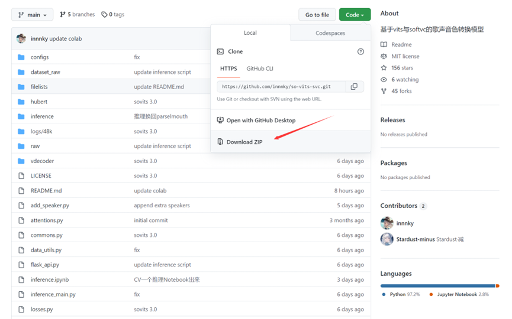

图（一）下载项目zip包

②解压项目zip包，解压完成后您应该得到类似这样的文件结构，如果文件夹没有需要自己新建同名文件夹，如图：

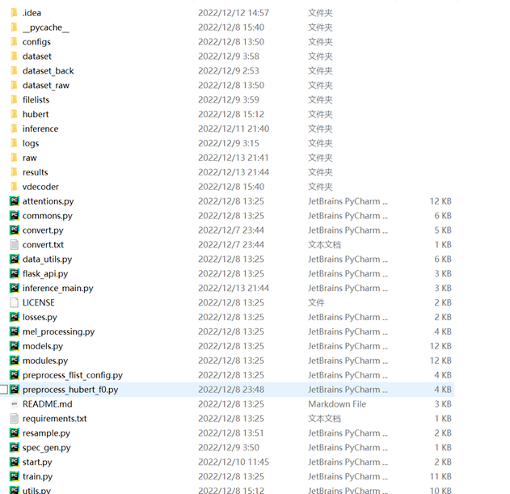

图（二）解压项目并新建缺少的文件夹（start.py是笔者自己写的，源工程中不包含）

③在GitHub上的链接里面下载预训练模型和hubert-soft模型，如图：

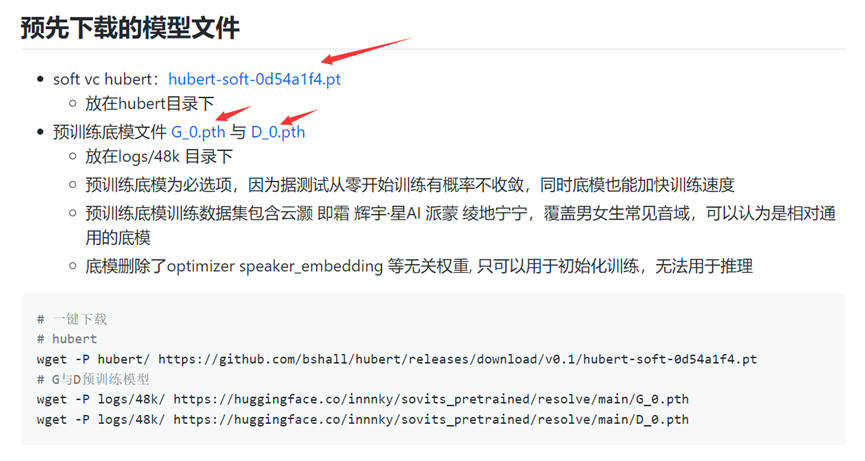

图（三）下载预训练模型和hubert-soft模型

  

④在dataset\_raw文件夹下新建一个文件夹，名字为你需要训练的角色名(请使用英文/数字避免其他问题，这里以“aqua”为例)并在这个文件夹中装入训练集(若干个“.wav”文件，每个文件最好不大于10秒，否则容易爆显存，请注意，您应当拥有至少1000个以上的wav文件以使模型拥有一个比较好的效果)，如图：

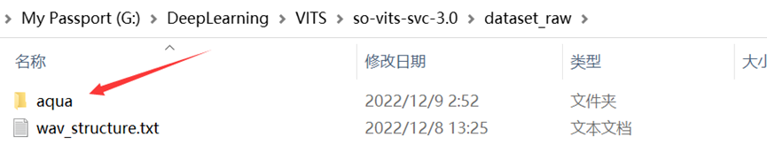

图（四）dataset\_raw文件夹结构

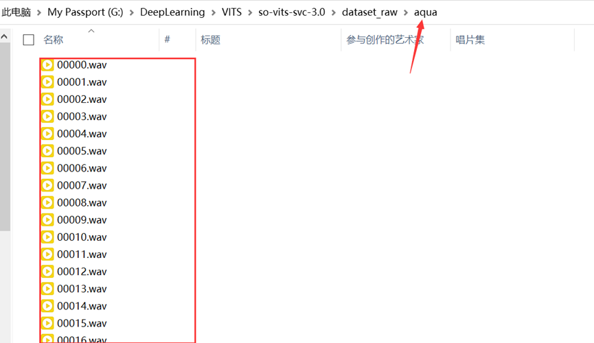

图（五）数据集（数据未全列出）

⑤按下Win+R键进入“运行”，输入cmd并确定，在弹出的命令提示符中切换至项目主文件夹下，如图（这里以G盘下的项目为例）：

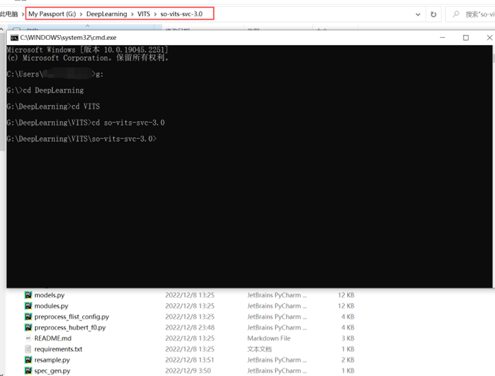

图（六）使用cmd进入项目文件夹

⑥安装依赖，在命令提示符中输入pip install -r requirements.txt -i https://pypi.mirrors.ustc.edu.cn/simple/（这是一整条命令，请不要换行），等待依赖安装完成。

⑦进行数据预处理，在命令提示符中输入python resample.py运行重采样程序(或者在PyCharm中运行)，重采样完成后应该会在dataset文件夹下生成一个“48k”文件夹，里面是重采样至48000khz后的音频数据，如图所示：

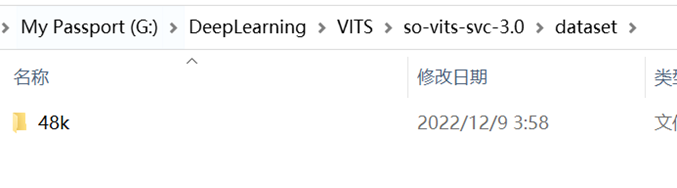

图（七）重采样后产生的数据文件夹

⑧在命令提示符中输入python preprocess\_flist\_config.py（或者在PyCharm中运行）以自动划分训练集、验证集、测试集，并且自动生成配置文件，运行完后您将得到如图所示的文件：

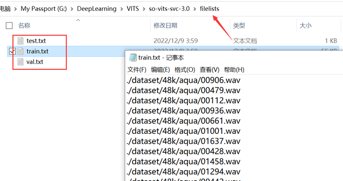

图（八）划分训练集、验证集、测试集，并且自动生成配置文件

⑨将下载好的hubert-soft模型和预训练模型放入对应的文件夹中，如图：  

  

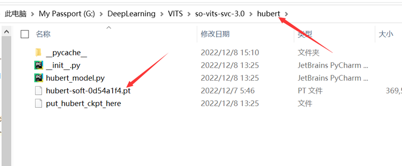

图（九）hubert-soft模型的放置位置

图（十）预训练模型的放置位置（请不要错过这条）

⑩生成hubert与f0，在命令提示符中输入python preprocess\_hubert\_f0.py（或者在PyCharm中运行），完成后您将得到这样的文件结构：

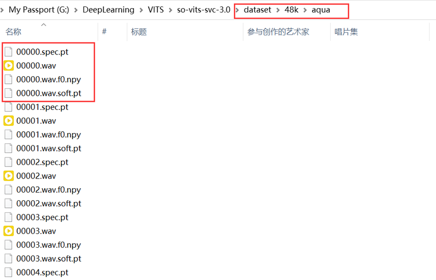

图（十一）生成hubert与f0后的训练集结构（每一个音频对应3个文件，这里有4个是因为训练时产生了一个）

⑪开始训练，在命令提示符中输入python train.py -c configs/config.json -m 48k开始训练，默认每**1000step**会保存一次**checkpoint**，当模型收敛时即可停止训练，在2000数据的情况下约100~200个Epoch即可收敛（不一定），当然你也可以启动**TensorBoard**对训练过程进行实时监控，确定收敛时间。训练时的控制台输出应当如图：

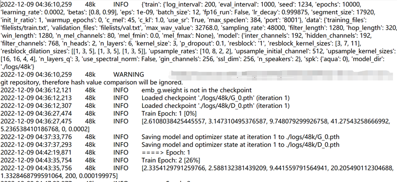

图（十二）训练时的控制台输出

**P.S.**

A.如果您想停止训练请在控制台按下**crtl+C**键，如果您下次再次开启训练，将自动加载上一个保存的checkpoint接着训练，因此**建议您在想要终止训练之前先等待程序自动保存checkpoint****。**

B.在训练开始后您的显卡应该有非常高的占用，如果没有则有可能您没有使用显卡进行训练，您需要检查您在安装依赖环节安装的是否是CUDA版的pytorch，如果不是则您应当去pytorch的官网按照官网的命令安装对应的CUDA版的pytorch，pytorch官网的地址是：https://pytorch.org/get-started/locally/，您应当安装的是pip版本的pytorch而不是conda版本的，除非您使用的是Anaconda，并且请与您的CUDA版本对应。

C.模型在收敛后继续训练所产生的提升非常有限并且有可能产生过拟合问题，因此如果您的模型效果不好有可能是您的数据集导致的。

