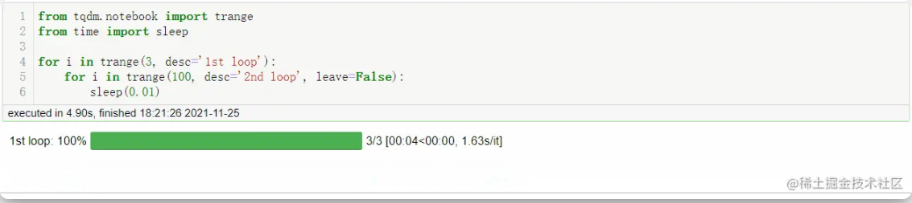
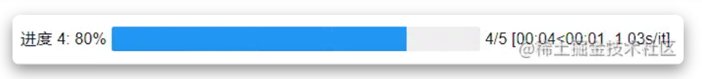
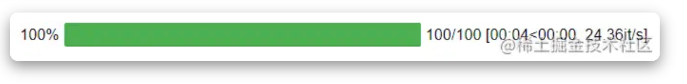
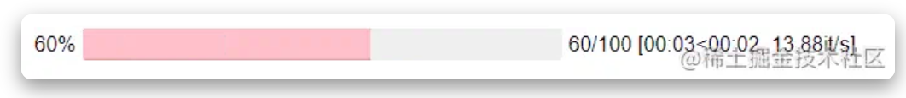
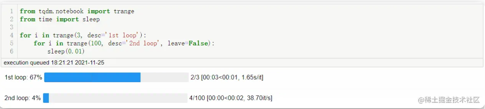

### 前言

* * *

今天和大家分享一个进度条可视化库，它的名字叫做 `tqdm` ，可以帮助我们监测程序运行的进度，用户只需要封装可迭代对象即可。



  

### 安装

* * *

通过命令行直接安装。

```plain
pip install tqdm
复制代码
```

  

也可以使用豆瓣镜像安装。

```plain
pip install -i https://pypi.douban.com/simple tqdm
复制代码
```

  

执行上述命令后，可以检查一下是否安装成功。

```plain
pip show tqdm
复制代码
```

  

### 使用方式

* * *

**以下演示运行环境：`jupyter notebook`不同运行环境使用方式稍有不同，可根据警告自行调整。**

`tqdm` 主要参数可选参数众多，我们先看一下常用的一些参数。

  

**主要参数**

*   `iterable`: 可迭代的对象, 在手动更新时不需要进行设置
*   `desc`: str, 左边进度条的描述性文字
*   `total`: 总的项目数
*   `leave`: bool, 执行完成后是否保留进度条
*   `file`: 输出指向位置, 默认是终端, 一般不需要设置
*   `ncols`: 调整进度条宽度, 默认是根据环境自动调节长度, 如果设置为0, 就没有进度条, 只有输出的信息
*   `unit`: 描述处理项目的文字, 默认是'it', 例如: 100 it/s, 处理照片的话设置为'img' ,则为 100 img/s
*   `unit_scale`: 自动根据国际标准进行项目处理速度单位的换算, 例如 100000 it/s >> 100k it/s
*   `colour`: 进度条颜色，例如：'green', '#00ff00'。

  

#### 示例

直接将列表传入 `tqdm()`。

```plain
from tqdm.notebook import tqdm
from time import sleep
for char in tqdm(['C', 'Python', 'Java', 'C++']):
    sleep(0.25)
复制代码
```


  

使用可迭代对象。

```plain
for i in tqdm(range(100)):
    sleep(0.05)
复制代码
```


  

`tqdm` 提供了 `trange()` 方法可以代替 `tqdm(range())`。

```plain
from tqdm.notebook import trange
for i in trange(100):
    sleep(0.05)
复制代码
```


  

我们在进度条前面添加描述性内容，这里把 `tqdm` 写在循环外，使用 `set_description()` 在进度条前面添加 "进度 %d"。

```plain
pbar = tqdm(range(5))
for char in pbar:
    pbar.set_description("进度 %d" %char)
    sleep(1)
复制代码
```



  

我们可以设置进度条的更新的间隔，下面我们设置总数为 `total=100`，然后分四次，使得进度条按 10%，20%，30%，40%的间隔来更新。

```plain
with tqdm(total=100) as pbar:
    for i in range(1, 5):
        sleep(1)
        # 更新进度
        pbar.update(10*i)
复制代码
```



  

更改进度条颜色。

```plain
with tqdm(total=100, colour='pink') as pbar:
    for i in range(1, 5):
        sleep(1)
        # 更新进度
        pbar.update(10*i)
复制代码
```



  

注：在使用 `tqdm` 显示进度条的时候，如果想要输出内容的话不能够使用 `print` ，`print` 会导致输出多行进度条，可以使用 `tqdm.write()`。

```plain
for i in tqdm(range(5)):
  tqdm.write("come on")
  sleep(0.1)
复制代码
```

  

对于多重循环可以指定多个进度条，设置 `leave=False` 第二个循环执行完后，进度条不保存。

```plain
for i in trange(3, desc='1st loop'):
    for i in trange(100, desc='2nd loop', leave=False):
        sleep(0.01)
复制代码
```

