简单写一个经验帖，总结下目前训练几十个Lora后感觉不错的经验。

如果最后需要训练集或者训练出来的模型，请私信。

## 软件准备

### WebUI或者Diffuser：

原版：[https://github.com/AUTOMATIC1111/stable-diffusion-webui](https://link.zhihu.com/?target=https%3A//github.com/AUTOMATIC1111/stable-diffusion-webui)

秋叶整合包 网盘链接容易失效，建议直接B站找

### Lora训练环境：

原版：[GitHub - kohya-ss/sd-scripts](https://link.zhihu.com/?target=https%3A//github.com/kohya-ss/sd-scripts)

EasyTrain：[https://github.com/derrian-distro/LoRA\_Easy\_Training\_Scripts](https://link.zhihu.com/?target=https%3A//github.com/derrian-distro/LoRA_Easy_Training_Scripts)

[GitHub - Akegarasu/lora-scripts: LoRA training scripts use kohya-ss's trainer, for diffusion model.](https://link.zhihu.com/?target=https%3A//github.com/Akegarasu/lora-scripts)

（这里我用的最后一个，都是基于sd-scripts的，还有很多整合包，用什么都一样）

## 数据准备

从网上爬取一些想要的角色图片，或者直接去截图。

这次我做的初春，找一些图片就行了，不需要很多，20张就可以，各个角度，全身，大头尽量都有些。

角色是这样子的，头上一定得有花，这个是角色属性。

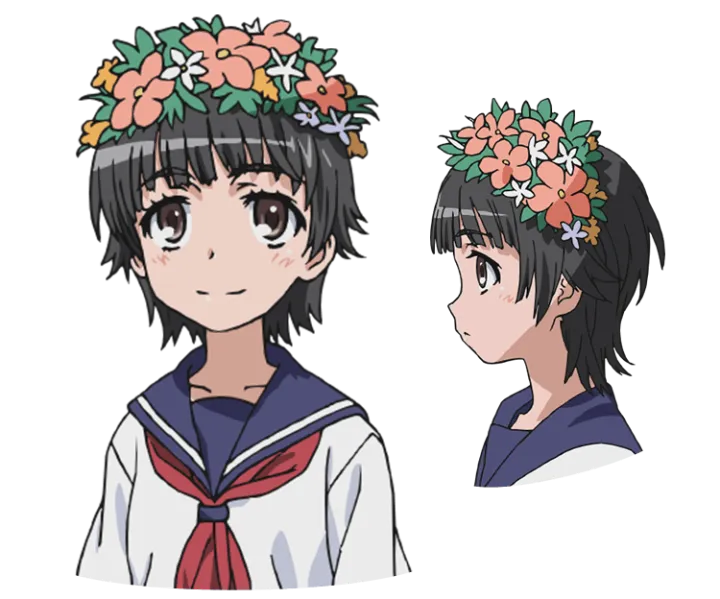

这些是我找的图：

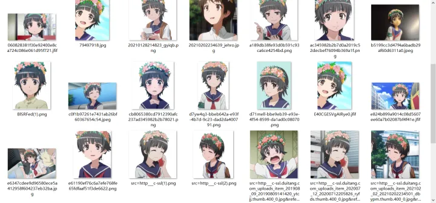

## 数据清洗打标

得到数据后，第一步就是清洗，所谓清洗主要是把爬的垃圾数据删了，并且该抠图的抠图（角色的Lora其实不扣也不太影响，真人是尽力抠图，功能性的lora基本上是要手动p图的）。

这里我给大家一个抠图脚本，用的阿里云API，非常方便：

```text
链接：https://pan.baidu.com/s/1PdF2ocgqOBtRmQqtmij6RA?pwd=bjf4 
提取码：bjf4 
```

总之清晰后数据就是干净的，最好是扣过的图，只有人物主体。

  

然后我们就要打标了，如果是真人或者风格类lora，可以学youtube里那些人做法，直接用BLIP做image caption，然后手动修改一些。但是二次元强烈建议直接上deepbooru，这是因为二次元SD的base model源头是NovelAI泄露的，而当时的模型就是这个风格的标签，所以二次元特别适合用booru风格的描述。具体操作如下：

首先打开SD webui，找到如下地方：

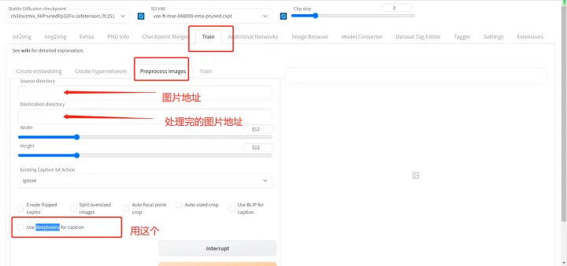

至于说分辨率，其实512就可以了，可以调大一些，如果你显存够大，我用3090发现基本上拉到1024分辨率后就没有收益了，而低于512明显效果不好。理论上图片分辨率高一些好，此外图片质量解析力也应该高。

打完勾后，就可以process了。

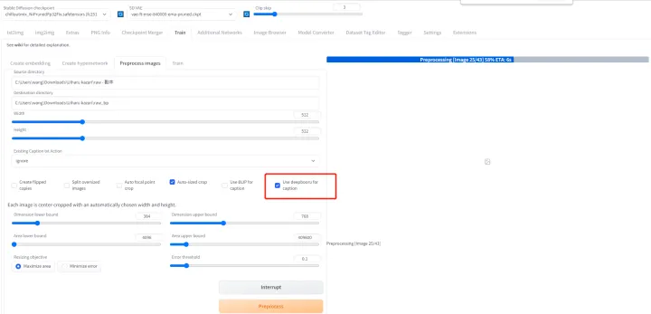

  

当程序自动走完流程我们就在目标文件夹里得到一组由image和text文件组成的对：

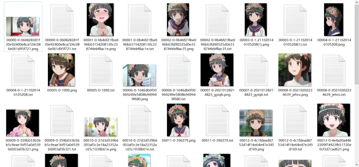

其中txt文件里就是对一幅图的描述，如下：

```text
1girl, blurry, solo, depth_of_field, hairband, blurry_background, building, torii
```

然后就进行最重要的步骤，**打标**。

所谓打标就是监督学习，告诉SD我们要它学什么。这里我们就是想学一个角色，这个角色有很多特征，比如她头上有花花，短发，眼睛样子等。

因此我们要把这些角色特征的描述词，从txt文件中的描述中删除。

。。。。。。

然后我们再加入一个特定的角色名，用来表示这个角色。让这个角色名学到刚才我们删除的特征。

换句话说，如果我们不删除那些特征，模型是不会把这些特征学给这个角色名的，而是专门学给具体的描述词。比如如果我们留下来头上的花，那么头上有花这个概念就不会学给初春这个角色名。当我们生成图像时候，初春这个词是不会生成头上有花的女孩，但是初春必须头上有花！所以我们要干掉这个词，这样模型就认为初春头上必然有花。

其实就很简单，控制变量法，我们留下来的标签就是我们想让模型学习的。

但是编辑这玩意如果一个一个文件走会很烦，我这里有个简单的步骤：

首先下载一个webui的插件“

<table data-draft-node="block" data-draft-type="table" data-size="normal" data-row-style="normal"><tbody><tr><td>stable-diffusion-webui-dataset-tag-editor-main</td></tr></tbody></table>

”（请去Github搜，然后放进Webui的Extensions目录下），然后我们可以进行批量编辑了：

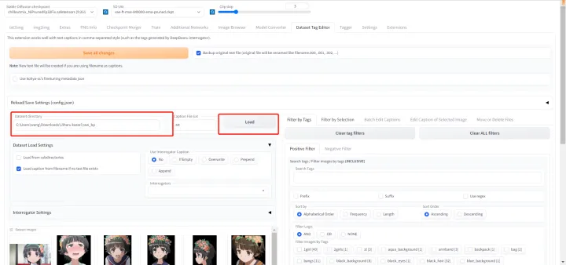

  

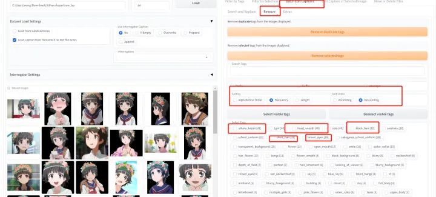

这就是可以批量编辑的地方，我们进行批量remove，即批量删除我们不想要的特征词：

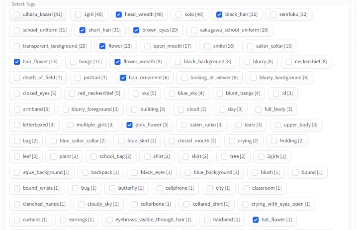

这些词我认为都是初春特征，所以我都打勾删除，记得删除后保存下。

等到这些删除完了后，我们在每句描述前面都加上**uiharu\_kazari，**这个是初春的触发词。一旦我们在prompts写上这个词，初春就会出现！我认为很重要，当然有人说可以不加，其实我训练几十个lora很多方案都试过，现在我感觉也是可加可不加的，但是我喜欢加上，里面原因很难直接说，就是加上后出图效果会好一些。但是不一定，有时候会变差，我说的这个方案其实是有些晋级的了，新人建议全都不删除tags，标签出来直接都拿去train，最简单稳定。

```text
为什么放在第一位，实际上tags是有顺序的，一般最开始的tags的权重最大，越靠后越小，所以我们要把我们最想学的这个人放在第一位，像是没有意义的概念，比如透明背景我们尽量往后放。
```

此外我们需要看每张图的描述，有一些描述是含有明显错误的，因为毕竟是打标器，很多都是错的。我们一定要删除错误的标签，这些错误是会明显影响我们训练结果的（当然图多时候其实不影响了，但是话又说回来，图片质量>图片数量，风格、功能性Lora>真人>二次元，二次元是最简单的lora）。

## 训练

我们开始写一个训练脚本参数。

首先是Base Model概念，这个应该是最重要概念之一，就是我们是在什么模型基础上训练的。

比如我们训练真人，女性，社区目前首选Chilloutmix系列。如果是汽车之类的物体，首选可以是SD1.5 2.1等官方模型。如果是二次元，我们这次首选NovelAI系列的模型，我这里选的Acertain，因为它画风比较朴素，接近动漫效果，我感觉用来训练比较好。

我这次直接把脚本参数都列出来了：

```bash
# LoRA train script by @Akegarasu
# Train data path | 设置训练用模型、图片
$pretrained_model="D:\workspace\stable-diffusion-webui\models\Stable-diffusion\ACertainModel.ckpt" # base model path | 底模路径
$train_data_dir="C:\Users\NUOSEN\Desktop\data\lora\Kazari"
$reg_data_dir = "" # directory for regularization images | 正则化数据集路径，默认不使用正则化图像。

# Train related params | 训练相关参数
$resolution = "768,768" # image resolution w,h. 图片分辨率，宽,高。支持非正方形，但必须是 64 倍数。
$batch_size = 2 # batch size
$max_train_epoches = 10 # max train epoches | 最大训练 epoch
$save_every_n_epochs = 1 # save every n epochs | 每 N 个 epoch 保存一次
$network_dim = 64 # network dim | 常用 4~128，不是越大越好
$network_alpha = 32 # network alpha | 常用与 network_dim 相同的值或者采用较小的值，如 network_dim的一半 防止下溢。默认值为 1，使用较小的 alpha 需要提升学习率。
$clip_skip = 2 # clip skip | 玄学 一般用 2
$train_unet_only = 0 # train U-Net only | 仅训练 U-Net，开启这个会牺牲效果大幅减少显存使用。6G显存可以开启
$train_text_encoder_only = 0 # train Text Encoder only | 仅训练 文本编码器

# Learning rate | 学习率
$lr = "5e-5"
$unet_lr = "5e-5"
$text_encoder_lr = "6e-6"
$lr_scheduler = "cosine_with_restarts" # "linear", "cosine", "cosine_with_restarts", "polynomial", "constant", "constant_with_warmup"
$lr_warmup_steps = 50 # warmup steps | 仅在 lr_scheduler 为 constant_with_warmup 时需要填写这个值
$lr_restart_cycles = 1 # cosine_with_restarts restart cycles | 余弦退火重启次数，仅在 lr_scheduler 为 cosine_with_restarts 时起效。

# Output settings | 输出设置
$output_name = "Kazari_v1" # output model name | 模型保存名称
$save_model_as = "safetensors" # model save ext | 模型保存格式 ckpt, pt, safetensors

# 其他设置
$network_weights = "" # pretrained weights for LoRA network | 若需要从已有的 LoRA 模型上继续训练，请填写 LoRA 模型路径。
# $network_weights = "D:\workspace\stable-diffusion-webui\models\Lora\koreanDollLikeness_v10.safetensors" # pretrained weights for LoRA network | 若需要从已有的 LoRA 模型上继续训练，请填写 LoRA 模型路径。
$min_bucket_reso = 256 # arb min resolution | arb 最小分辨率
$max_bucket_reso = 1024 # arb max resolution | arb 最大分辨率
$persistent_data_loader_workers = 0 # persistent dataloader workers | 容易爆内存，保留加载训练集的worker，减少每个 epoch 之间的停顿

# 优化器设置
$use_8bit_adam = 0 # use 8bit adam optimizer | 使用 8bit adam 优化器节省显存，默认启用。部分 10 系老显卡无法使用，修改为 0 禁用。
$use_lion = 1 # use lion optimizer | 使用 Lion 优化器


# ============= DO NOT MODIFY CONTENTS BELOW | 请勿修改下方内容 =====================
# Activate python venv
.\venv\Scripts\activate

$Env:HF_HOME = "huggingface"
$ext_args = [System.Collections.ArrayList]::new()

if ($train_unet_only) {
  [void]$ext_args.Add("--network_train_unet_only")
}

if ($train_text_encoder_only) {
  [void]$ext_args.Add("--network_train_text_encoder_only")
}

if ($network_weights) {
  [void]$ext_args.Add("--network_weights=" + $network_weights)
}

if ($reg_data_dir) {
  [void]$ext_args.Add("--reg_data_dir=" + $reg_data_dir)
}

if ($use_8bit_adam) {
  [void]$ext_args.Add("--use_8bit_adam")
}

if ($use_lion) {
  [void]$ext_args.Add("--use_lion_optimizer")
}

if ($persistent_data_loader_workers) {
  [void]$ext_args.Add("--persistent_data_loader_workers")
}

# run train
accelerate launch --num_cpu_threads_per_process=8 "./sd-scripts/train_network.py" `
  --enable_bucket `
  --pretrained_model_name_or_path=$pretrained_model `
  --train_data_dir=$train_data_dir `
  --output_dir="./output" `
  --logging_dir="./logs" `
  --resolution=$resolution `
  --network_module=networks.lora `
  --max_train_epochs=$max_train_epoches `
  --learning_rate=$lr `
  --unet_lr=$unet_lr `
  --text_encoder_lr=$text_encoder_lr `
  --lr_scheduler=$lr_scheduler `
  --lr_warmup_steps=$lr_warmup_steps `
  --lr_scheduler_num_cycles=$lr_restart_cycles `
  --network_dim=$network_dim `
  --network_alpha=$network_alpha `
  --output_name=$output_name `
  --train_batch_size=$batch_size `
  --save_every_n_epochs=$save_every_n_epochs `
  --mixed_precision="fp16" `
  --save_precision="fp16" `
  --seed="1337" `
  --cache_latents `
  --clip_skip=$clip_skip `
  --prior_loss_weight=1 `
  --max_token_length=225 `
  --caption_extension=".txt" `
  --save_model_as=$save_model_as `
  --min_bucket_reso=$min_bucket_reso `
  --max_bucket_reso=$max_bucket_reso `
  --xformers --shuffle_caption $ext_args

Write-Output "Train finished"
Read-Host | Out-Null ;
```

train\_data\_dir是我们放图片的目录，我们把刚才处理好的图片文件夹（里面有图片和文字对）放在这个目录下。

我的目录结构是这样的（其中2\_images就是我们处理好的图片文件夹，为什么这么命名一会讲）：

```text
C:\Users\NUOSEN\Desktop\data\lora\Kazari\2_uiharu_kazari
```

所以我在上面的脚本里填写的目录为

```text
C:\Users\NUOSEN\Desktop\data\lora\Kazari
```

训练的时候脚本自动在Kazari目录下找图片文件夹，它判定的是**\[NUM\]\_XXX**命名的文件夹就是要输入给dataloader的图片文件夹。

我们一定要按照这个规则明明我们的文件夹，NUM表示我们一个epoch要遍历几遍这个目录，即repeats，而XXX就是我们默认的触发词。

而我们还会在脚本设置**max\_train\_epoches**这个参数，这个就表示我们要训练多少个epoch。

所以训练时候优化的次数Step就是num\_images X **repeats** X **max\_train\_epoches** / **batch\_size**

**batch\_size**就是一次处理几张图片，也是我们在脚本里设置的，显卡有能力就别设置1。

更重要的参数就是学习率**Lr**了：

$lr="5e-5"

$unet\_lr="5e-5"

$text\_encoder\_lr="6e-6"

这个我们可以先设置成这样，然后看loss函数下降了没，再进行调整。

训练图片分辨率**resolution**这个参数也是非常重要的，它是我们训练时候图片的分辨率，显卡有能力设置大一些比较好，建议不要低于512，会很差。

**network\_dim**表示我们训练出来的Lora模型大小，一般不要大于128，因为没收益，小一些的dim可以抗过拟合。

**clip\_skip**这个参数在二次元模型里就设置2或者3，但真人模型可以考虑设置1，但是需要测试效果，一般就2。这个参数其实是CLIP这个模型结构的原因，它其实是层级概念，比如上一层是“人”，那么下一层就是“男人”“女人”，逐渐细化。而二次元这个从NovelAI起源的模型，都沿用了2这个设定。我们也设置成2。

**use\_lion**这个我设置成1，是因为我想启用Lion这个优化器，因为测试效果发现这个优化器泛化性好一些。

**save\_every\_n\_epochs**这个我设置成1，就是每个epoch都保存模型，这样最后我有10个模型了。

设置好参数我们就一键运行脚本开始训练。

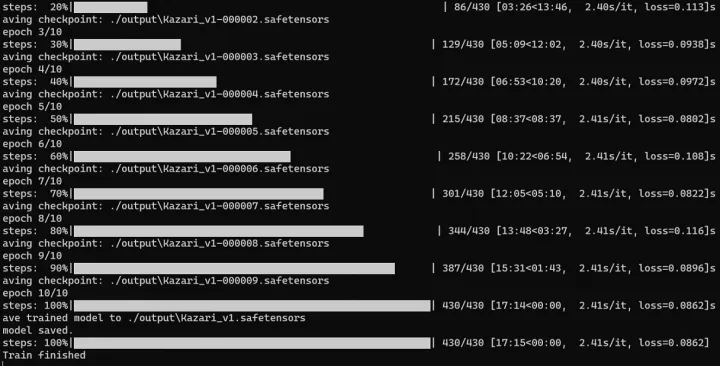

好了我们训练完了。

## 检测结果

训练完的lora应该看下不同epoch的结果，排除欠拟合和过拟合的模型，用最合适的模型。

我们直接用简单的prompts遍历所有的模型和weights：

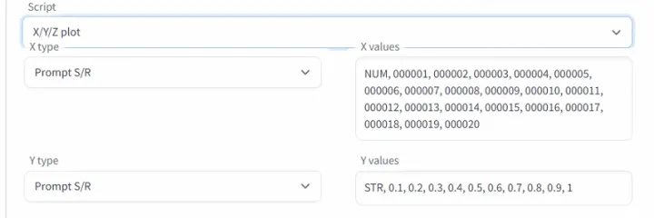

能出一张xy表：

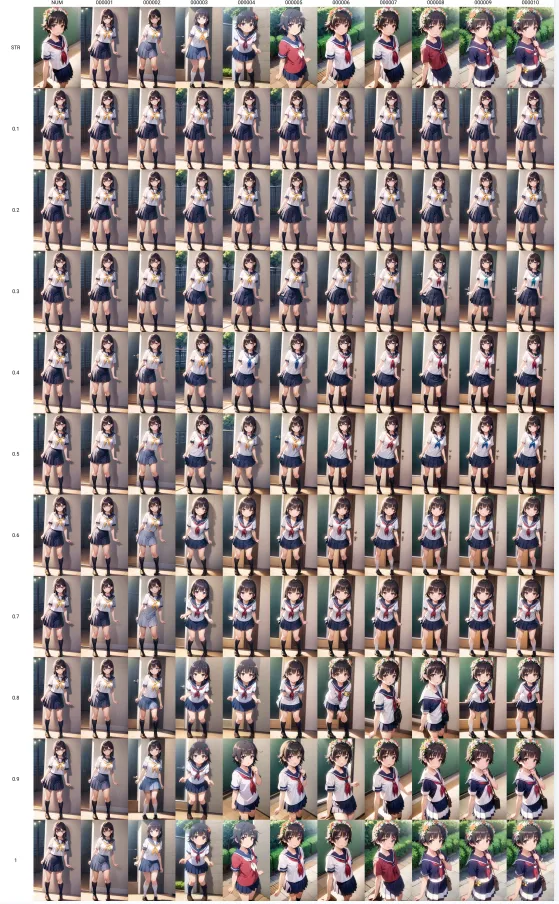

我最后选了8epoch的模型，因为我感觉它在各种环境下最稳定。

## 出图

训练好的Lora就可以出图啦。

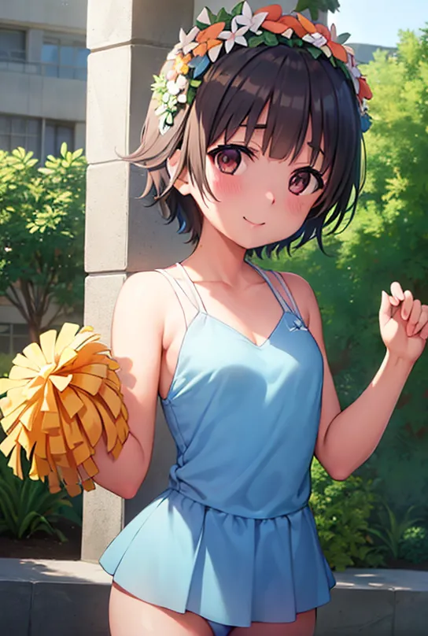


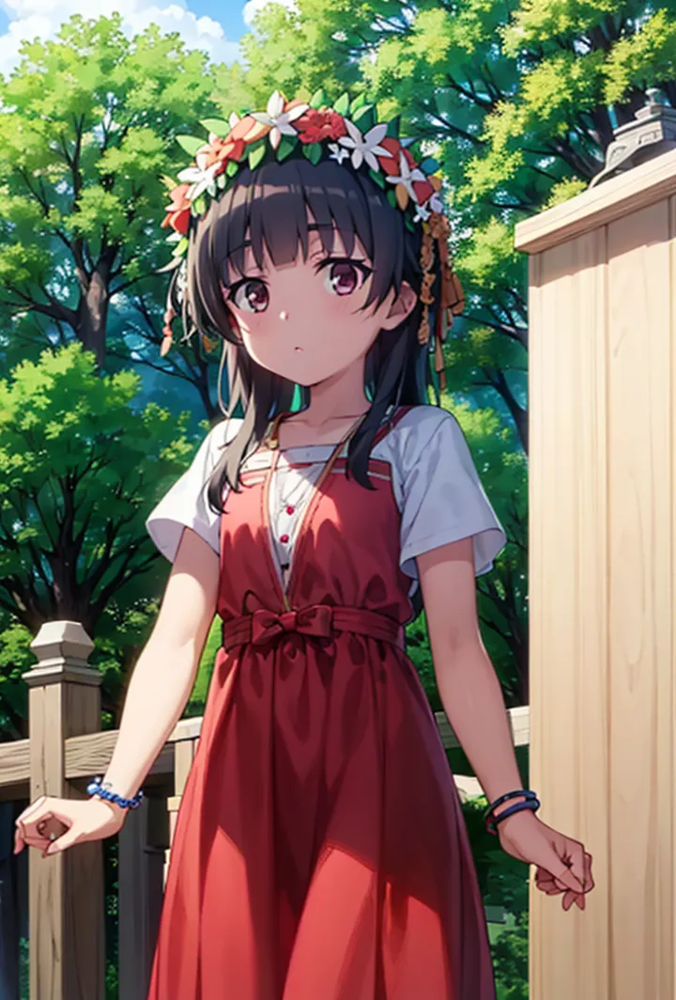

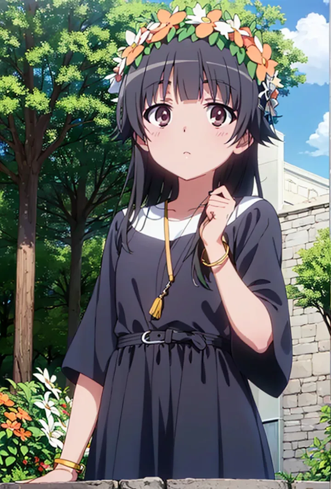

  

  

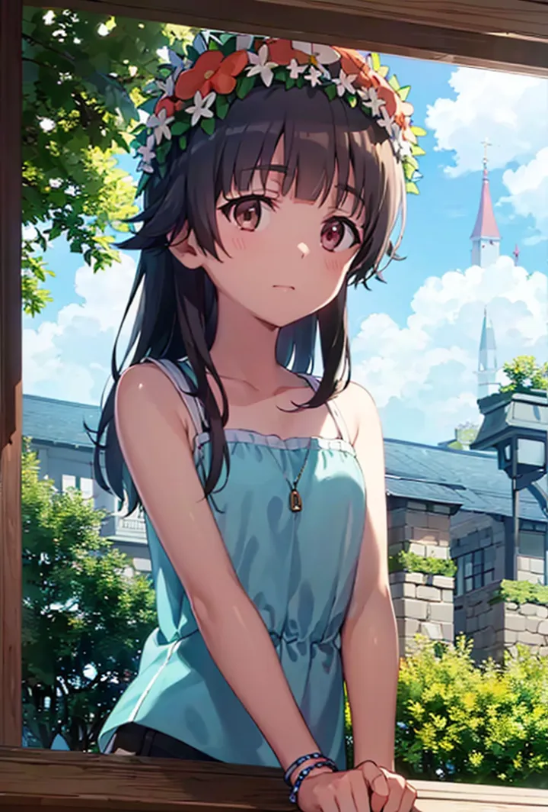


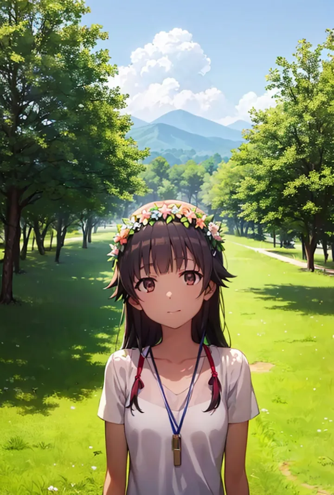


