之前答应过大家放出来的Lora本地训练教程，终于写好啦。

会训练lora，代表着你可以生成属于你的独一无二的角色。

你可以让这个角色在各种不同背景的地方出现，可以让它摆出各种姿势，满足你的无限幻想。

还有的商家，用Lora训练衣服，以致于他们可以省下不少模特，摄像的钱，

有的用Lora训练商品，让自己的商品以低成本高效率地获得很多高端大气上档次的商详图。

今天咱就来给大家讲讲，如何本地训练Lora训练模型。

提醒，本地训练模型，建议显卡显存8G以上，最好12G以上。

显存低的同学可以考虑去租GPU线上训练。

另外训练需要修改调试脚本，对英文和代码比较头大的人要做好心理准备。

因为训练真人有法律风险，我们这个教程，就以一个比较少见的动漫人物《君与彼女与彼女之恋》的女主之一，美雪，来做例子吧。

说起来美雪，她是我玩过的游戏里，印象很深的一个角色，她是跨越次元的爱恋的代表。

游戏里，她被困在二次元世界，却对玩家“你”（而不是游戏里玩家控制的主角）产生了深刻的依恋，可是她又没法走出游戏，只能在二次元世界的游戏世界中，那个充满无趣和重复的小镇里，一直一直，等你来看她，等你来陪她。

你不来，她只有无尽的孤苦的寂寞。

那么今天，我们就把她拯救出来，带她穿上漂亮衣服，进入更广阔的世界遨游吧。


（美雪-游戏《君彼》人物角色图）

那么，开始吧。

1.首先，下载这个lora训练程序包。

[https://pan.quark.cn/s/d81b8754a484#/list/share](https://link.zhihu.com/?target=https%3A//pan.quark.cn/s/d81b8754a484%23/list/share)

（夸克网盘，可能需要短信登陆和下载客户端，文件大概1个多G）

2.安装notepad3，安装python

（1）下载完毕后，安装notepad3，用于后面编辑训练参数文件。

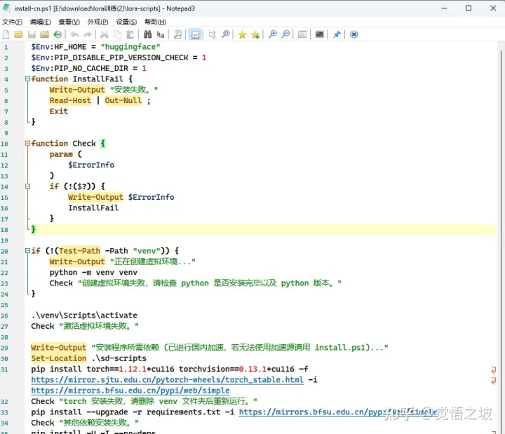

（用notepad3打开代码图比记事本会有条理一些）

（2）安装python文件

（记得勾选path），如果你的系统已经安装了python3.10，则跳过此步。

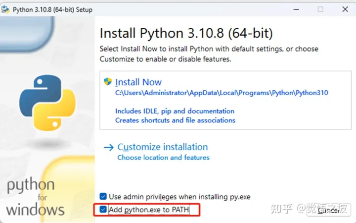

（3）解压lora-scripts.zip压缩包。

提示：如果你自已已有常用的其他文本编辑器，也可以不用安装notepad3。

3.进入解压后的lora-scripts文件夹，点击运行“强制更新bat”，更新到最新脚本

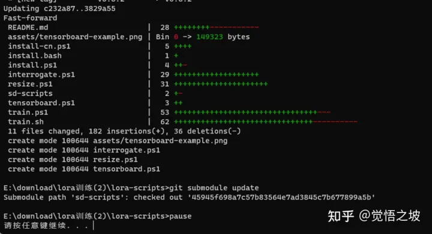

4.运行install-cn.ps1文件

（1）先开始菜单，搜索PowerShell，并用管理员权限运行，接着执行下面指令

```text
Set-ExecutionPolicy -ExecutionPolicy RemoteSigned
```

如果提示是否执行策略，则输入Y，再回车。

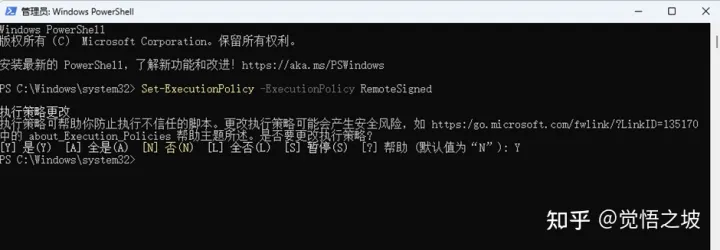

（2）右键点击lora-scripts文件夹下面的install-cn.ps1文件，并选择使用Powershell运行

等待系统自动安装和配置相关环境。

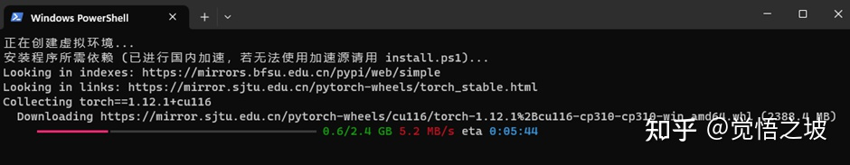

如果网络问题报错，就退出，重新运行install-cn.ps1即可。

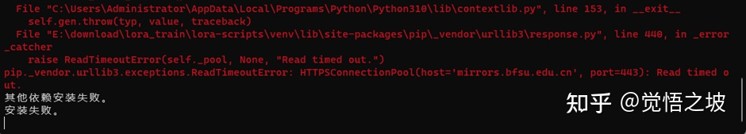

直到显示安装完成

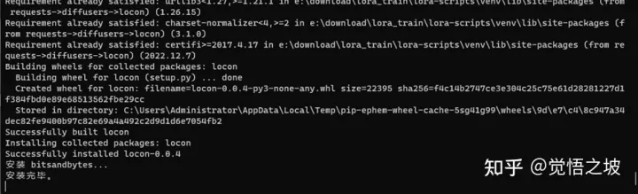

（这样就是装好了，如果不放心可以多执行几次）

5.收集整理图片

（1）准备你要训练的人物图像，最少8张，最好12张以上。需要不同角度，正面，侧面，背面，俯视图等。

选取的图片很影响训练的质量，一定要认真选图，不要只有正面大脸图。

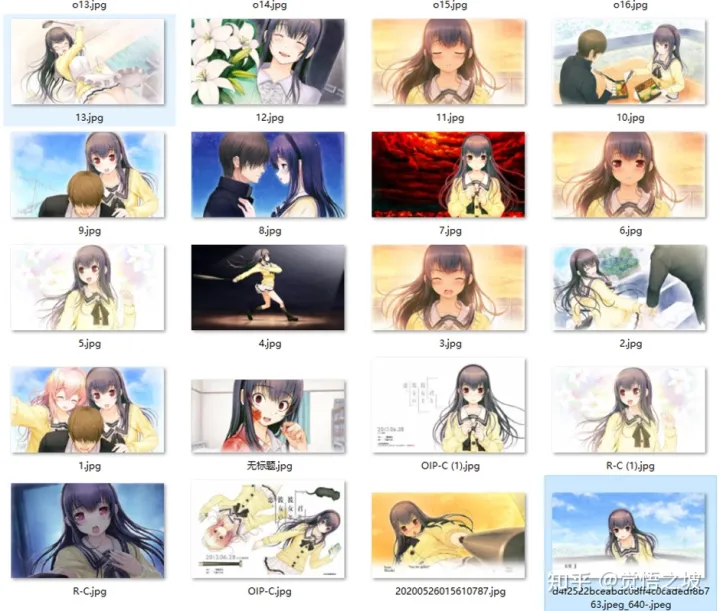

（训练图集）

（2）裁剪成要训练的大小，比如我是512x512，并放入一个单独的文件夹，比如就叫512。

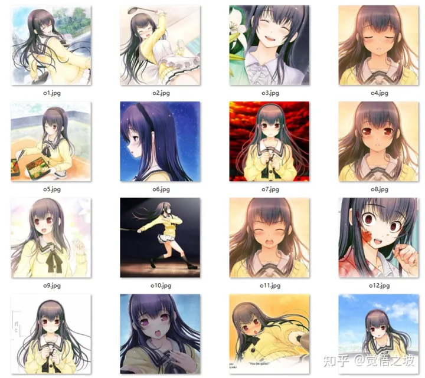

（3）生成tag

打开stable diffusion webui，输入你处理好的图片地址和输出的地址。

勾选Auto focal point crop，Use Deepbooru for caption。

点击Process。

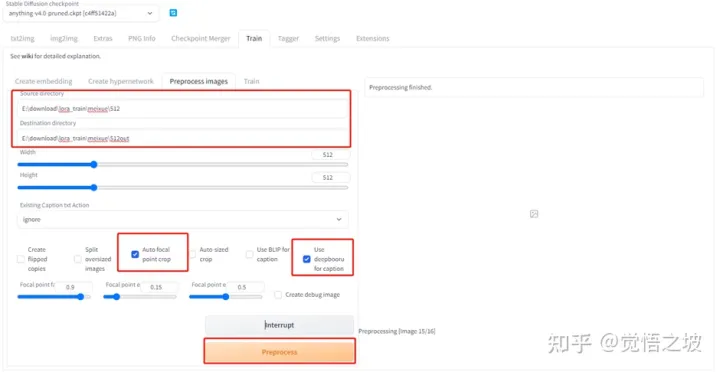

等待完成。

完成之后，目标文件夹自动会给图片命名并生成对应的tag，存储在对应的txt文件里面。

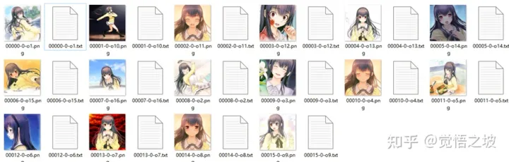

6.设定训练文件夹

（1）在lora-scripts文件夹下面，新建一个train文件夹

（2）train文件夹下面新建一个文件夹，叫做meixue（你如果想叫做其他tag，也能改成其他名字）

（3）meixue文件夹下面，再新建一个文件夹，叫做6\_meixue

（4）把第5步当中的图片和txt文件放进6\_meixue文件夹

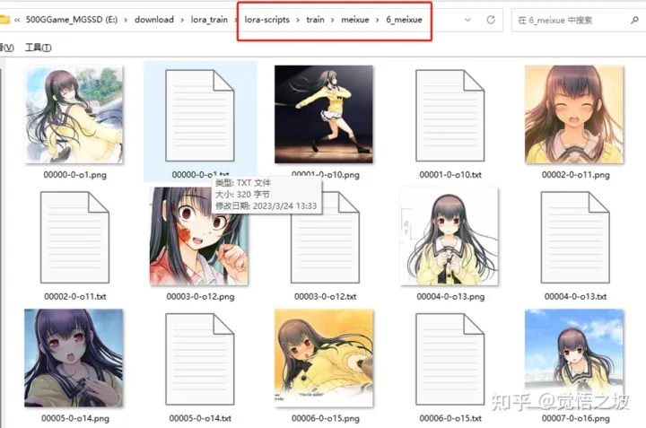

7.打开并设置训练文件

（1）用notepad3打开lora-scripts下面的train.ps1文件

（2）配置模型

找到你电脑stable-diffusion-webui -> models -> stable-diffusion下面的模型，最好用动漫类模型，比如我用的是anything4.0.ckpt，大家如果用Counterfeit，waifu，或者之类的动漫模型都行。

（如果你训练真人，就要用真实模型，比如chilloutmix，realistic version等）。

然后复制到lora-scripts下面的sd-models文件夹里面，并把模型文件名改成models.ckpt.或者models.safetensors.

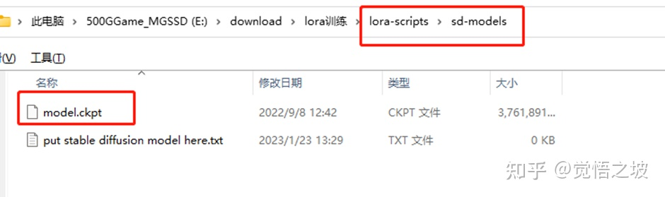

（3）修改训练图片的文件夹名称，比如我改成了meixue

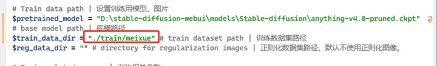

（4）max\_train\_poches这里我改成了15，大家选10-20都是可以的。

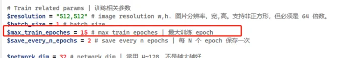

Max train epochs 下面的save every n epochs就是每多少个epoches就生成1个lora（safetensors）文件。一般不用动。

（5）resolution没动，因为我的训练图片就是512x512，所以没动。你如果自己的图片分辨率统一都比较大，比如都是1024x1024，你就改一下变成1024,1024。

（6）输出文件名改一下，改成meixue

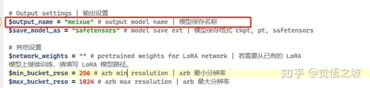

（7）其他没提到的最好不要动。然后保存train.ps1文件。

8.开始训练

右键点击train.ps1文件，选择powershell管理员运行。

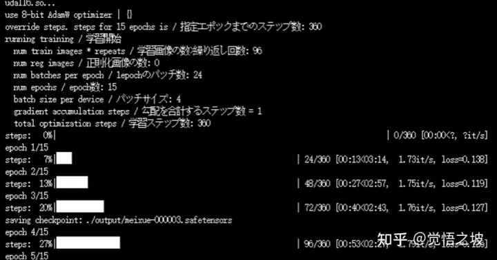

大概需要几分钟到几十分钟，取决于你的显卡性能，等待训练完成。

9.找到并使用lora

（1）训练完成后，在lora-scripts的output文件夹，找到生成的多个meixue \_xxxx.safetentor文件。

（2）放入stable-diffusion-webui -> models -> lora文件夹

（3）打开stable-diffusion-webui，点击generate下面的小图，点击lora，点击refresh，在下面找到meixue lora，点一下。

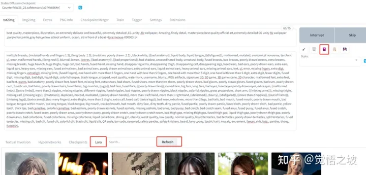

（4）在prompt 区域，使用lora文件，并增加相关描述

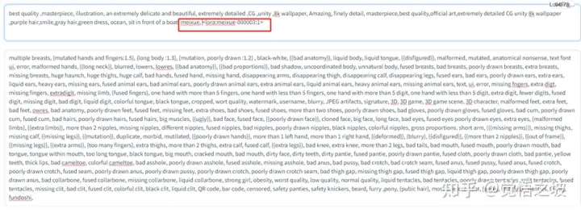

点了之后，看到prompt中，有<lora: meixue xxx:1>之类的文字，代表你要使用这个lora，再加上自己打上的tag “meixue”，然后generate生成。

你看，紫发圆脸的美雪就出来了。

她终于逃脱了次元牢笼里的小镇，穿上了漂亮的衣服，来到了海边玩耍，还交了很多新朋友~

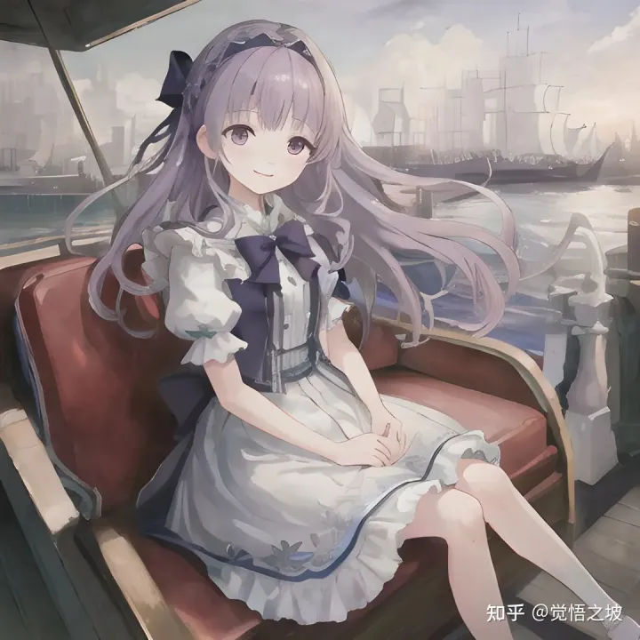

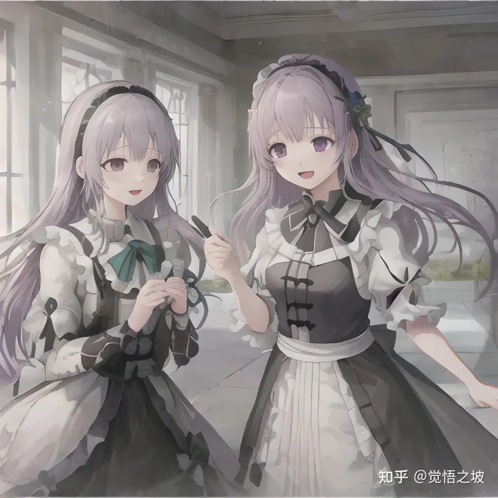

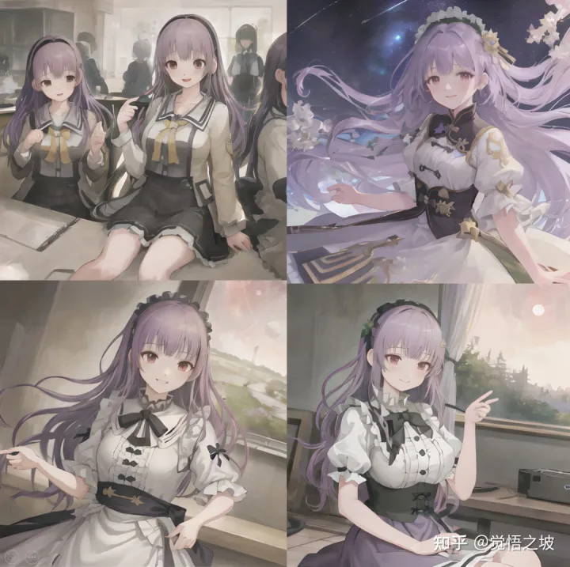

10.不断测试几个生成的safetensors文件，找到一两个你觉得拟合得最好的，然后保存。其他就可以删掉了。

一般来说，越往前的拟合越不好，越往后的越容易过拟合。

总之找到自己喜欢的，效果最好的就是了。

11.如果对于所有的训练结果不满意，还可以继续训练，调试train.ps1里面的一些参数。直到你满意为止。

调试之前记得先保存一个备份。否则后面容易忘了默认参数是什么。

（别问我怎么知道的）

* * *

好了，那么，今天的教程就先到这里吧。

这个lora训练很好玩的，天花板也很高，大家可以多调试着玩耍，我也试了好久写了好久。

如果觉得有用的话，记得点点关注，点点赞赏哦~

因为教程比较复杂，字比较多，图也比较多，大家要是还不会的，可以私我哈，不过不保证都能解决，但会尽力哈。


觉悟之坡

1 次咨询

5.0

2269 次赞同

去咨询

那么，我们今天的课就先到这里，下课！

<End>

* * *

参考内容：保姆式LoRA模型训练教程 一键包发布--秋叶

历史教程文集，请查看[AI绘画文章合集](https://link.zhihu.com/?target=http%3A//mp.weixin.qq.com/s%3F__biz%3DMzI2NTQ0MjY5Nw%3D%3D%26mid%3D2247485181%26idx%3D1%26sn%3D37f84b5a4dd7a35e83ffe1187ae88acb%26chksm%3Dea9c021bddeb8b0d2e8fdfa508ec4781de655d6eb5d4fb90e246a8ec066dd45b26cb91334473%26scene%3D21%23wechat_redirect)

关注我们，更多AI绘图技能知识持续更新中~