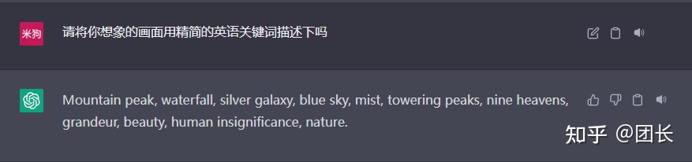
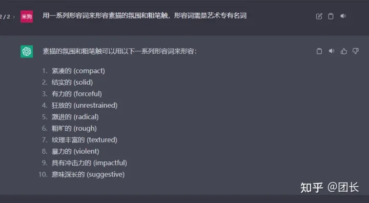
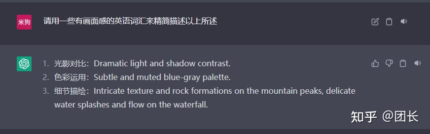
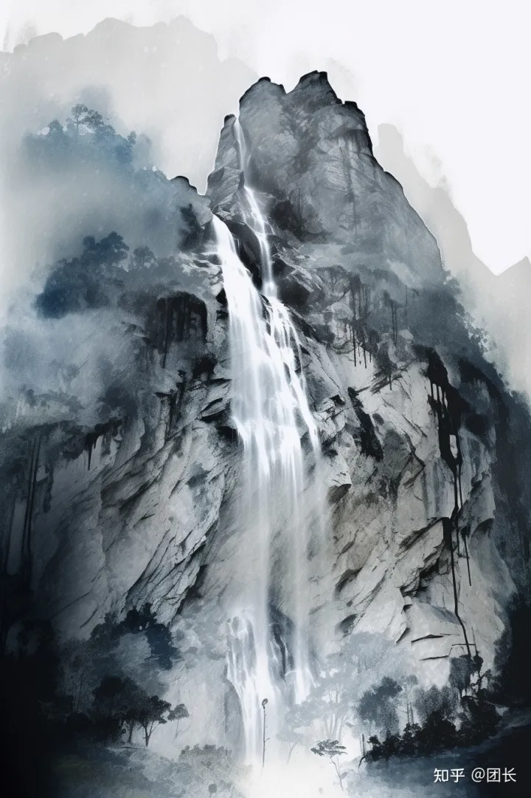
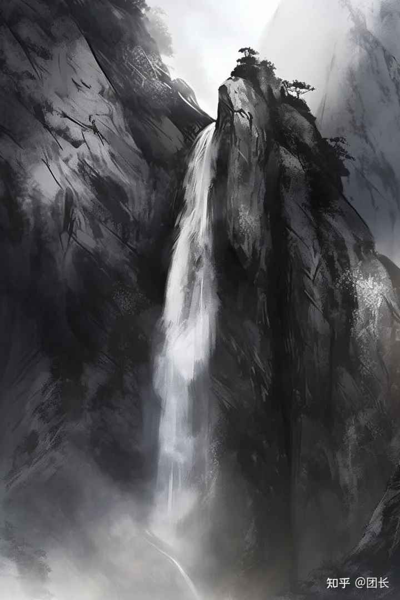
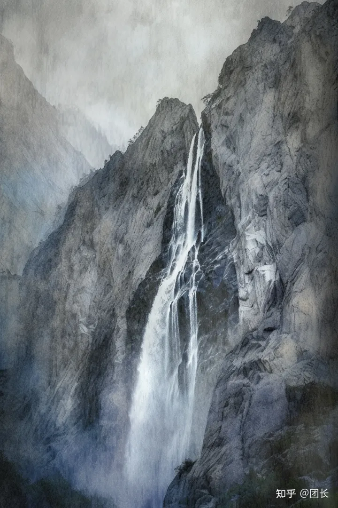

## **不难！**

我这里举个例子，尝试用ChatGPT和Midjourney协作来为古诗配图

首先要GPT帮我描述下“飞流直下三千尺，疑是[银河落九天](https://www.zhihu.com/search?q=%E9%93%B6%E6%B2%B3%E8%90%BD%E4%B9%9D%E5%A4%A9&search_source=Entity&hybrid_search_source=Entity&hybrid_search_extra=%7B%22sourceType%22%3A%22answer%22%2C%22sourceId%22%3A2953346524%7D)”的画面

李白？？？？？

画面是描述出来了，作者名和诗歌名依然一本正经的胡说八道

再要GPT提炼下关键词

提炼得不错，反正比我这种[战五渣](https://www.zhihu.com/search?q=%E6%88%98%E4%BA%94%E6%B8%A3&search_source=Entity&hybrid_search_source=Entity&hybrid_search_extra=%7B%22sourceType%22%3A%22answer%22%2C%22sourceId%22%3A2953346524%7D)好多了

继续问它

确定画面风格，GPT给出了两套方案，我觉得素描可能比油画和水彩更贴近画面的表现，所以我继续问它

给出不少关键词，都用小本本记录下，然后再深化下

比较有道理，最后要他汇总翻译下

我们最终得到了一系列的描述词

Mountain peak, [waterfall](https://www.zhihu.com/search?q=waterfall&search_source=Entity&hybrid_search_source=Entity&hybrid_search_extra=%7B%22sourceType%22%3A%22answer%22%2C%22sourceId%22%3A2953346524%7D), silver galaxy, mist, [towering peaks](https://www.zhihu.com/search?q=towering%20peaks&search_source=Entity&hybrid_search_source=Entity&hybrid_search_extra=%7B%22sourceType%22%3A%22answer%22%2C%22sourceId%22%3A2953346524%7D), nine heavens, [grandeur](https://www.zhihu.com/search?q=grandeur&search_source=Entity&hybrid_search_source=Entity&hybrid_search_extra=%7B%22sourceType%22%3A%22answer%22%2C%22sourceId%22%3A2953346524%7D), sketch, beauty, human insignificance, nature, sketch, compact, solid, forceful, rough, textured, violent, impactful,Dramatic light and shadow contrast, Subtle and muted blue-gray palette, Intricate texture and rock formations on the mountain peaks, delicate water splashes and flow on the waterfall. --v 5 --ar 2:3

画面主体描述部分有：Mountain peak, waterfall, silver galaxy, mist, towering peaks, nine heavens, grandeur,  
画面质量描述的部分有：sketch, beauty, human insignificance, nature, sketch, compact, solid, [forceful](https://www.zhihu.com/search?q=forceful&search_source=Entity&hybrid_search_source=Entity&hybrid_search_extra=%7B%22sourceType%22%3A%22answer%22%2C%22sourceId%22%3A2953346524%7D), rough, textured, violent,  
加强画面的描述语有：impactful,Dramatic light and shadow contrast, Subtle and muted blue-gray palette, Intricate texture and rock formations on the [mountain peaks](https://www.zhihu.com/search?q=mountain%20peaks&search_source=Entity&hybrid_search_source=Entity&hybrid_search_extra=%7B%22sourceType%22%3A%22answer%22%2C%22sourceId%22%3A2953346524%7D), delicate water splashes and flow on the waterfall.  
  
最终我们将描述语放到Midjourney，版本选择5.0，画面宽长比选择2:3

最终得到以下作品：

  
随着[语言模型](https://www.zhihu.com/search?q=%E8%AF%AD%E8%A8%80%E6%A8%A1%E5%9E%8B&search_source=Entity&hybrid_search_source=Entity&hybrid_search_extra=%7B%22sourceType%22%3A%22answer%22%2C%22sourceId%22%3A2953346524%7D)和绘图模型不断迭代，只会越来越容易，同时显得人类越来越无能（叹气）