之前两篇我只讲了二次元人物训练和简单说一下三次元人物训练，但是我发现很多人对画风、风格训练很感兴趣，可能大家都有喜欢的画家或者风格吧，这个需求比较大。我们这里用的是Lora，而不是最初的Dreambooth微调大模型，但是lora也是可以训练画风的，而且轻量。

首先说，画风训练可以说非常简单，但是又很难，我这里只简单用一个例子来说明怎么训练，但是好的画风非常难训练，需要大量精力堆数据。

开始前需要配置环境，请看下面篇来了解一下本训练的环境是什么：

[星云舰长：Stable Diffusion Lora训练定制角色（二次元向）479 赞同 · 50 评论文章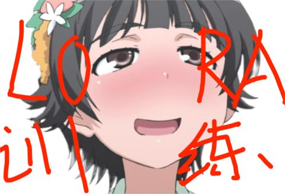](https://zhuanlan.zhihu.com/p/616500728)

## 数据集准备

首先我们要有数据集，这个是必然的。

需要说明一下，我今天中午在购物网站上找到一个别人整理好的图包下载下来了，也没有特别挑选，这个画家我之前并不认识，但是他的风格我感觉很有特色，很适合展示我们训练好的风格效果，所以选了这个画家的图包。（我晚上写这个文章时候才知道这个画家在c站被人做了相关的模型，效果很好的，不过我这里只是当作教程展示一下）

我选的画家是CHICHI，微博在这里，他的风格自行去微博看，很有特色的风格，因为版权问题我这里不发他的原图了。

[https://weibo.com/u/5748383382​weibo.com/u/5748383382](https://link.zhihu.com/?target=https%3A//weibo.com/u/5748383382)

然后我们找到一堆图，有人建议我直接去p站或者微博爬，我实在懒得去爬，大家想爬的自己去爬吧，只需要下载100张高质量图片即可。

我下载的图片非常混乱，有很多随手画的草图，可能那个人也是爬的卖给我了：

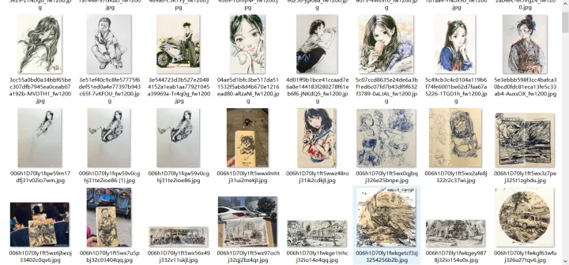

所以最重要的第一步就是洗数据，做画风非常重要一点就是，我们一定得知道画家都是人，是在成长的。每个画家不同阶段画的画都不一样的，它们的画风也不一样。我们要选我们最喜欢的画风，要手动选出来画风一致的图片，而不是一股脑全塞给网络，这很重要。更何况这个图包一堆爬的草图，必须清洗一遍。

清洗完我们扔给deepbooru打标，上一篇文章已经说了方法了。如果英语好的，可以直接BLIP打标。打标时候设置一下阈值在0.3左右，就是让打标器生成尽可能多的标签来描述画面（这点和人物不一样）。


如果是BLIP就需要手动添加一些说明，尽可能详细的描述画面。

不需要啥触发词，就这么把所有图片的标签全部写好，尽可能详细的描述画面，因为我们要让训练数据的画风覆盖住原本Base Model的画风，所以我们要把元素都标注出来。然后我们就得到一样的image和txt文本对：

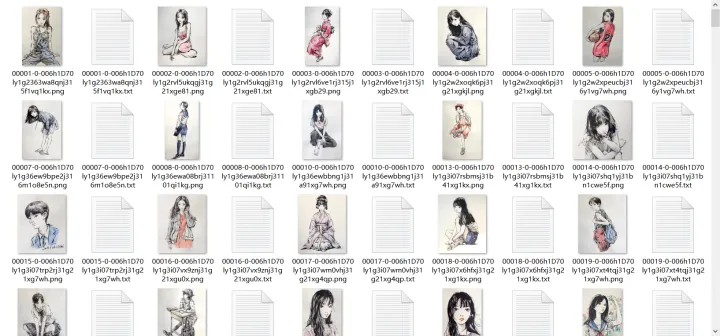

标签基本上都这样，我甚至都没删tags，理想情况下应该把打错的重复的都删除了：

```text
1girl, school_uniform, skirt, solo, serafuku, shoes, pleated_skirt, loafers, traditional_media, kneehighs, full_body, standing, blue_sailor_collar, long_sleeves, blue_skirt, sailor_collar, looking_at_viewer, black_footwear, shirt, black_hair, neckerchief, looking_back, socks, gradient, gradient_background, long_hair, blue_legwear, looking_to_the_side, black_legwear, watercolor_\(medium\), arms_at_sides, twintails, simple_background, painting_\(medium\)
```

## 训练

非常简单，我们可以把图片拿去训练了，比训练人物还直接。

这里做画风我建议Base model选原版的Stable Diffusion 1.5 2.1或者选Naifu（novelai那个），因为这两种都是最基础的源型了，其余的base都是后来微调融合出来的，它们风格不可控的，最好我们排除这些干扰选最早的这两种模型。如果是人物的话，就很多后来融合的模型也能用，效果也挺不错的，但是画风会有些意想不到的情况。

我这里参数如下：

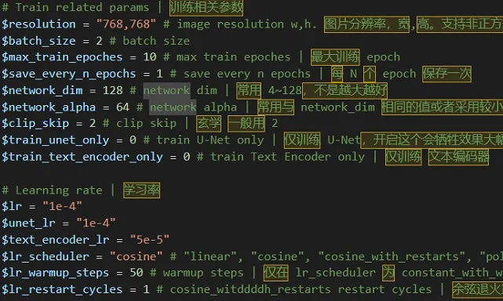

都是随便设置的，一把出了这个模型，repeats我设置的是5，每个文件夹有200多张图。

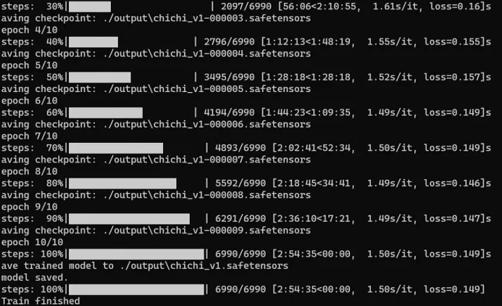

## 测试效果

实在没啥可说的，画风这东西只要别过拟合，其实都还行。判断画风过拟合了没，请看你测试的图是不是很丑，如果很丑就是过拟合了，因为base model想出很丑的人物挺难的。

不像原画师风格可能更好了，我们自己融模型可以玩新的风格。

我感觉我这次训练很一般，距离CHICHI的原作差的很远，所以训练画风真的要多试参数，我这参数只能说仅仅做到没过拟合而已。

Base model: Anything 4.5

Prompts非常简单，没有加画风的prompts，原本anything4.5啥风格可以自己去试试。

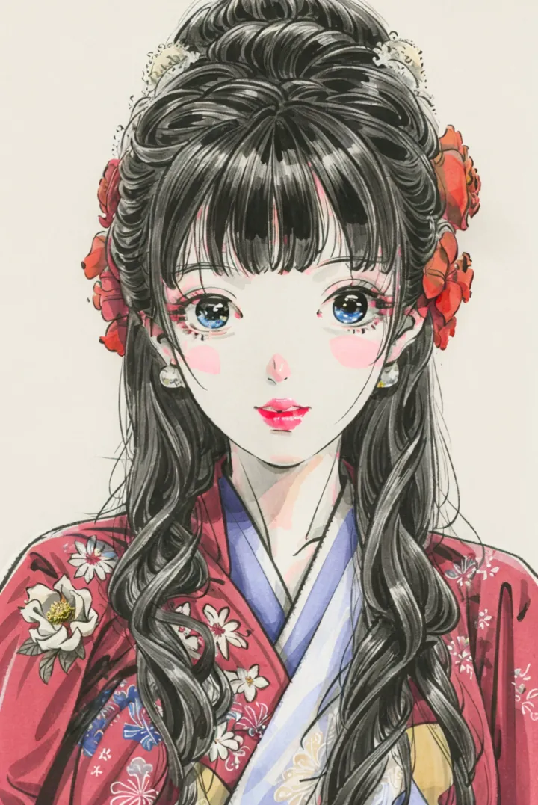

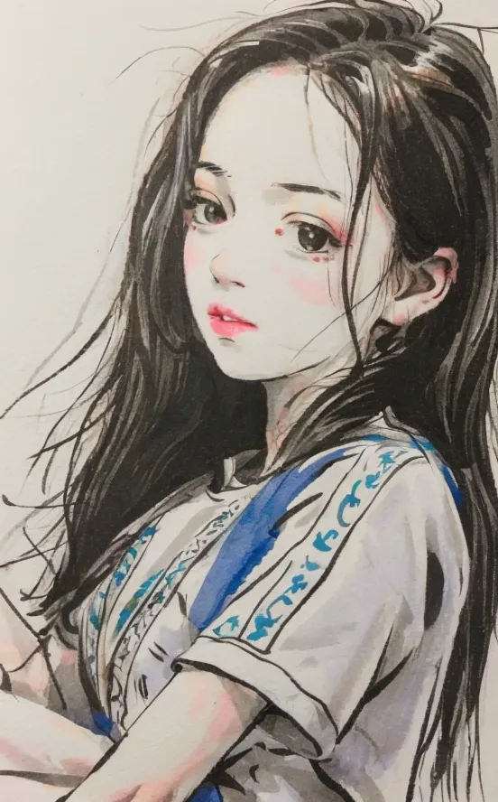

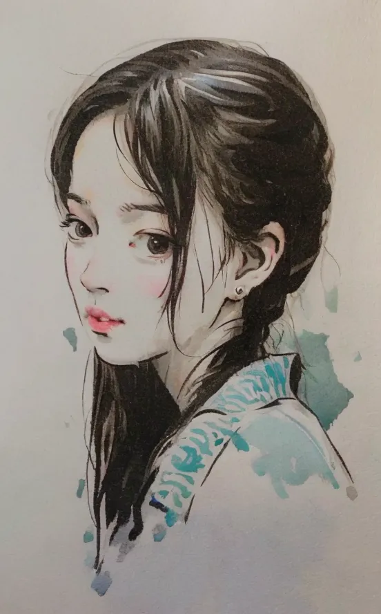

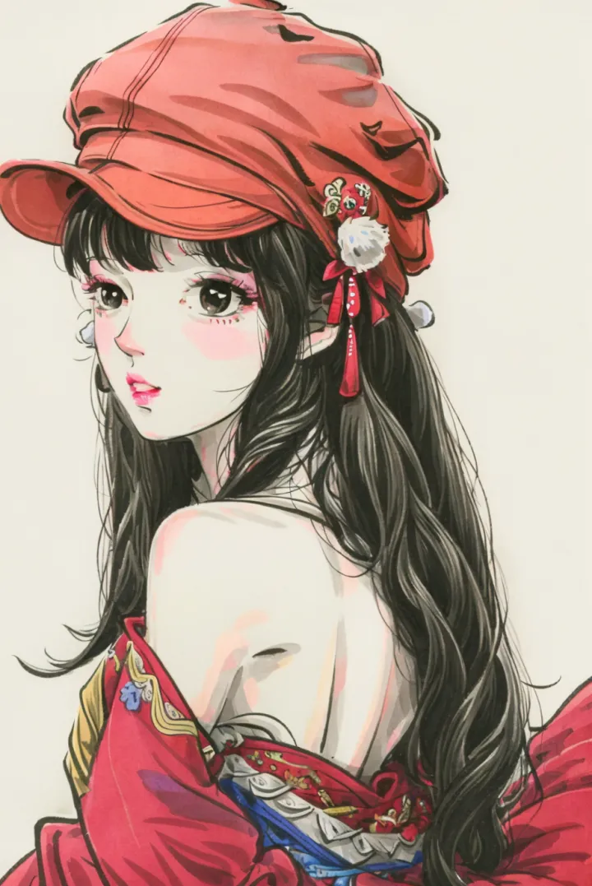

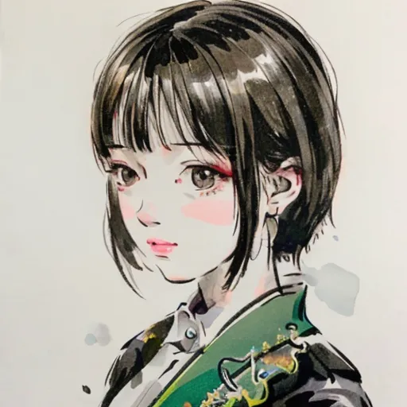

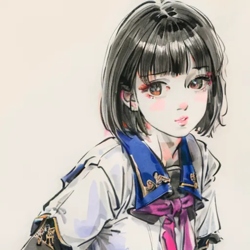

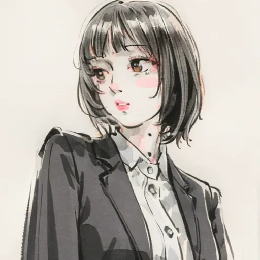

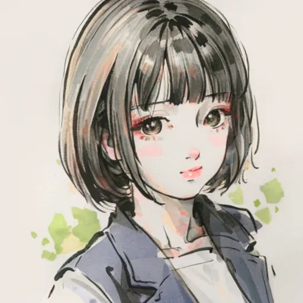

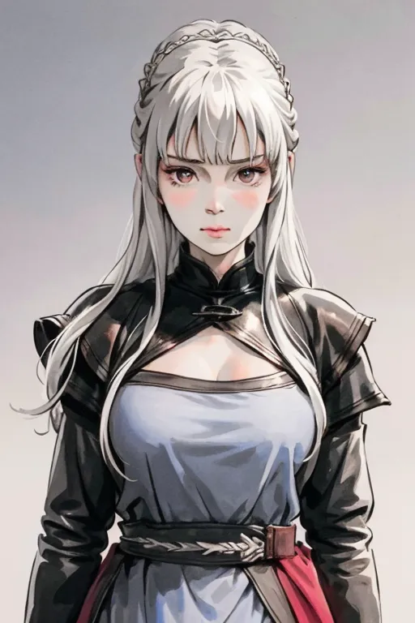

这个设成0.5weight，所以倾向于一些anything的风格

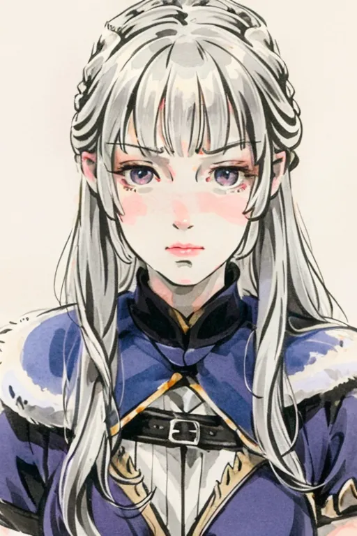

这个就是0.9了

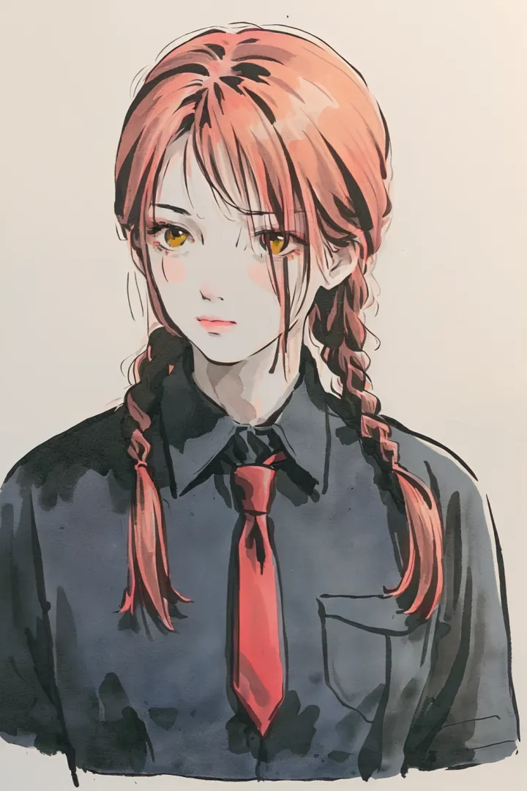

最后说一下为啥画风很难，这主要是因为好的风格就是很难，好的风格应该能在各种base上都有正面效果，并且出的图大部分都应该好看，可以很容易写一些prompts就出来好看的图。这种好的画风模型才会传播出去。

另外就是风格模型可以融合再微调的，可以用生成的图迭代的，所以玩法非常多e1。制作好的风格模型非常累，主要是高质量的数据，还有漫长的训练测试时间。我这里就是简单说一下怎么训练的，本质做法非常简单直接。