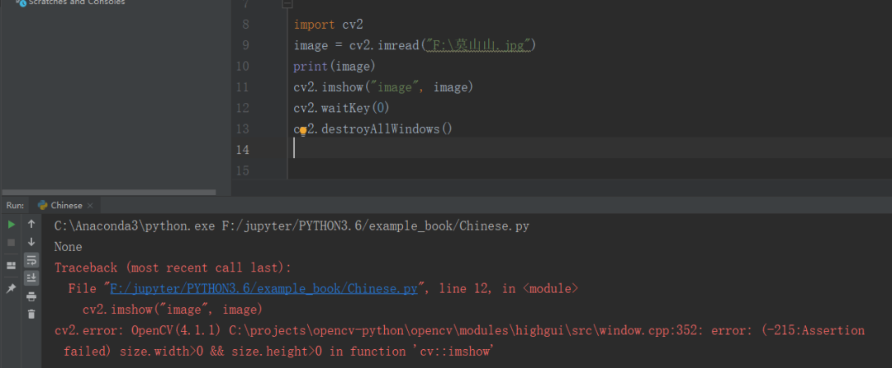
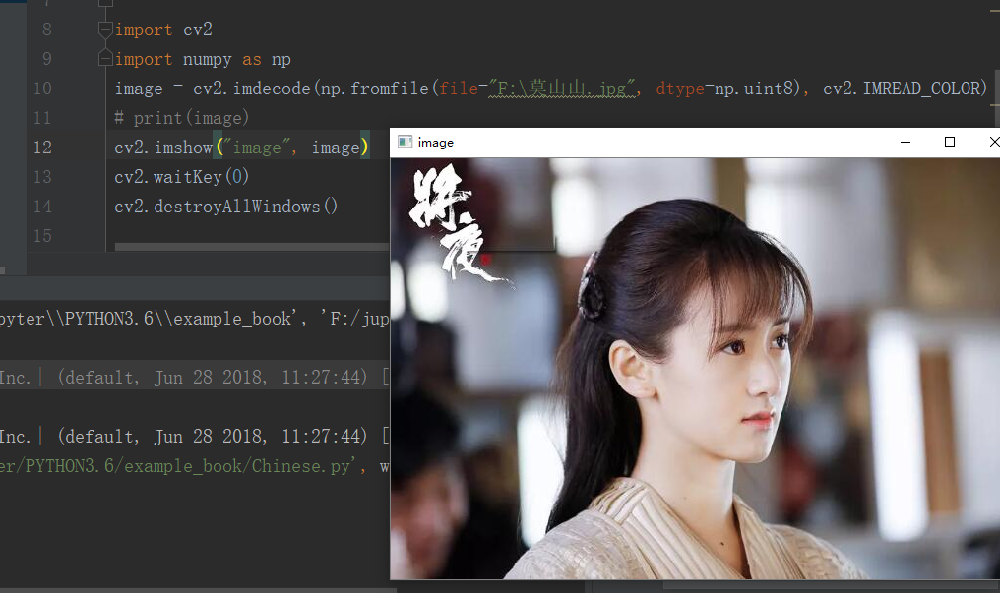
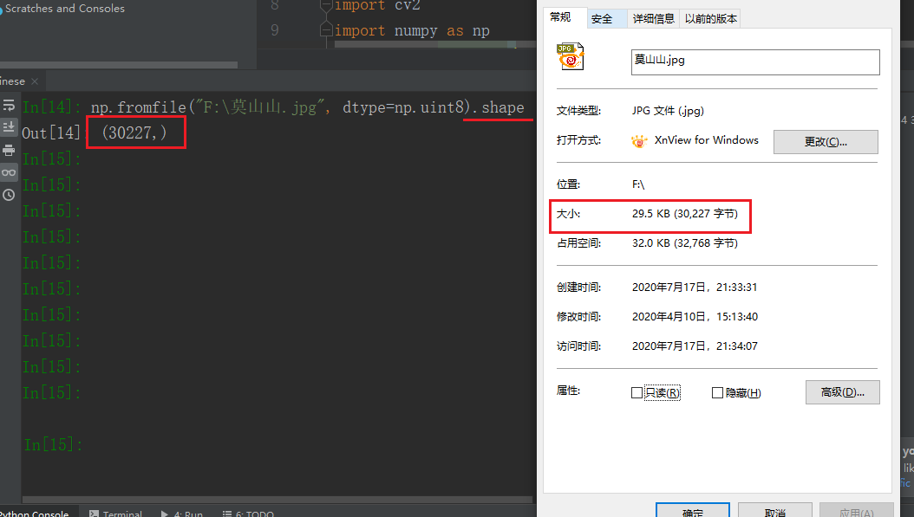
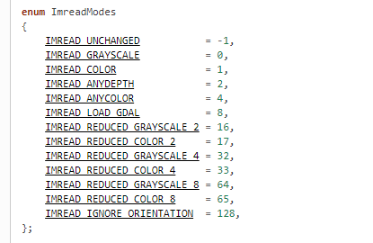
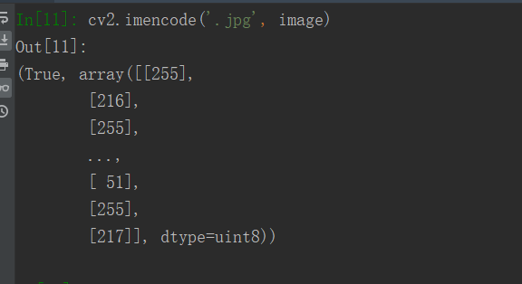
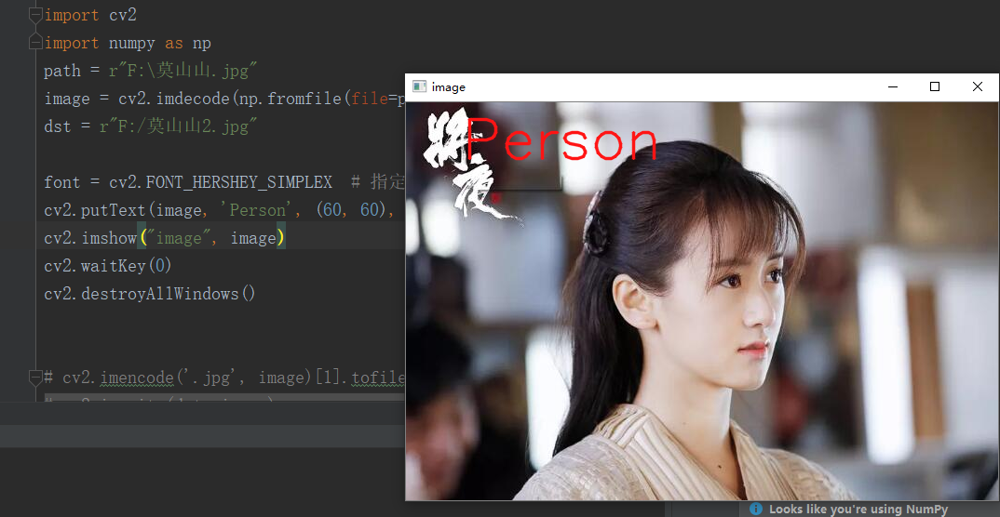
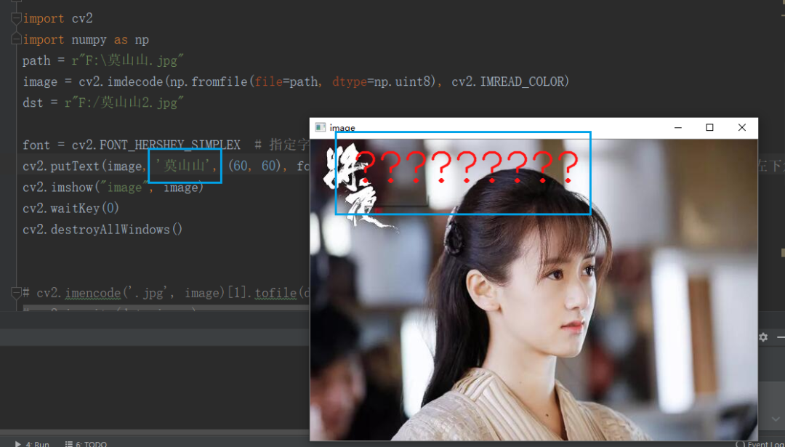

发布于2020-07-23 11:32:15阅读 3.9K0

在 OpenCV 中，由于编码的缘故，对于中文的处理并不是很友好，比如中文路径的图片读取和写入以及在图片上绘制中文文字等，这几个问题都是笔者经常遇到的，本文列出这几个问题的解决办法，希望能够帮助到大家。

### **读取中文路径的图片**

首先是中文路径的读取

一般我们使用 `cv2.imread` 进行图片的读取，但是一遇到中文，就会出现错误，如下：

```javascript
import cv2image = cv2.imread("F:\莫山山.jpg")print(image)cv2.imshow("image", image)cv2.waitKey(0)cv2.destroyAllWindows()
```



解决的方法如下：我们借助 `np.fromfile` 和 `cv2.imdecode` 来实现中文路径的读取

```javascript
import cv2import numpy as npimage = cv2.imdecode(np.fromfile(file="F:\莫山山.jpg", dtype=np.uint8), cv2.IMREAD_COLOR)# print(image)cv2.imshow("image", image)cv2.waitKey(0)cv2.destroyAllWindows()
```



其中 `np.fromfile` 代表的含义是**从文本或者二进制文件构造 array，参数：file 是文件名，参数 dtype 是数据类型，因为是图像，所以我们使用 np.uint8 格式其中 np.fromfile 有个 shape 属性，其值是文件的字节数**



`cv2.imdecode` 的含义是从内存中的指定缓冲区读取图像，参数：buf 就是数据缓存了，即上面 np.fromfile 得到的内容，参数：flag 见下图，即读取什么样的图片 (彩色、灰度等)



参考：https://vovkos.github.io/doxyrest-showcase/opencv/sphinx\_rtd\_theme/enum\_cv\_ImreadModes.html

### **保存中文路径的图片**

既然有读取，那就有写入中文路径图片的需求 通常我们使用的是 `cv2.imwrite` 保存图片，但是遇见中文路径时，就会出现编码错误或者保存失败（我在不同的电脑上进行过测试，如果保存成功了，得到的文件名会是乱码）。

```javascript
import cv2import numpy as nppath = "F:/莫山山.jpg"image = cv2.imdecode(np.fromfile(file=path, dtype=np.uint8), cv2.IMREAD_COLOR)cv2.imwrite("F:/莫山山2.jpg", image)
```

解决方法如下：上面我们读取用的是 `imdecode` 那么写入自然是 `imencode` 了

```javascript
import cv2import numpy as nppath = r"F:\莫山山.jpg"image = cv2.imdecode(np.fromfile(file=path, dtype=np.uint8), cv2.IMREAD_COLOR)dst = r"F:/莫山山2.jpg"cv2.imencode(ext='.jpg', img=image)[1].tofile(dst)
```

**`cv2.imencode` 中的参数：ext 是图片的扩展名，参数：img 就是 array 矩阵了。单独运行 `cv2.imencode('.jpg', image)` 得到的是一个元组（2 部分，第二部分才是 array），所以上面程序中有一个取 \[1\] 的操作**



### **在图像中绘制中文文字**

OpenCV 处理中另外一个中文会出现问题是在图上绘制中文文字，要想在图片上绘制文字，我们一般使用的是 `cv2.putText()` 函数，一个示例如下：

```javascript
import cv2import numpy as nppath = r"F:\莫山山.jpg"image = cv2.imdecode(np.fromfile(file=path, dtype=np.uint8), cv2.IMREAD_COLOR)dst = r"F:/莫山山2.jpg"font = cv2.FONT_HERSHEY_SIMPLEX  # 指定字体cv2.putText(image, 'Person', (60, 60), font, 2, (20, 20, 255), 2, cv2.LINE_AA)  # 绘制的图像，文字，文字左下角的坐标,字体，字体颜色，厚度等cv2.imshow("image", image)cv2.waitKey(0)cv2.destroyAllWindows()
```

绘制英文文字一般没什么问题



但是一到绘制中文文字时，**小朋友你是否会有很多问号？？？？？**



OpenCV 内置的函数不能帮助我们解决这个问题，我们需要借助另外一个库 PIL（pillow） 不过实现起来会稍微有点麻烦。

```javascript
import cv2from PIL import Image, ImageDraw, ImageFontimport numpy as nppath = r"F:\莫山山.jpg"image = cv2.imdecode(np.fromfile(file=path, dtype=np.uint8), cv2.IMREAD_COLOR)font = ImageFont.truetype('STZHONGS.TTF', 40)  # 字体设置，Windows系统可以在 "C:\Windows\Fonts" 下查找img_PIL = Image.fromarray(image[..., ::-1])  # 转成 PIL 格式draw = ImageDraw.Draw(img_PIL)  # 创建绘制对象draw.text(xy=(60, 60), text="莫山山", font=font, fill=(255, 0, 0))image = cv2.cvtColor(np.asarray(img_PIL), cv2.COLOR_RGB2BGR)  # 再转成 OpenCV 的格式，记住 OpenCV 中通道排布是 BGRcv2.imshow("image", image)cv2.waitKey(0)cv2.destroyAllWindows()
```
