# 前言

Selector 选择器，也就是通常说的元素定位了，页面上点点点的操作，都是基于元素定位，所以这块是重点需要学的核心内容。

# Selector 选择器

说到元素定位，大家肯定会首先想到 selenium 的八大元素定位，其中xpath 和 css才是最主要的。  
playwright 可以通过 `CSS selector`, `XPath selector`, `HTML 属性（比如 id, data-test-id`）或者是 `text 文本内容`定位元素。  
除了xpath selector外，所有selector默认都是指向shadow DOM，如果要指向常规DOM，可使用\*:light。不过通常不需要。

操作元素，可以先定位再操作

```bash
   # 先定位再操作
    page.locator('#kw').fill("上海悠悠")
    page.locator('#su').click()
```

也可以直接调用fill 和 click 方法，传Selector选择器

```bash
page.fill('#kw', "上海-悠悠博客")
page.click('#su')
```

一般推荐下面的这种方式

# CSS 或 XPath 选择器

可以使用xpath 和 css 元素

```bash
# CSS and XPath
page.fill('css=#kw', "上海-悠悠博客")
page.click('xpath=//*[@id="su"]')
```

或者可以直接写xpath和css语法，不需要前面的前缀`css=` 和 `xpath=`, 它会自动判断你写的是css还是xpath语法，前提是你语法没有错误。

```bash
page.fill('#kw', "上海-悠悠博客")
page.click('//*[@id="su"]')
```

XPath 和 CSS 选择器可以绑定到 DOM 结构或实现。  
当 DOM 结构发生变化时，这些选择器可能会中断。下面的长 CSS 或 XPath 链是导致测试不稳定的**不良做法的示例**：

```bash
page.click("#tsf > div:nth-child(2) > div.A8SBwf > div.RNNXgb > div > div.a4bIc > input")
page.click('//*[@id="tsf"]/div[2]/div[1]/div[1]/div/div[2]/input')
```

# text 文本选择器

文本选择器是一个非常实用的定位方式，根据页面上看到的text文本就可以定位了，比如我们经常使用xpath 的文本选择器定位

*   完全匹配文本 `//*[text()="上海悠悠"]`
*   包含某个文本 `//*[contains(text(),"上海悠悠")]`

playwright 封装了text文本定位的方式，也可以支持2种文本定位方式

```bash
page.click("text=yo yo")
page.click("text='YO YO'")
```

`text=yo yo` 和 `text='YO YO'` 的区别：

*   text=yo yo 没有加引号（单引号或者双引号），模糊匹配，对大小写不敏感
*   text='YO YO' 有引号，精确匹配，对大小写敏感

使用示例,比如点击百度上的“新闻” 文本  
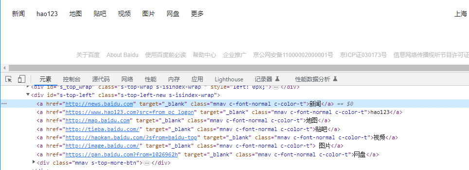

```css
from playwright.sync_api import sync_playwright
# 上海悠悠 wx:283340479  
# blog:https://www.cnblogs.com/yoyoketang/


with sync_playwright() as p:
    browser = p.chromium.launch(headless=False, slow_mo=1000)
    page = browser.new_page()
    page.goto("https://www.baidu.com")
    print(page.title())
    page.click('text=新闻')
    page.wait_for_timeout(5000)
    browser.close()
```

text 文本除了可以定位 a 标签，还可以定位 button 按钮

input 标签的button 按钮，有`value="百度一下"` 文本值

```lua
<input type=button value="百度一下">
```

或者是button 标签的按钮

```css
<button>百度一下</button>
```

使用示例:定位百度的搜索按钮  
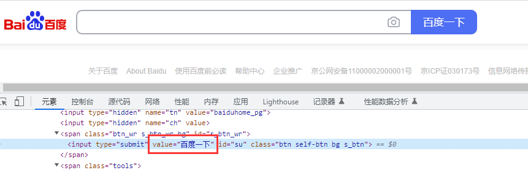

```css
from playwright.sync_api import sync_playwright
# 上海悠悠 wx:283340479  
# blog:https://www.cnblogs.com/yoyoketang/


with sync_playwright() as p:
    browser = p.chromium.launch(headless=False, slow_mo=1000)
    page = browser.new_page()
    page.goto("https://www.baidu.com")
    print(page.title())
    page.fill("#kw", "上海-悠悠")
    page.click('text=百度一下')
    page.wait_for_timeout(5000)
    browser.close()
```

HTML 属性选择器, 根据html元素的id 定位

```bash
page.fill("id=kw", "上海-悠悠")
```

# Selector 选择器组合定位

查找目标元素  
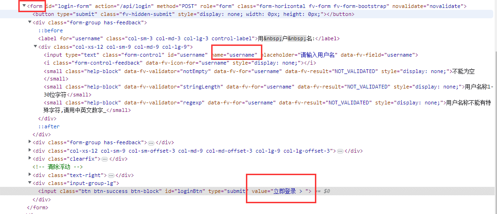

不同的selector可组合使用，用`>>`连接

```bash
    # id 属性+ css
    page.fill('form >> [name="username"]', "yoyo")
    page.fill('form >> #password', "aa123456")
    page.click("text=立即登录")
```

`form >> [name="username"]` 定位方式等价于

```objectivec
    # page.fill('form >> [name="username"]', "yoyo")
    page.locator("form").locator('[name="username"]').fill("yoyo")
```

相当于是根据父元素找到子元素了

登录按钮的值是`value="立即登录 > "`,可以用text文本定位的方式，模糊匹配到，这个人性化的设计提高了定位的效率。

```python
<input class="btn btn-success btn-block" id="loginBtn" type="submit" value="立即登录 > ">
```

# 内置定位器

这些是 playwright 推荐的内置定位器。

*   page.get\_by\_role()通过显式和隐式可访问性属性进行定位。
*   page.get\_by\_text()通过文本内容定位。
*   page.get\_by\_label()通过关联标签的文本定位表单控件。
*   page.get\_by\_placeholder()按占位符定位输入。
*   page.get\_by\_alt\_text()通过替代文本定位元素，通常是图像。
*   page.get\_by\_title()通过标题属性定位元素。
*   page.get\_by\_test\_id()根据data-testid属性定位元素（可以配置其他属性）。

使用示例

```scss
page.get_by_label("User Name").fill("John")
page.get_by_label("Password").fill("secret-password")
page.get_by_role("button", name="Sign in").click()
expect(page.get_by_text("Welcome, John!")).to_be_visible()
```

### 角色定位 page.get\_by\_role()

Playwright 带有多个内置定位器。为了使测试具有弹性，我们建议优先考虑面向用户的属性和显式契约，例如page.get\_by\_role()。  
例如，考虑以下 DOM 结构。

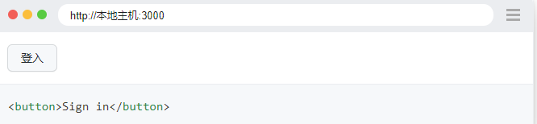

button通过名称为“登录”的角色定位元素。

```bash
page.get_by_role("button", name="Sign in").click()
```

每次将定位器用于操作时，都会在页面中找到一个最新的 DOM 元素。在下面的代码片段中，底层 DOM 元素将被定位两次，一次在每个动作之前。这意味着如果 DOM 由于重新渲染而在调用之间发生变化，则将使用与定位器对应的新元素。

```makefile
locator = page.get_by_role("button", name="Sign in")

locator.hover()
locator.click()
```

请注意，所有创建定位器的方法（例如page.get\_by\_label() ）也可用于Locator和FrameLocator类，因此您可以将它们链接起来并迭代地缩小定位器的范围。

```makefile
locator = page.frame_locator("my-frame").get_by_role("button", name="Sign in")

locator.click()
```

page.get\_by\_role ()定位器反映了用户和辅助技术如何感知页面，例如某个元素是按钮还是复选框。按角色定位时，通常还应传递可访问的名称，以便定位器准确定位元素。

例如，考虑以下 DOM 结构。  
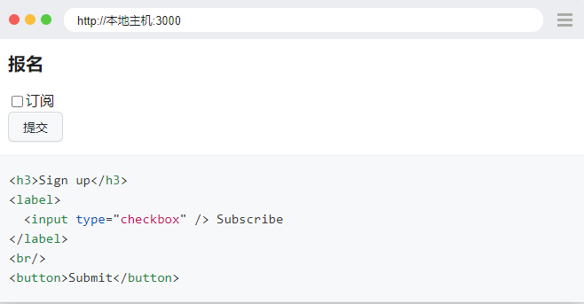

您可以通过其隐含角色定位每个元素：

```erlang
expect(page.get_by_role("heading", name="Sign up")).to_be_visible()

page.get_by_role("checkbox", name="Subscribe").check()

page.get_by_role("button", name=re.compile("submit", re.IGNORECASE)).click()
```

角色定位器包括按钮、复选框、标题、链接、列表、表格等，并遵循ARIA 角色、ARIA 属性和可访问名称的 W3C 规范。  
请注意，许多 `html` 元素`<button>`都有一个隐式定义的角色，该角色可被角色定位器识别。

请注意，角色定位器不会取代可访问性审核和一致性测试，而是提供有关 ARIA 指南的早期反馈。

> 何时使用角色定位器  
> 我们建议优先使用角色定位器来定位元素，因为这是最接近用户和辅助技术感知页面的方式。

### 输入框标签 page.get\_by\_label()

大多数表单控件通常都有专用标签，可以方便地用于与表单交互。在这种情况下，您可以使用page.get\_by\_label()通过其关联标签定位控件。  
例如，考虑以下 DOM 结构。  
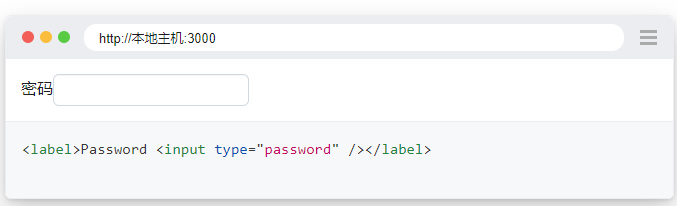

您可以在通过标签文本定位后填写输入：

```bash
page.get_by_label("Password").fill("secret")
```

输入可能有一个占位符属性来提示用户应该输入什么值。您可以使用page.get\_by\_placeholder()找到这样的输入。

### 输入框 page.get\_by\_placeholder()

例如，考虑以下 DOM 结构。

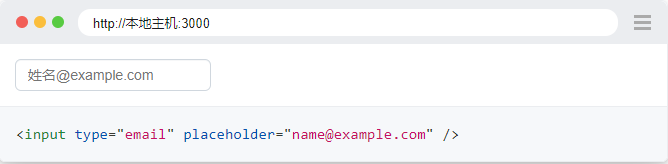  
您可以在通过占位符文本定位后填充输入：

```perl
page.get_by_placeholder("name@example.com").fill("playwright@microsoft.com")
```

### 包含的文本 page.get\_by\_text()

根据元素包含的文本查找元素。使用page.get\_by\_text()时，您可以通过子字符串、精确字符串或正则表达式进行匹配。

例如，考虑以下 DOM 结构。  
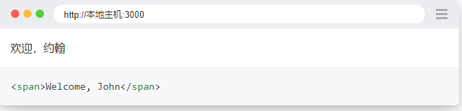

```scss
expect(page.get_by_text("Welcome, John")).to_be_visible()
```

设置精确匹配：

```scss
expect(page.get_by_text("Welcome, John", exact=True)).to_be_visible()
```

与正则表达式匹配：

```scss
expect(page
    .get_by_text(re.compile("welcome, john", re.IGNORECASE)))
    .to_be_visible()
```

> 笔记  
> 按文本匹配总是规范化空白，即使是完全匹配。例如，它将多个空格变成一个，将换行符变成空格并忽略前导和尾随空格

我们建议使用文本定位器来查找非交互式元素，如div, span, p 等。对于交互式元素，如请button, a, input, 使用角色定位器.

### 包含的文本 page.get\_by\_text()

所有图像都应该有一个alt描述图像的属性。您可以使用page.get\_by\_alt\_text()根据替代文本定位图像。

例如，考虑以下 DOM 结构。  
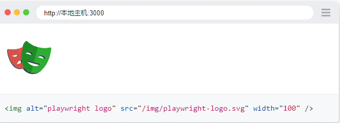

可以在通过文本选项找到图像后单击它：

```scss
page.get_by_alt_text("playwright logo").click()
```

当您的元素支持替代文本（例如img和area元素）时使用此定位器。

### title 属性 page.get\_by\_title()

使用page.get\_by\_title()找到具有匹配 title 属性的元素。

例如，考虑以下 DOM 结构。  
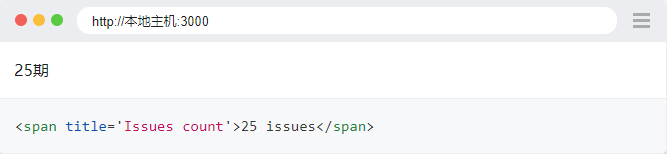

您可以在通过标题文本找到它后检查问题数：

```erlang
expect(page.get_by_title("Issues count")).to_have_text("25 issues")
```

当您的元素具有该title属性时使用此定位器。

### 测试 ID page.get\_by\_test\_id()

通过测试 ID 进行测试是最具弹性的测试方式，因为即使您的文本或属性角色发生变化，测试仍会通过。QA 和开发人员应该定义明确的测试 ID 并使用page.get\_by\_test\_id()查询它们。但是，通过测试 ID 进行的测试不是面向用户的。如果角色或文本值对您很重要，那么请考虑使用面向用户的定位器，例如角色定位器和文本定位器。

例如，考虑以下 DOM 结构。  
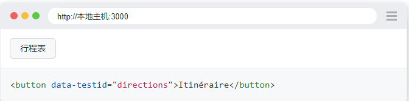

您可以通过它的测试 ID 找到该元素：

```scss
page.get_by_test_id("directions").click()
```

设置自定义测试 id  
默认情况下，page.get\_by\_test\_id()将根据data-testid属性定位元素，但您可以在测试配置中或通过调用selectors.set\_test\_id\_attribute()对其进行配置。

设置测试 ID 以使用自定义数据属性进行测试。

```bash
playwright.selectors.set_test_id_attribute("data-pw")
```

在您的 html 中，您现在可以使用data-pwtest id 而不是 default data-testid。  
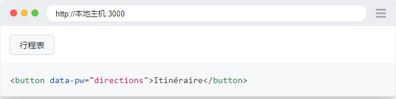

然后像往常一样定位元素：

```scss
page.get_by_test_id("directions").click()
```

Playwright 提供了一些非常实用的定位方式，也是大家在工作中经常会用到的，比如text文本定位，label 和 placeholder 都是非常实用的定位方式。  
  


