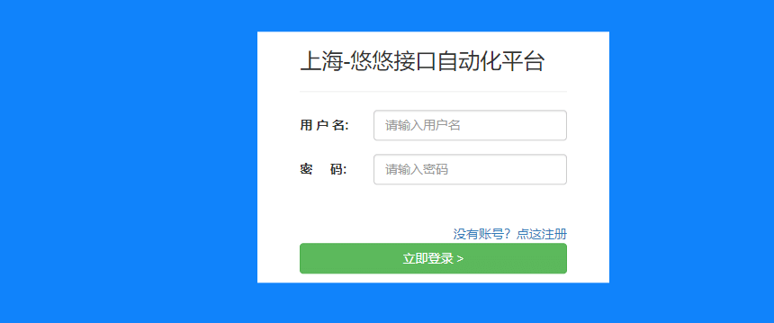

# 前言

Playwright 可以与 HTML 输入元素交互，例如文本输入、复选框、单选按钮、选择选项、鼠标单击、键入字符、键和快捷方式以及上传文件和焦点元素。

# fill() 输入文字

使用 `locator.fill()` 是填写表单字段的最简单方法。它聚焦元素并input使用输入的文本触发事件。它适用于`<input>`,`<textarea>`和`[contenteditable]`元素。

同步示例

```bash
# Text 文本框输入
page.get_by_role("textbox").fill("Peter")

# 根据label 定位 Date 日期输入
page.get_by_label("Birth date").fill("2020-02-02")

# Time input
page.get_by_label("Appointment time").fill("13:15")

# Local datetime input
page.get_by_label("Local time").fill("2020-03-02T05:15")
```

异步示例

```csharp
# Text input
await page.get_by_role("textbox").fill("Peter")

# Date input
await page.get_by_label("Birth date").fill("2020-02-02")

# Time input
await page.get_by_label("Appointment time").fill("13:15")

# Local datetime input
await page.get_by_label("Local time").fill("2020-03-02T05:15")
```

以下登录框示例, 在不查看元素属性的情况下，可以直接根据输入框的label 标签定位，非常的方便  


```bash
# 直接根据label定位
    page.get_by_label("用 户 名:").fill("yoyo")
    page.get_by_label("密     码:").fill("aa123456")
```

# Type 输入

一个字符一个字符地输入字段，就好像它是一个使用locator.type()的真实键盘的用户。

```haskell
# Type character by character
page.locator('#area').type('Hello World!')
```

此方法将发出所有必要的键盘事件，所有keydown, keyup,keypress事件就位。您甚至可以指定delay按键之间的可选操作来模拟真实的用户行为。  
**大多数时候，page.fill()会正常工作。如果页面上有特殊的键盘处理，您只需要键入字符。**

# 鼠标点击 click()

执行简单的人工点击。

```bash
# Generic click
page.get_by_role("button").click()

# Double click
page.get_by_text("Item").dblclick()

# Right click
page.get_by_text("Item").click(button="right")

# Shift + click
page.get_by_text("Item").click(modifiers=["Shift"])

# Hover over element
page.get_by_text("Item").hover()

# Click the top left corner
page.get_by_text("Item").click(position={ "x": 0, "y": 0})
```

在幕后，这个和其他与指针相关的方法：

*   等待具有给定选择器的元素出现在 DOM 中 （**不用自己去写轮询等待了**）
*   等待它显示出来，即不为空，不display:none，不visibility:hidden （**这个太人性化了，不用去判断元素是否隐藏**）
*   等待它停止移动，例如，直到 css 转换完成
*   将元素滚动到视图中 （**这个太人性化了，不用自己去滚动了**）
*   等待它在动作点接收指针事件，例如，等待直到元素变得不被其他元素遮挡
*   如果元素在上述任何检查期间分离，则重试

**由此可见，click() 方法优化了selenium 点击元素的遇到的一些痛点问题，比如元素遮挡，不在当前屏幕，元素未出现在DOM中或隐藏不可见等不可点击的状态。**

使用示例

```cpp
    page.get_by_label("用 户 名:").fill("yoyo")
    page.get_by_label("密     码:").fill("aa123456")
    page.locator("text=立即登录").click()
    # page.click("text=立即登录")
```

# 文件上传

您可以使用locator.set\_input\_files()方法选择要上传的输入文件。  
它期望第一个参数指向类型为 的输入元素"file"。数组中可以传递多个文件。  
如果某些文件路径是相对的，则它们将相对于当前工作目录进行解析。空数组清除所选文件。

```bash
# Select one file
page.get_by_label("Upload file").set_input_files('myfile.pdf')

# Select multiple files
page.get_by_label("Upload files").set_input_files(['file1.txt', 'file2.txt'])

# Remove all the selected files
page.get_by_label("Upload file").set_input_files([])

# Upload buffer from memory
page.get_by_label("Upload file").set_input_files(
    files=[
        {"name": "test.txt", "mimeType": "text/plain", "buffer": b"this is a test"}
    ],
)
```

如果当前没有输入元素（它是动态创建的），您可以处理page.on("filechooser")事件或在您的操作中使用相应的等待方法：

```css
with page.expect_file_chooser() as fc_info:
    page.get_by_label("Upload file").click()
file_chooser = fc_info.value
file_chooser.set_files("myfile.pdf")
```

# select 下拉框

`<select>`使用locator.select\_option()选择元素中的一个或多个选项。您可以指定选项value，或label选择。可以选择多个选项。

```dockerfile
# Single selection matching the value
page.get_by_label('Choose a color').select_option('blue')

# Single selection matching the label
page.get_by_label('Choose a color').select_option(label='Blue')

# Multiple selected items
page.get_by_label('Choose multiple colors').select_option(['red', 'green', 'blue'])
```

# 复选框和单选

使用`locator.set_checked()`是选中和取消选中复选框或单选按钮的最简单方法。`input[type=checkbox]`此方法可与,`input[type=radio]`和元素一起使用`[role=checkbox]`。

```python
# Check the checkbox
page.get_by_label('I agree to the terms above').check()

# Assert the checked state
assert page.get_by_label('Subscribe to newsletter').is_checked() is True

# Select the radio button
page.get_by_label('XL').check()
```

# focus()聚焦给定元素

对于处理焦点事件的动态页面，您可以使用`locator.focus()`聚焦给定元素。

```scss
page.get_by_label('password').focus()
```

# drag\_to 拖动

您可以使用`locator.drag_to()`执行拖放操作。此方法将：

*   将鼠标悬停在要拖动的元素上。
*   按鼠标左键。
*   将鼠标移动到将接收放置的元素。
*   松开鼠标左键。

```bash
page.locator("#item-to-be-dragged").drag_to(page.locator("#item-to-drop-at"))
```

如果您想精确控制拖动操作，请使用较低级别的方法，如`locator.hover()`、`mouse.down()`、`mouse.move()`和`mouse.up()`。

```scss
page.locator("#item-to-be-dragged").hover()
page.mouse.down()
page.locator("#item-to-drop-at").hover()
page.mouse.up()
```

如果您的页面依赖于dragover正在调度的事件，则您至少需要移动两次鼠标才能在所有浏览器中触发它。要可靠地发出第二次鼠标移动，请重复mouse.move()或locator.hover()两次。操作顺序是：悬停拖动元素，鼠标向下，悬停放置元素，第二次悬停放置元素，鼠标向上。  
  


