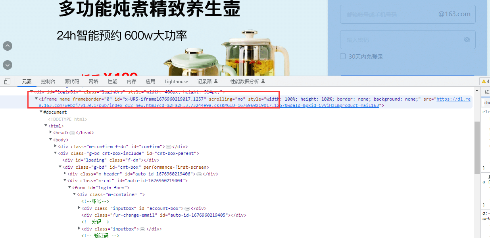

# 前言

iframe 是web自动化里面一个比较头疼的场景，在Selenium中处理 iframe 需要切换来切换去非常麻烦。  
在playwright中，让其变得非常简单，我们在使用中无需切换iframe，直接定位元素即可。

# iframe 定位

可以使用page.frame\_locator()或locator.frame\_locator()方法创建 FrameLocator 捕获足该 iframe 中检索和定位元素。

使用示例一：

```makefile
locator = page.frame_locator("my-frame").get_by_text("Submit")
locator.click()
```

使用frame\_locator() 定位到iframe上，然后继续在上面使用locator方法定位元素

iframe 定位器是严格的。这意味着如果有多个元素与给定的选择器匹配，则对 iframe 定位器的所有操作都会抛出异常。

```bash
# Throws if there are several frames in DOM:
page.frame_locator('.result-frame').get_by_role('button').click()

# Works because we explicitly tell locator to pick the first frame:
page.frame_locator('.result-frame').first.get_by_role('button').click()
```

以下代码段在带有 id 的 iframe 中定位带有文本“提交”的元素my-frame，例如`<iframe id="my-frame">`：

```makefile
locator = frame.frame_locator("#my-iframe").get_by_text("Submit")
locator.click()
```

以163 邮箱为例



由于iframe 元素 id 属性是动态可变的`id="x-URS-iframe1676960382133.3657"` 可以使用xpath的contains 模糊匹配，或者css的正则匹配

```css
from playwright.sync_api import sync_playwright
# 上海悠悠 wx:283340479  
# blog:https://www.cnblogs.com/yoyoketang/

with sync_playwright() as p:
    browser = p.chromium.launch(headless=False, slow_mo=1000)
    page = browser.new_page()
    page.goto("https://mail.163.com/")

    # 操作 iframe 上的元素
    # frame = page.frame_locator("iframe[id^=x-URS-iframe]")
    # xpath 模糊匹配
    frame = page.frame_locator('//iframe[contains(@id, "x-URS-iframe")]')
    frame.locator('[name="email"]').fill('yoyoketang')
    frame.locator('[name="password"]').fill("123456")
    frame.locator('#dologin').click()

    page.wait_for_timeout(5000)
    browser.close()
```

当定位到有多个时候， last 将定位器返回到最后一个

```scss
frame_locator().last
```

first 匹配第一个

```scss
frame_locator().first
```

还可以使用index索引

```scss
frame_locator().nth(index)
```

# page.frames 获取页面上所有的iframe

获取全部iframes

```css
from playwright.sync_api import sync_playwright
# 上海悠悠 wx:283340479  
# blog:https://www.cnblogs.com/yoyoketang/

with sync_playwright() as p:
    browser = p.chromium.launch(headless=False, slow_mo=1000)
    page = browser.new_page()
    page.goto("https://mail.163.com/")
    print(page.frames)
    for f in page.frames:
        print(f)

    page.wait_for_timeout(5000)
    browser.close()
```

运行结果

```xml
[<Frame name= url='https://mail.163.com/'>, <Frame name=frameforlogin url='about:blank'>, <Frame name=frameJS6 url='about:blank'>, <Frame name=x-URS-iframe1676963051544.6213 url='https://dl.reg.163.com/webzj/v1.0.1/pub/index_dl2_new.html?cd=%2F%2Fmimg.127.net%2Fp%2Ffreemail%2Findex%2Funified%2Fstatic%2F2023%2F%2Fcss%2F&cf=urs.163.73244e9a.css&MGID=1676963051544.6213&wdaId=&pkid=CvViHzl&product=mail163'>]
<Frame name= url='https://mail.163.com/'>
<Frame name=frameforlogin url='about:blank'>
<Frame name=frameJS6 url='about:blank'>
<Frame name=x-URS-iframe1676963051544.6213 url='https://dl.reg.163.com/webzj/v1.0.1/pub/index_dl2_new.html?cd=%2F%2Fmimg.127.net%2Fp%2Ffreemail%2Findex%2Funified%2Fstatic%2F2023%2F%2Fcss%2F&cf=urs.163.73244e9a.css&MGID=1676963051544.6213&wdaId=&pkid=CvViHzl&product=mail163'>
```

# frame() 定位方法

还有一种frame() 定位方法 ，可以根据name属性和url属性匹配

```python
frame = page.frame(name="frame-name")
frame = page.frame(url=r".*domain.*")
# Interact with the frame
frame.fill('#username-input', 'John')
```

page.frame 和 page.frame\_locator 使用差异

page.frame\_locator('') 返回的对象只能用locator() 方法定位元素然后click()等操作元素  
page.frame() 返回的对象能直接使用fill() 和 click() 方法  
  


