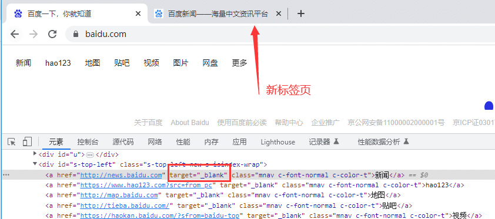

# 前言

browser.new\_context() 创建一个新的浏览器上下文。它不会与其他浏览器上下文共享 cookies/缓存。

# 浏览器上下文

使用browser.new\_context() 创建context对象，context之间是相互隔离的，可以理解为轻量级的浏览器实例.  
如需要不同用户登录同一个网页，不需要创建多个浏览器实例，只需要创建多个context即可

以下是在一个浏览器实例上打开2个标签页

```mipsasm
from playwright.sync_api import sync_playwright


with sync_playwright() as p:
    browser = p.chromium.launch(headless=False, slow_mo=1000)
    context = browser.new_context()  # 创建上下文，浏览器实例
    page = context.new_page()    # 打开标签页1
    page.goto("https://www.baidu.com/")
    page2 = context.new_page()  # 打开标签页2
    page2.goto("https://www.cnblogs.com/yoyoketang/")

    context.close()
    browser.close()
```

也可以通过context 上下文操作多个浏览器实例，它不会与其他浏览器上下文共享 cookies/缓存， 适用于多用户同时登陆的场景。

```csharp
from playwright.sync_api import sync_playwright


with sync_playwright() as p:
    browser = p.chromium.launch(headless=False, slow_mo=1000)
    context1 = browser.new_context()  # 创建上下文，浏览器实例1
    context2 = browser.new_context()  # 创建上下文，浏览器实例2
    page1 = context1.new_page()    # 打开标签页1
    page1.goto("https://www.baidu.com/")

    # 操作第二个浏览器窗口
    page2 = context2.new_page()  # 打开标签页1
    page2.goto("https://www.baidu.com/")
```

运行后会发现打开了2个浏览器窗口

# Context实现测试浏览器环境隔离

使用 Playwright 编写的测试在称为浏览器上下文的隔离的全新环境中执行。这种隔离模型提高了可重复性并防止级联测试失败。

### 什么是测试隔离

测试隔离是指每个测试与另一个测试完全隔离。每个测试都独立于任何其他测试运行。这意味着每个测试都有自己的本地存储、会话存储、cookie 等。Playwright 使用BrowserContext实现了这一点，这相当于隐身式配置文件。它们的创建速度快、成本低，并且完全隔离，即使在单个浏览器中运行也是如此。Playwright 为每个测试创建一个上下文，并在该上下文中提供一个默认页面。

### 为什么测试隔离很重要

*   没有失败结转。如果一个测试失败，它不会影响另一个测试。
*   易于调试错误或不稳定，因为您可以根据需要多次运行单个测试。
*   并行运行、分片等时不必考虑顺序。

测试隔离有两种不同的策略：从头开始或在两者之间进行清理。在测试之间清理的问题是很容易忘记清理，有些东西是不可能清理的，比如“访问过的链接”。来自一个测试的状态可能会泄漏到下一个测试中，这可能会导致您的测试失败并使调试变得更加困难，因为问题来自另一个测试。从头开始意味着一切都是新的，因此如果测试失败，您只需查看该测试即可进行调试。

### Playwright 如何实现测试

Playwright 使用浏览器上下文来实现测试隔离。每个测试都有自己的浏览器上下文。每次运行测试都会创建一个新的浏览器上下文。使用 Playwright 作为测试运行程序时，默认情况下会创建浏览器上下文。否则，您可以手动创建浏览器上下文。

```ini
browser = playwright.chromium.launch()
context = browser.new_context()
page = context.new_page()
```

浏览器上下文还可用于模拟涉及移动设备、权限、区域设置和配色方案的多页面场景

Playwright 可以在一个场景中创建多个浏览器上下文。当您想测试多用户功能（如聊天）时，这很有用。

```python
from playwright.sync_api import sync_playwright

def run(playwright):
    # create a chromium browser instance
    chromium = playwright.chromium
    browser = chromium.launch()

    # create two isolated browser contexts
    user_context = browser.new_context()
    admin_context = browser.new_context()

    # create pages and interact with contexts independently

with sync_playwright() as playwright:
    run(playwright)
```

# 多标签页

每个浏览器上下文可以承载多个页面（选项卡）。

*   每个页面都像一个聚焦的活动页面。不需要将页面置于最前面。
*   上下文中的页面遵循上下文级别的模拟，例如视口大小、自定义网络路由或浏览器区域设置。

```ini
# create two pages
page_one = context.new_page()
page_two = context.new_page()

# get pages of a browser context
all_pages = context.pages
```

使用示例，在page\_one 标签页打开百度，输入“上海-悠悠”， 在page\_two 标签页打开百度，输入“yoyoketang”

```mipsasm
from playwright.sync_api import sync_playwright
# 上海悠悠 wx:283340479  
# blog:https://www.cnblogs.com/yoyoketang/

with sync_playwright() as p:
    browser = p.chromium.launch(headless=False, slow_mo=1000)
    context = browser.new_context()  # 创建上下文，浏览器实例1

    page1 = context.new_page()    # 打开标签页1
    page2 = context.new_page()  # 打开标签页2
    page1.goto("https://www.baidu.com/")
    page1.fill('#kw', "上海-悠悠")
    page1.wait_for_timeout(3000)

    page2.goto("https://www.baidu.com/")
    page2.fill('#kw', "yoyoketang")
    page2.wait_for_timeout(3000)
```

虽然你看不到第一个页面的操作，实际上它已经操作了，每个页面 page对象都是聚焦的活动页面， 不需要将页面置于最前面。

# 处理新标签页

浏览器上下文中的事件page可用于获取在上下文中创建的新页面。这可用于处理通过target="\_blank"链接打开的新页面。

```css
# Get page after a specific action (e.g. clicking a link)
with context.expect_page() as new_page_info:
    page.get_by_text("open new tab").click() # Opens a new tab
new_page = new_page_info.value

new_page.wait_for_load_state()
print(new_page.title())
```

使用示例，打开百度页面的-新闻链接，会出现一个新标签页



```python
from playwright.sync_api import sync_playwright
# 上海悠悠 wx:283340479  
# blog:https://www.cnblogs.com/yoyoketang/


with sync_playwright() as p:
    browser = p.chromium.launch(headless=False, slow_mo=1000)
    context = browser.new_context()  # 创建上下文，浏览器实例

    page = context.new_page()    # 打开标签页
    page.goto("https://www.baidu.com/")
    print(page.title())
    # Get page after a specific action (e.g. clicking a link)
    with context.expect_page() as new_page_info:
        page.click('text=新闻')  # Opens a new tab
    new_page = new_page_info.value

    new_page.wait_for_load_state()  # 等待页面加载到指定状态
    print(new_page.title())
```

运行结果

```undefined
百度一下，你就知道
百度新闻——海量中文资讯平台
```

如果触发新页面的操作未知，可以使用以下模式。

```css
# Get all new pages (including popups) in the context
def handle_page(page):
    page.wait_for_load_state()
    print(page.title())

context.on("page", handle_page)
```

# 处理弹出窗口

如果页面打开一个弹出窗口（例如通过链接打开的页面），您可以通过监听页面上的事件target="\_blank"来获取对它的引用。popup  
除了browserContext.on('page')事件之外还会发出此事件，但仅针对与此页面相关的弹出窗口。

```css
# Get popup after a specific action (e.g., click)
with page.expect_popup() as popup_info:
    page.get_by_text("open the popup").click()
popup = popup_info.value

popup.wait_for_load_state()
print(popup.title())
```

如果触发弹出窗口的操作未知，则可以使用以下模式。

```css
# Get all popups when they open
def handle_popup(popup):
    popup.wait_for_load_state()
    print(popup.title())

page.on("popup", handle_popup)
```

  


