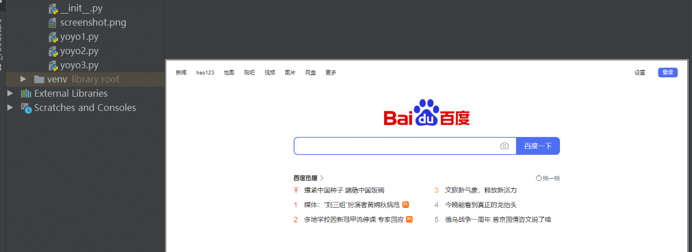
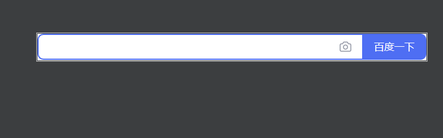

# 前言

playwright 除了可以截取当前屏幕，还可以截长图，也可以对某个元素截图，这点非常棒。

# screenshot 截图

这是捕获屏幕截图并将其保存到文件中的快速方法：

```lua
page.screenshot(path="screenshot.png")
```

使用示例

```mipsasm
from playwright.sync_api import sync_playwright
# 上海悠悠 wx:283340479  
# blog:https://www.cnblogs.com/yoyoketang/


with sync_playwright() as p:
    browser = p.chromium.launch(headless=False, slow_mo=1000)
    context = browser.new_context()  # 创建上下文，浏览器实例1

    page = context.new_page()    # 打开标签页
    page.goto("https://www.baidu.com/")
    print(page.title())
    page.screenshot(path="screenshot.png")
```

于是就可以看到截图了



# 截长图

设置`full_page=True` 参数 screenshot 是一个完整的可滚动页面的屏幕截图，就好像你有一个非常高的屏幕并且页面可以完全容纳它。

```lua
page.screenshot(path="screenshot.png", full_page=True)
```

# 捕获图片数据流

您可以获取包含图像的缓冲区并对其进行后处理或将其传递给第三方像素差异工具，而不是写入文件。

```mipsasm
screenshot_bytes = page.screenshot()
print(base64.b64encode(screenshot_bytes).decode())
```

# 截取单个元素

有时截取单个元素的屏幕截图很有用

```lua
page.locator(".header").screenshot(path="screenshot.png")
```

使用示例,截图百度页面的form 表单输入框和搜索按钮

```mipsasm
from playwright.sync_api import sync_playwright
# 上海悠悠 wx:283340479  
# blog:https://www.cnblogs.com/yoyoketang/


with sync_playwright() as p:
    browser = p.chromium.launch(headless=False, slow_mo=1000)
    context = browser.new_context()  # 创建上下文，浏览器实例1

    page = context.new_page()    # 打开标签页
    page.goto("https://www.baidu.com/")
    print(page.title())
    page.screenshot(path="screenshot.png")
```

于是最终截图效果  
  
  


