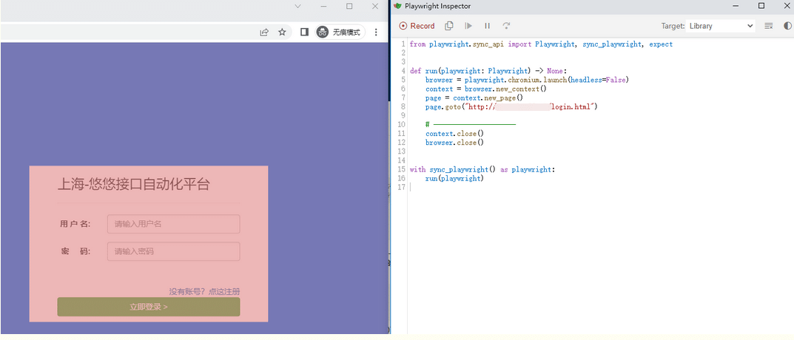
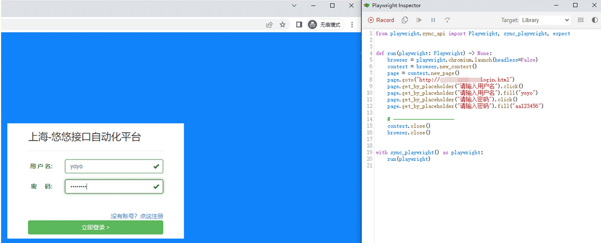
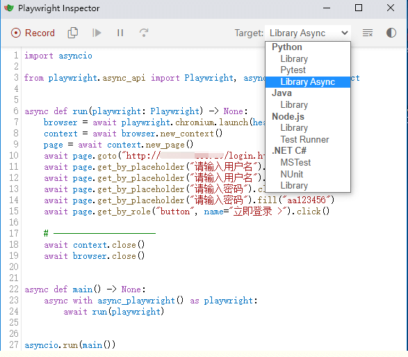
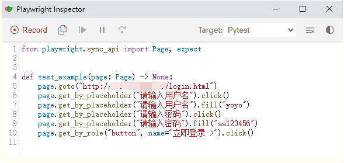

# 前言

playwright 可以支持自动录制生成脚本，也就是说只需要在页面上点点点，就可以自动生成对应的脚本了。

# 启动运行

Playwright 具有开箱即用的生成测试的能力，是快速开始测试的好方法。它将打开两个窗口，一个是浏览器窗口，您可以在其中与要测试的网站进行交互，另一个是 Playwright Inspector 窗口，您可以在其中记录测试、复制测试、清除测试以及更改测试语言。

使用命令行启动

```cpp
playwright codegen http://网站地址
```

启动后，电脑上出现2个窗口，左边是浏览器打开网站可以操作，右边是inspector 可以生成对应的脚本



登录框输入账号和密码点登录为例  


一个完整的登录流程代码生成如下

```css
from playwright.sync_api import Playwright, sync_playwright, expect
# 上海悠悠 wx:283340479  
# blog:https://www.cnblogs.com/yoyoketang/

def run(playwright: Playwright) -> None:
    browser = playwright.chromium.launch(headless=False)
    context = browser.new_context()
    page = context.new_page()
    page.goto("http://127.0.0.1:8000/login.html")
    page.get_by_placeholder("请输入用户名").click()
    page.get_by_placeholder("请输入用户名").fill("yoyo")
    page.get_by_placeholder("请输入密码").click()
    page.get_by_placeholder("请输入密码").fill("aa123456")
    page.get_by_role("button", name="立即登录 >").click()

    # ---------------------
    context.close()
    browser.close()


with sync_playwright() as playwright:
    run(playwright)

```

还可以选择生成异步代码  


如果你是写自动化测试用例，还能自动生成 pytest 框架的代码，简直了！



```css
from playwright.sync_api import Page, expect
# 上海悠悠 wx:283340479  
# blog:https://www.cnblogs.com/yoyoketang/

def test_example(page: Page) -> None:
    page.goto("http://127.0.0.1:8000/login.html")
    page.get_by_placeholder("请输入用户名").click()
    page.get_by_placeholder("请输入用户名").fill("yoyo")
    page.get_by_placeholder("请输入密码").click()
    page.get_by_placeholder("请输入密码").fill("aa123456")
    page.get_by_role("button", name="立即登录 >").click()
```

# 录制相关命令操作

相关命令参数：  
1.codegen在浏览器中运行并执行操作

```undefined
playwright codegen playwright.dev
```

2.Playwright 打开一个浏览器窗口，其视口设置为特定的宽度和高度，并且没有响应，因为需要在相同条件下运行测试。  
使用该--viewport选项生成具有不同视口大小的测试。

```lua
playwright codegen --viewport-size=800,600 playwright.dev
```

3.`--device` 使用设置视口大小和用户代理等选项模拟移动设备时记录脚本和测试。  
模拟移动设备iPhone11，注意：device的值必须用双引号，并且区分大小写

```bash
playwright codegen --device="iPhone 11" playwright.dev 
```

4.模拟配色

```lua
playwright codegen --color-scheme=dark playwright.dev
```

5.模拟地理位置、语言和时区

```bash
playwright codegen --timezone="Europe/Rome" --geolocation="41.890221,12.492348" --lang="it-IT" maps.google.com
```

6.保留经过身份验证的状态  
运行codegen以在会话结束时--save-storage保存cookie和localStorage 。这对于单独记录身份验证步骤并在稍后的测试中重用它很有用。

执行身份验证并关闭浏览器后，auth.json将包含存储状态。

```lua
playwright codegen --save-storage=auth.json
```

运行--load-storage以消耗先前加载的存储。这样，所有的cookie和localStorage都将被恢复，使大多数网络应用程序进入身份验证状态。

```mipsasm
playwright open --load-storage=auth.json my.web.app
playwright codegen --load-storage=auth.json my.web.app
# Perform actions in authenticated state.
```

# page.pause() 断点调试

如果您想在某些非标准设置中使用 codegen（例如，使用browser\_context.route()），可以调用page.pause()，这将打开一个带有 codegen 控件的单独窗口。

```mipsasm
from playwright.sync_api import sync_playwright

with sync_playwright() as p:
    # Make sure to run headed.
    browser = p.chromium.launch(headless=False)

    # Setup context however you like.
    context = browser.new_context() # Pass any options
    context.route('**/*', lambda route: route.continue_())

    # Pause the page, and start recording manually.
    page = context.new_page()
    page.pause()
```

  


