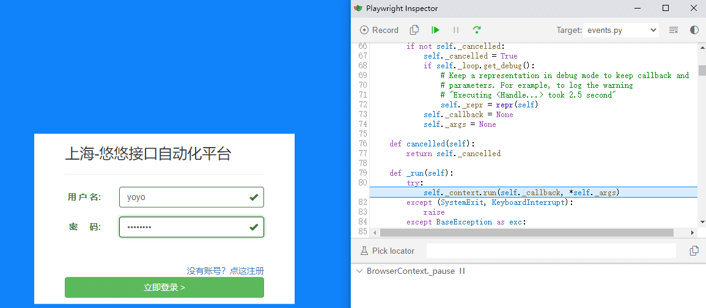
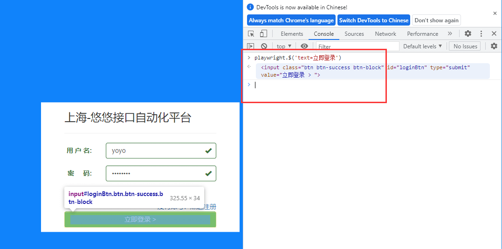
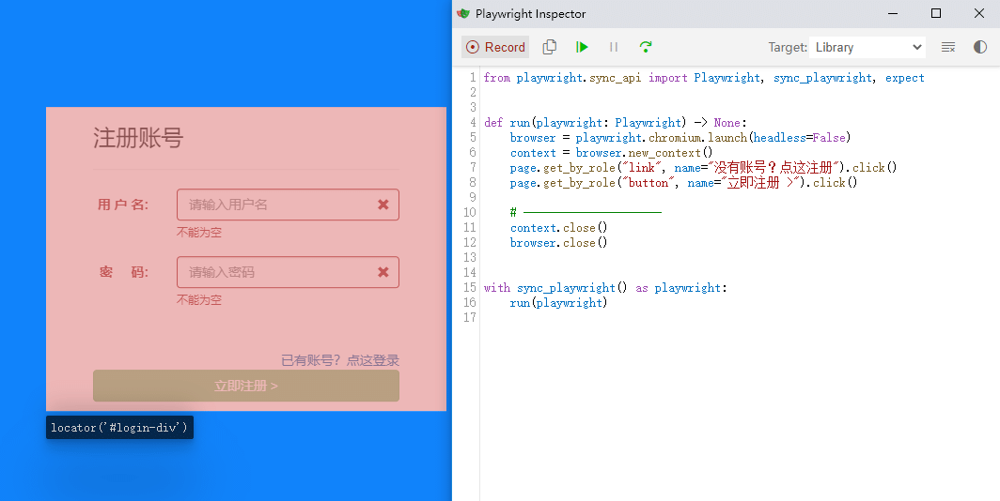
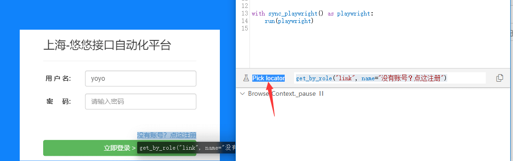

# 前言

在运行selenium脚本的时候，我们通常习惯用sleep去让页面暂停，打开console 输入 $(selector) 去调试定位页面的元素。  
有时候明明页面能找到元素，代码运行却找不到，很是郁闷！  
playwright 的`page.pause()` 断点功能出现，让打开可以愉快的在页面上调试了，我们甚至可以直接使用 `playwright.$(selector)` 直接支持playwright选择器的方法。

# page.pause() 断点

在代码中加入`page.pause()`进入断点状态

```css
from playwright.sync_api import Playwright, sync_playwright, expect
# 上海悠悠 wx:283340479  
# blog:https://www.cnblogs.com/yoyoketang/

def run(playwright: Playwright) -> None:
    browser = playwright.chromium.launch(headless=False)
    context = browser.new_context()
    page = context.new_page()
    page.goto("http://127.0.0.1:8000/login.html")
    page.get_by_placeholder("请输入用户名").click()
    page.get_by_placeholder("请输入用户名").fill("yoyo")
    page.get_by_placeholder("请输入密码").click()
    page.get_by_placeholder("请输入密码").fill("aa123456")
    page.pause()  # 断点
    page.get_by_role("button", name="立即登录 >").click()

    # ---------------------
    context.close()
    browser.close()


with sync_playwright() as playwright:
    run(playwright)
```

运行后会弹出 `playwright inspector` 工具



# console 调试定位

我们可以在 用代码打开的浏览器上f12 打开console页面，输入`playwright.$(selector)` 调试定位



selector 语法可以支持 playwright 的selector 定位的语法。

其它相关操作

*   playwright.$(selector) 使用实际的Playwright查询引擎查询Playwright选择器
*   playwright.$$(selector) 类似于 `playwright.$`,但是返回全部的匹配元素
*   playwright.inspect(selector) 在元素面板中显示元素（如果相应浏览器的DevTools支持）。
*   playwright.locator(selector) 使用实际的Playwright查询引擎查询Playwright元素
*   playwright.selector(element) 为给定元素生成选择器。

# playwright inspector 使用

还可以在playwright inspector 工具上点开启录制按钮，在页面上点点点，就可以生成对应的元素和操作



Pick locator 使用



点击 Pick locator 后在浏览器上选择需要定位的元素，即可生成对应的 locator  
  


