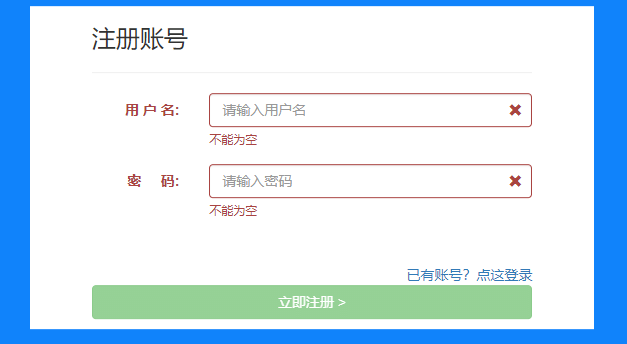
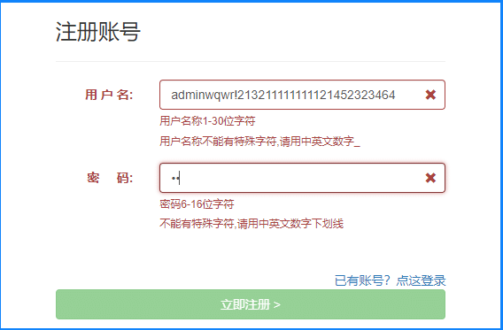

# 前言

POM(Page Object Models) 页面对象模型已经成了写 web 自动化的一个标准模型。

# 页面对象模型Page Object Models

页面对象代表 Web 应用程序的一部分。电子商务 Web 应用程序可能有一个主页、一个列表页面和一个结帐页面。它们中的每一个都可以由页面对象模型表示。  
页面对象通过创建适合您的应用程序的更高级别的 API 来简化创作，并通过在一个地方捕获元素选择器和创建可重用代码来避免重复来简化维护。

官方示例

```ruby
# models/search.py
class SearchPage:
    def __init__(self, page):
        self.page = page
        self.search_term_input = page.locator('[aria-label="Enter your search term"]')

    def navigate(self):
        self.page.goto("https://bing.com")

    def search(self, text):
        self.search_term_input.fill(text)
        self.search_term_input.press("Enter")
```

然后可以在测试中使用页面对象。

```makefile
# test_search.py
from models.search import SearchPage

# in the test
page = browser.new_page()
search_page = SearchPage(page)
search_page.navigate()
search_page.search("search query")
```

官方文档总是那么简洁精悍，接下来看下具体的实例

# 使用实例

以测试注册页面为例



注册页面根据输入框的内容，我们可以写多个有效等价，无效等价的测试用例，那么这些用例的操作最终都是在页面上的几个固定元素上点点点。  


整个项目结构

```markdown
├─cases
│  │  test_register.py
│  │  __init__.py
├─models
│  │  register_page.py
│  │  __init__.py
│  │
├─conftest.py
├─pytest.ini
```

于是可以把注册页的元素定位和操作，封装成一个RegisterPage 类

```python
from playwright.sync_api import Page
# 上海悠悠 wx:283340479  
# blog:https://www.cnblogs.com/yoyoketang/

class RegisterPage:

    def __init__(self, page: Page):
        self.page = page
        self.locator_username = page.get_by_label("用 户 名:")
        self.locator_password = page.get_by_label("密     码:")
        self.locator_register_btn = page.locator('text=立即注册')
        self.locator_login_link = page.locator('text=已有账号？点这登录')
        # 用户名输入框提示语
        self.locator_username_tip1 = page.locator('[data-fv-validator="notEmpty"][data-fv-for="username"]')
        self.locator_username_tip2 = page.locator('[data-fv-validator="stringLength"][data-fv-for="username"]')
        self.locator_username_tip3 = page.locator('[data-fv-validator="regexp"][data-fv-for="username"]')
        # 密码输入框提示语
        self.locator_password_tip1 = page.locator('[data-fv-validator="notEmpty"][data-fv-for="password"]')
        self.locator_password_tip2 = page.locator('[data-fv-validator="stringLength"][data-fv-for="password"]')
        self.locator_password_tip3 = page.locator('[data-fv-validator="regexp"][data-fv-for="password"]')
        # 账号或密码不正确！
        self.locator_register_error = page.locator('text=用户名已存在或不合法！')

    def navigate(self):
        self.page.goto("http://127.0.0.1:8000/register.html")

    def fill_username(self, username):
        self.locator_username.fill(username)

    def fill_password(self, password):
        self.locator_password.fill(password)

    def click_register_button(self):
        self.locator_register_btn.click()

    def click_login_link(self):
        self.locator_login_link.click()
```

conftest.py 前置和后置操作代码

```mipsasm
from playwright.sync_api import sync_playwright
import pytest


@pytest.fixture(scope="session")
def context_chrome():
    p = sync_playwright().start()
    browser = p.chromium.launch(headless=False)
    context = browser.new_context()
    yield context
    # 实现用例后置
    context.close()
    browser.close()
    p.stop()
```

用例部分

```python
from models.register_page import RegisterPage
from playwright.sync_api import expect
import pytest
# 上海悠悠 wx:283340479  
# blog:https://www.cnblogs.com/yoyoketang/

class TestRegister:

    @pytest.fixture(autouse=True)
    def start_for_each(self, context_chrome):
        print("for each--start: 打开新页面访问注册页")
        self.page = context_chrome.new_page()
        self.register = RegisterPage(self.page)
        self.register.navigate()
        yield
        print("for each--close: 关闭注册页")
        self.page.close()

    def test_register_1(self):
        """用户名为空，点注册"""
        self.register.fill_username('')
        self.register.fill_password('123456')
        self.register.click_register_button()
        # 断言
        expect(self.register.locator_username_tip1).to_be_visible()
        expect(self.register.locator_username_tip1).to_contain_text("不能为空")

    def test_register_2(self):
        """用户名大于30字符"""
        self.register.fill_username('hello world hello world hello world')
        # 断言
        expect(self.register.locator_username_tip2).to_be_visible()
        expect(self.register.locator_username_tip2).to_contain_text("用户名称1-30位字符")
        # 断言 注册按钮不可点击
        expect(self.register.locator_register_btn).not_to_be_enabled()

    def test_register_3(self):
        """用户名有特殊字符"""
        self.register.fill_username('hello!@#')
        # 断言
        expect(self.register.locator_username_tip3).to_be_visible()
        expect(self.register.locator_username_tip3).to_contain_text("用户名称不能有特殊字符,请用中英文数字")
        # 断言 注册按钮不可点击
        expect(self.register.locator_register_btn).not_to_be_enabled()

    def test_register_4(self):
        """密码框不能为空"""
        self.register.fill_username('hello')
        self.register.fill_password('')
        self.register.click_register_button()
        # 断言
        expect(self.register.locator_password_tip1).to_be_visible()
        expect(self.register.locator_password_tip1).to_contain_text("不能为空")

    @pytest.mark.parametrize('test_input', ['abc12', 'abc1234567890abc1'])
    def test_register_5(self, test_input):
        """密码框6-16位"""
        self.register.fill_password(test_input)
        # 断言
        expect(self.register.locator_password_tip2).to_be_visible()
        expect(self.register.locator_password_tip2).to_contain_text("密码6-16位字符")

    def test_register_6(self):
        """密码框不能有特殊字符"""
        self.register.fill_password('abc123!')
        # 断言
        expect(self.register.locator_password_tip3).to_be_visible()
        expect(self.register.locator_password_tip3).to_contain_text("不能有特殊字符,请用中英文数字下划线")

    def test_login_link(self):
        """已有账号？点这登录"""
        expect(self.register.locator_login_link).to_have_attribute("href", "login.html")
        self.register.click_login_link()
        expect(self.register.page).to_have_title('网站登录')

    def test_register_error(self):
        """测试注册正常流程， 已被注册过的账号"""
        self.register.fill_username('yoyo')
        self.register.fill_password('aa123456')
        self.register.click_register_button()
        # 断言提示语可见
        expect(self.register.locator_register_error).to_be_visible()

    def test_register_success(self):
        """测试注册正常流程， 注册成功"""
        # 生成随机账号
        import uuid
        self.register.fill_username(str(uuid.uuid4())[:8])
        self.register.fill_password('aa123456')
        self.register.click_register_button()
        # 断言提示语可见
        expect(self.register.page).to_have_title('首页')
```

整体下来感觉非常流畅，执行效率很高，很多断言方法都有了封装，很不错的体验。  
pytest 自己不太会写的，playwright 官方还很贴心的提供了一个插件`pytest-playwright` 专门用于写自动化测试用例。

  


