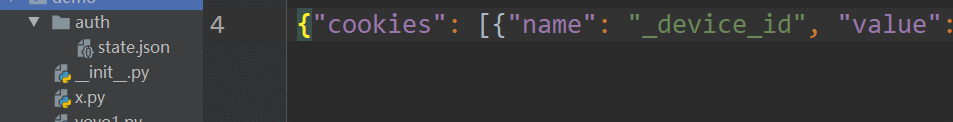

# 前言

在写web自动化的时候，很多用例是需要先登录的，为了做到每个用例的隔离，数据互不影响，一般会创建一个新的page对象。  
很多用例是需要先登录的，可以先登录后把cookie保存到本地，通过加载cookie的方式解决重复登录的问题。

# 登录认证

Playwright 在称为浏览器上下文的隔离环境中执行测试。这种隔离模型提高了可重复性并防止级联测试失败。  
测试可以加载现有的经过身份验证的状态。这消除了在每个测试中进行身份验证的需要并加快了测试执行速度。

我们建议创建 `auth` 目录并将其添加到您的 `.gitignore`. 您的身份验证例程将生成经过身份验证的浏览器状态并将其保存到此`auth`目录中的文件中。稍后，测试将重用此状态并开始已通过身份验证。  
windows 操作命令

```bash
md auth
echo. >> .gitignore
echo "auth" >> .gitignore
```

以下示例登录到 GitHub。执行这些步骤后，浏览器上下文将通过身份验证。

```makefile
page = context.new_page()
page.goto('https://github.com/login')

# Interact with login form
page.get_by_label("Username or email address").fill("username")
page.get_by_label("Password").fill("password")
page.get_by_role("button", name="Sign in").click()
# Continue with the test
```

为每个测试重做登录会减慢测试执行速度。为了缓解这种情况，请改用现有的身份验证状态

# storageState保存登录cookies

Playwright 提供了一种在测试中重用登录状态的方法。这样您就可以只登录一次，然后跳过所有测试的登录步骤。  
Web 应用程序使用基于 cookie 或基于令牌的身份验证，其中经过身份验证的状态存储为cookie或本地存储。Playwright 提供browserContext.storageState(\[options\])方法，可用于从经过身份验证的上下文中检索存储状态，然后创建具有预填充状态的新上下文。  
Cookie 和本地存储状态可以跨不同的浏览器使用。它们取决于您的应用程序的身份验证模型：某些应用程序可能需要 cookie 和本地存储。

以下代码片段从经过身份验证的上下文中检索状态，并使用该状态创建一个新上下文。

```mipsasm
from playwright.sync_api import Playwright, sync_playwright, expect
# 上海悠悠 wx:283340479  
# blog:https://www.cnblogs.com/yoyoketang/

def run(playwright: Playwright) -> None:
    browser = playwright.chromium.launch(headless=False)
    context = browser.new_context()
    page = context.new_page()
    page.goto('https://github.com/login')

    # Interact with login form
    page.get_by_label("Username or email address").fill("yoyo")
    page.get_by_label("Password").fill("*********")
    page.get_by_role("button", name="Sign in").click()
    # Continue with the test

    # 保存storage state 到指定的文件
    storage = context.storage_state(path="auth/state.json")

    # ---------------------
    context.close()
    browser.close()


with sync_playwright() as playwright:
    run(playwright)
```

  
于是在本地会保存一个state.json文件

这样在其它地方就可以使用本地的cookies，实现免登录了

```ini
# Create a new context with the saved storage state.
context = browser.new_context(storage_state="state.json")
```

验证下是不是已经不需要登录了

```mipsasm
from playwright.sync_api import Playwright, sync_playwright, expect
# 上海悠悠 wx:283340479  
# blog:https://www.cnblogs.com/yoyoketang/

def run(playwright: Playwright) -> None:
    browser = playwright.chromium.launch(headless=False)
    # 加载本地cookies，免登陆
    context = browser.new_context(storage_state="auth/state.json")
    
    # 打开页面继续操作
    page = context.new_page()
    page.goto('https://github.com/')
    page.pause()  # 打断点看是不是已经登录了

    context.close()
    browser.close()


with sync_playwright() as playwright:
    run(playwright)
```

# 高级场景

重用经过身份验证的状态包括cookie和基于本地存储的身份验证。会话存储很少用于存储与登录状态相关的信息。会话存储特定于特定域，并且不会跨页面加载持续存在。Playwright 不提供持久会话存储的 API，但以下代码片段可用于保存/加载会话存储。

使用添加到环境变量的方式

```python
import os
# Get session storage and store as env variable
session_storage = page.evaluate("() => JSON.stringify(sessionStorage)")
os.environ["SESSION_STORAGE"] = session_storage

# Set session storage in a new context
session_storage = os.environ["SESSION_STORAGE"]
context.add_init_script("""(storage => {
  if (window.location.hostname === 'example.com') {
    const entries = JSON.parse(storage)
    for (const [key, value] of Object.entries(entries)) {
      window.sessionStorage.setItem(key, value)
    }
  }
})('""" + session_storage + "')")
```

  


