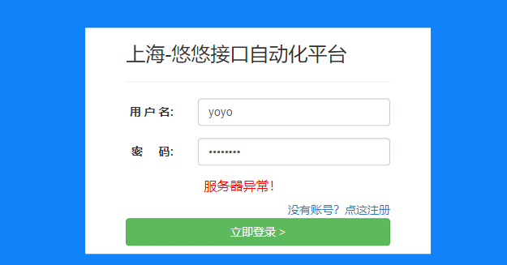

# 前言

web 自动化主要测前端UI 的功能，有很多异常的场景，我们很难造真实的场景去触发，比如服务器异常时候，前端的提示语。  
这时候就可以使用mock 功能，模拟接口的返回，测试前端的功能。

# 模拟网络请求

Web API 通常作为 HTTP 端点实现。Playwright 提供 API 来模拟和修改网络流量，包括 HTTP 和 HTTPS。页面执行的任何请求，包括XHR和获取请求，都可以被跟踪、修改和模拟。

以下代码将拦截对的所有调用https://dog.ceo/api/breeds/list/all并将返回测试数据。不会向https://dog.ceo/api/breeds/list/all端点发出任何请求。

```scss
async def handle(route):
    json = { message: { "test_breed": [] } }
    route.fulfill(json=json)

page.route("https://dog.ceo/api/breeds/list/all", handle)
```

# 修改 API

有时，必须发出 API 请求，但需要修补响应以允许可重现的测试。在这种情况下，可以执行请求并使用修改后的响应来完成请求，而不是模拟请求。

```python
def handle(route):
    response = route.fulfill()
    json = response.json()
    json["message"]["big_red_dog"] = []
    # Fulfill using the original response, while patching the response body
    # with the given JSON object.
    route.fulfill(response=response, json=json)

page.route("https://dog.ceo/api/breeds/list/all", handle)
```

# 模拟登录时候，服务器异常的场景



当登录的接口返回状态码是500 的时候，前端才会触发：服务器异常！

于是可以用 page.route() 拦截请求，修改状态码即可触发

```css
from playwright.sync_api import Playwright, sync_playwright, expect
# 上海悠悠 wx:283340479  
# blog:https://www.cnblogs.com/yoyoketang/

def handle(route):
    # 状态码改成500 模拟服务器异常
    route.fulfill(status=500)


def run(playwright: Playwright) -> None:
    browser = playwright.chromium.launch(headless=False)
    context = browser.new_context()
    page = context.new_page()
    page.goto("http://127.0.0.0:8000/login.html")
    page.get_by_placeholder("请输入用户名").click()
    page.get_by_placeholder("请输入用户名").fill("yoyo")
    page.get_by_placeholder("请输入密码").click()
    page.get_by_placeholder("请输入密码").fill("*********")

    page.route("http://127.0.0.1/api/login", handle)

    page.get_by_role("button", name="立即登录 >").click()
    page.pause()  # 断点
    # ---------------------
    context.close()
    browser.close()


with sync_playwright() as playwright:
    run(playwright)
```

这就给我们测试前端的各种异常场景带来了很大的遍历，可以模拟出任何我们希望返回的接口数据。这对于前后端分离的项目测试是非常关键的。  
selenium 没有拦截请求模拟请求的功能，playwright 在这方面做的确实很优秀！  
  


