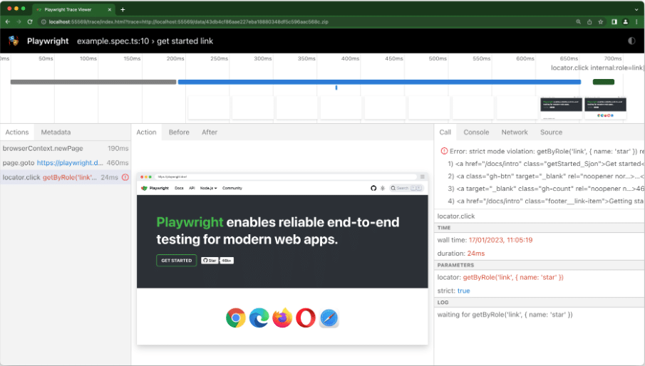
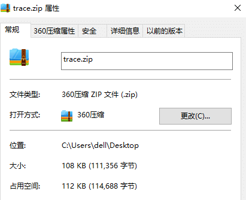
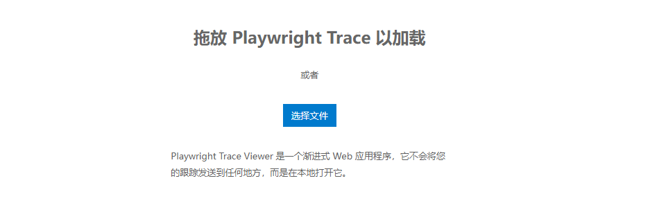
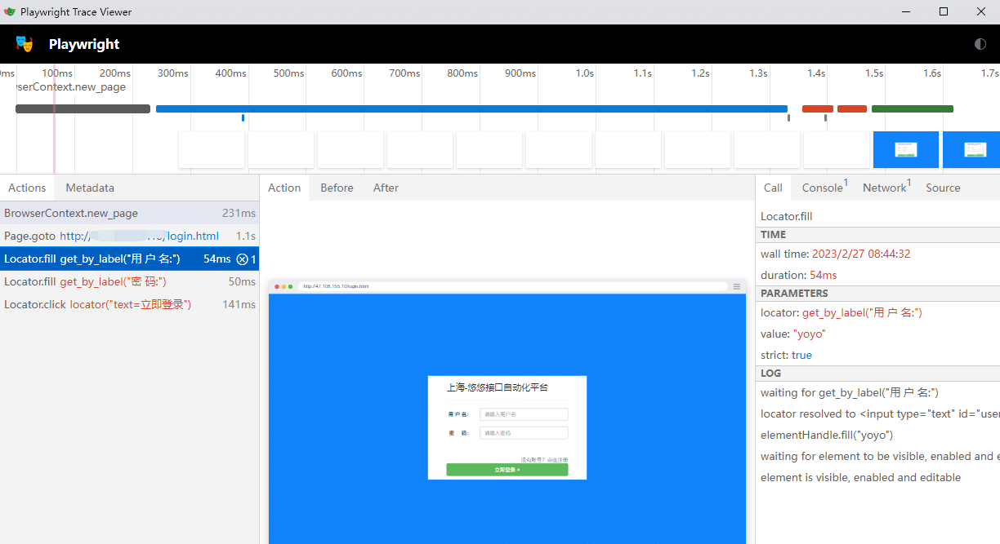
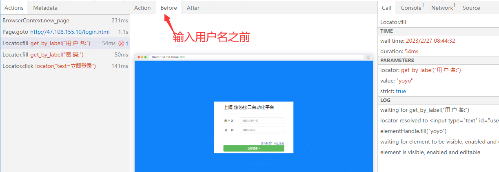
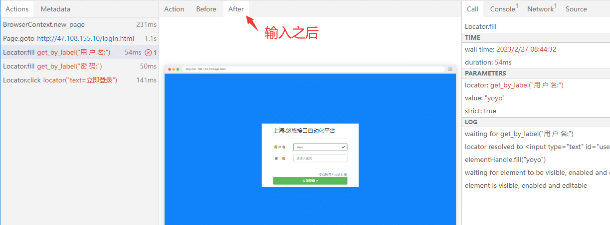

# 前言

在执行自动化用例的过程中，出现一些不稳定偶然性的bug，需要复现bug, 还原bug出现的过程。于是需要追踪用例执行的过程。  
Playwright Trace Viewer 是一个 GUI 工具，可让您探索记录的 Playwright 测试跟踪，这意味着您可以在测试的每个操作中前后移动，并直观地查看每个操作期间发生的情况。

# Trace Viewer 追踪功能

可以使用browser\_context.tracing API 记录跟踪，如下所示：

```mipsasm
browser = chromium.launch()
context = browser.new_context()

# Start tracing before creating / navigating a page.
context.tracing.start(screenshots=True, snapshots=True, sources=True)

page = context.new_page()
page.goto("https://playwright.dev")

# Stop tracing and export it into a zip archive.
context.tracing.stop(path = "trace.zip")
```

这将记录跟踪并将其放入名为trace.zip.

您可以使用 Playwright CLI 或在您的浏览器中打开保存的跟踪trace.playwright.dev。

```python
playwright show-trace trace.zip
```

# 查看

通过单击每个操作或使用时间轴悬停来查看测试的痕迹，并查看操作前后页面的状态。在测试的每个步骤中检查日志、源和网络。跟踪查看器创建一个 DOM 快照，因此您可以与其完全交互，打开 devtools 等。  


# 使用示例

打开网站登录，记录操作过程

```mipsasm
from playwright.sync_api import Playwright, sync_playwright, expect
# 上海悠悠 wx:283340479  
# blog:https://www.cnblogs.com/yoyoketang/


def run(playwright: Playwright) -> None:
    browser = playwright.chromium.launch(headless=False)
    context = browser.new_context()

    # Start tracing before creating / navigating a page.
    # 配置追踪开始
    context.tracing.start(screenshots=True, snapshots=True, sources=True)
    # 打开页面
    page = context.new_page()
    page.goto('http://127.0.0.1:8000/login.html')
    page.get_by_label("用 户 名:").fill("yoyo")
    page.get_by_label("密     码:").fill("123456")
    page.locator("text=立即登录").click()

    context.tracing.stop(path="trace.zip")  # 结束追踪的地方，添加 tracing 的结束配置。
    context.close()
    browser.close()


with sync_playwright() as playwright:
    run(playwright)
```

运行结束后在本地保存一个 `trace.zip` 功能，并且文件只有100K左右，占用空间很小  


# 查看追踪

有2种方法可以查看追踪日志

方法1. 通过命令行查看操作过程追踪

```python
>playwright show-trace trace.zip
```

方法2.访问 [https://trace.playwright.dev/](https://trace.playwright.dev/) 选择录制好的trace.zip文件即可打开



它可以清晰的记录代码的每个步骤  


并且还能记录每个动作前和后的对比  




Playwright 的 Trace Viewer 功能非常强大，执行过程中出现的问题可以快速定位  
  


