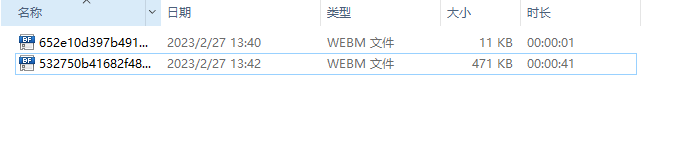

# 前言

使用 Playwright，您可以为测试录制视频。

# 录制

视频在测试结束时浏览器上下文关闭时保存。如果您手动创建浏览器上下文，请确保browser\_context.close(), 会在调用close的时候保存视频。

```mipsasm
context = browser.new_context(record_video_dir="videos/")

# 确保调用 close,  videos视频才会保存
context.close()
```

执行完成后，会保存到videos/目录下



视频录制40秒左右，也才400k大小，一般用户3-5秒可以执行完，所以完全不用担心视频占用太多的空间。

您还可以指定视频大小。视频大小默认为缩小以适合 800x800 的视口大小。  
视口的视频放置在输出视频的左上角，必要时按比例缩小以适合。您可能需要设置视口大小以匹配您想要的视频大小。

```mipsasm
context = browser.new_context(
    record_video_dir="videos/",
    record_video_size={"width": 640, "height": 480}
)
```

# 获取保存视频路径

保存的视频文件将出现在指定的文件夹中。它们都生成了唯一的名称。对于多页面场景，可以通过 page.video 访问页面关联的视频文件。

```lua
path = page.video.path()
print(path)  # videos\b880519a32528f80d64a2cb6769f2162.webm
```

  


