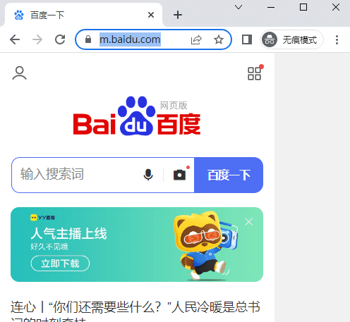

# 前言

使用 Playwright，您可以在任何浏览器上测试您的应用程序，也可以模拟真实设备，例如手机或平板电脑。

# 设置手机模式

只需配置您想要模拟的设备，Playwright 就会模拟浏览器行为，例如"userAgent"、"screenSize"以及"viewport"是否"hasTouch"启用。  
您还可以为所有测试或特定测试模拟,以及设置以"geolocation"显示通知或更改."locale""timezone""permissions""colorScheme"

Playwright使用playwright.devices为选定的台式机、平板电脑和移动设备提供设备参数注册表。  
它可用于模拟特定设备的浏览器行为，例如用户代理、屏幕尺寸、视口以及是否启用了触摸。所有测试都将使用指定的设备参数运行。

```css
from playwright.sync_api import sync_playwright
# 上海悠悠 wx:283340479  
# blog:https://www.cnblogs.com/yoyoketang/

def run(playwright):
    iphone_12 = playwright.devices['iPhone 12']
    browser = playwright.chromium.launch(headless=False)
    context = browser.new_context(
        **iphone_12,
    )
    page = context.new_page()
    page.goto('https://m.baidu.com')
    page.pause()


with sync_playwright() as playwright:
    run(playwright)
```

运行后就是以手机模式打开的



# pytest-playwright 测试用例

在pytest-playwright 测试用例中可以通过重写browser\_context\_args 来实现

```python
# conftest.py

import pytest
# 上海悠悠 wx:283340479  
# blog:https://www.cnblogs.com/yoyoketang/

@pytest.fixture(scope="session")
def browser_context_args(browser_context_args, playwright):
    iphone_11 = playwright.devices['iPhone 11 Pro']
    return {
        **browser_context_args,
        **iphone_11,
    }
```

用例部分

```python
from playwright.sync_api import Page


def test_m_baidu(page: Page):
    page.goto("https://m.baidu.com/")
```

这样可以指定手机型号运行用例  
  


