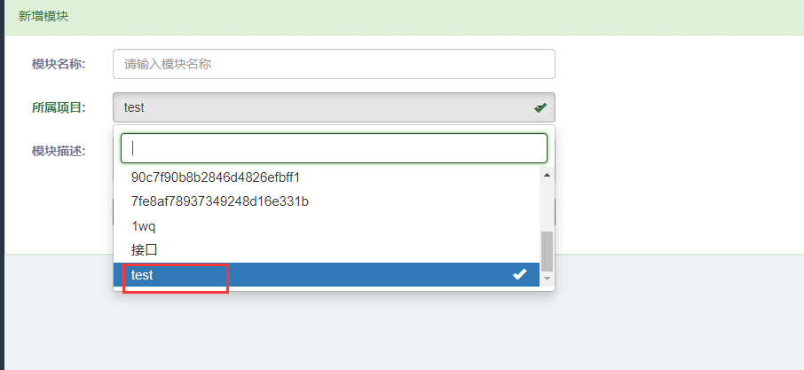
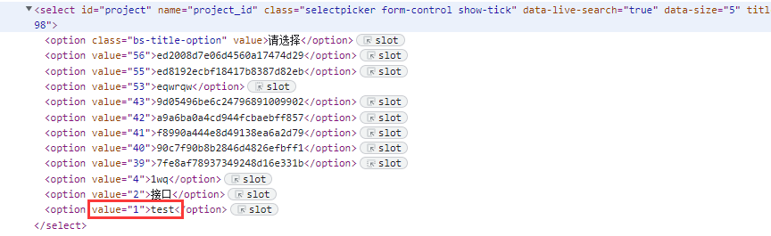

# 前言

select 选择框是页面上常见的场景

# select 用法

`<select>` 使用locator.select\_option()选择元素中的一个或多个选项。您可以指定选项value，或label选择。可以选择多个选项。

```dockerfile
# Single selection matching the value
page.get_by_label('Choose a color').select_option('blue')

# Single selection matching the label
page.get_by_label('Choose a color').select_option(label='Blue')

# Multiple selected items
page.get_by_label('Choose multiple colors').select_option(['red', 'green', 'blue'])
```

select 元素示例

```xml
<select multiple>
  <option value="red">Red</div>
  <option value="green">Green</div>
  <option value="blue">Blue</div>
</select>
```

用法

```dockerfile
# 上海悠悠 wx:283340479  
# blog:https://www.cnblogs.com/yoyoketang/

# single selection matching the value or label
element.select_option("blue")
# single selection matching the label
element.select_option(label="blue")
# multiple selection for blue, red and second option
element.select_option(value=["red", "green", "blue"])
```

# 使用示例

下拉框选择  


从option 中选一个  


示例代码

方法一，先定位select元素，再定位选项  
1.根据选项名称定位

```csharp
select = page.get_by_label("所属项目:")
select.select_option("test")
```

2.根据index 索引定位

```csharp
select = page.get_by_label("所属项目:")
select.select_option(index=1)
```

3.根据label 标签定位  
如下select

```xml
<select name="test" id="t" onchange="change(this)" >
    <option value="1" label="第一" selected="selected">第一</option>
    <option value="2" label="第二">第二</option>
    <option value="3" label="第三">第三</option>
    <option value="4" label="第四">第四</option>
</select>
```

option 有label 属性的情况下可以使用label 标签定位

```vhdl
select = page.get_by_label("选择:")
select.select_option(label="第四")
```

方法二，通过page对象直接调用

```bash
page.select_option("select#project", "test")
```

类似于page.fill和page.click的用法  
  


