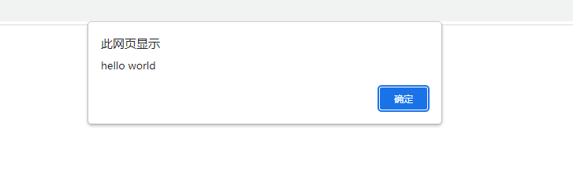

# 前言

网页上的alert 弹出框你不知道什么时候弹出来，selenium 处理alert弹出框的方式是先判断有没alert 再处理，并且只能处理这一次。  
playwright 框架可以监听dialog事件，不管你alert 什么时候弹出来，监听到事件就自动处理了。

# dialog 事件监听

当出现 JavaScript 对话框时发出，例如alert、prompt或。侦听器必须dialog.accept()或dialog.dismiss()对话框 - 否则页面将冻结等待对话框，并且单击等操作将永远不会完成。

```mipsasm
page.on("dialog", lambda dialog: dialog.accept())
```

**注意:当没有page.on("dialog")侦听器存在时，所有对话框都会自动关闭。**

用法

```csharp
page.on("dialog", handler)
```



使用示例

```python
from playwright.sync_api import sync_playwright
# 上海悠悠 wx:283340479  
# blog:https://www.cnblogs.com/yoyoketang/

def run(playwright):
    chromium = playwright.chromium
    browser = chromium.launch(headless=False, slow_mo=3000)
    page = browser.new_page()
    # 没监听时，它自动会关闭
    page.evaluate("alert('hello world')")
    browser.close()


with sync_playwright() as playwright:
    run(playwright)
```

当监听器存在时，它必须dialog.accept()或dialog.dismiss()对话框 - 否则页面将冻结等待对话框，并且单击等操作将永远不会完成。

```python
from playwright.sync_api import sync_playwright
# 上海悠悠 wx:283340479  
# blog:https://www.cnblogs.com/yoyoketang/

def handle_dialog(dialog):
    """监听后处理"""
    print(dialog.message)
    dialog.dismiss()


def run(playwright):
    chromium = playwright.chromium
    browser = chromium.launch(headless=False, slow_mo=3000)
    page = browser.new_page()
    page.on("dialog", handle_dialog)
    page.evaluate("alert('hello world')")
    browser.close()


with sync_playwright() as playwright:
    run(playwright)
```

通过`page.on("dialog", handler)` 监听到dialog 事件，可以获取到dialog.message内容

# dialog 属性和方法

accept()当对话框被接受时返回。

```scss
dialog.accept()
dialog.accept(**kwargs)
```

参数 prompt\_text（可选), 要在提示中输入的文本。如果对话框 type 没有提示，则不会产生任何影响.

default\_value, 如果对话框是提示的，则返回默认提示值。否则，返回空字符串。

```mipsasm
dialog.default_value
```

dismiss 关闭对话框

```scss
dialog.dismiss()
```

message 获取对话框中显示的消息

```mipsasm
dialog.message
```

type返回对话框的类型，可以是`alert`, `beforeunload`, `confirm`或 `prompt`其中一个。

```haskell
dialog.type
```

  


