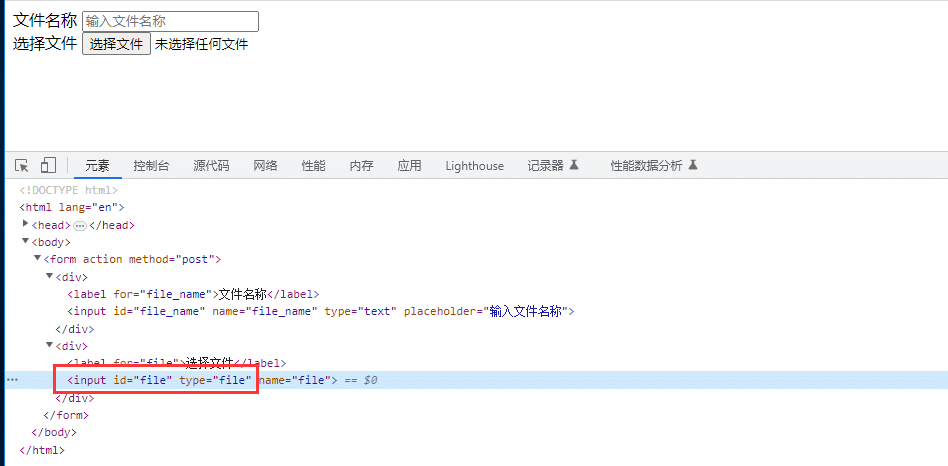
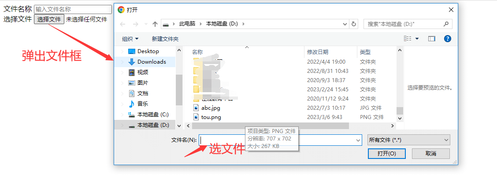

# 前言

如果你之前用过selenium，肯定遇到过文件上传头疼的事，有些控件是input输入框，可以直接传本地文件地址，然而有些需要弹出本地文件选择器的时候就不好处理了。  
playwright 控件优雅的处理了文件上传操作，在这里一切都变得如此简单了。

# 文件上传

您可以使用locator.set\_input\_files()方法选择要上传的输入文件。它期望第一个参数指向 `<input >` 的输入元素"file"。  
数组中可以传递多个文件。如果某些文件路径是相对的，则它们将相对于当前工作目录进行解析。空数组清除所选文件。

```bash
# Select one file
page.get_by_label("Upload file").set_input_files('myfile.pdf')

# Select multiple files
page.get_by_label("Upload files").set_input_files(['file1.txt', 'file2.txt'])

# Remove all the selected files
page.get_by_label("Upload file").set_input_files([])

# Upload buffer from memory
page.get_by_label("Upload file").set_input_files(
    files=[
        {"name": "test.txt", "mimeType": "text/plain", "buffer": b"this is a test"}
    ],
)
```

如果您手头没有输入元素（它是动态创建的），您可以处理 `page.on("filechooser")` 事件或在您的操作中使用相应的等待方法：

```css
with page.expect_file_chooser() as fc_info:
    page.get_by_label("Upload file").click()
file_chooser = fc_info.value
file_chooser.set_files("myfile.pdf")
```

几个操作方法

*   file\_chooser.element 返回与此文件选择器关联的输入元素。
*   file\_chooser.is\_multiple() 返回此文件选择器是否接受多个文件。
*   file\_chooser.page 返回此文件选择器所属的页面。

设置与此选择器关联的文件输入的值。如果其中一些filePaths是相对路径，那么它们将相对于当前工作目录进行解析。对于空数组，清除所选文件。

```scss
file_chooser.set_files(files)
file_chooser.set_files(files, **kwargs)
```

几个参数

*   files pathlib.Path
*   no\_wait\_after 启动导航的操作正在等待这些导航发生并等待页面开始加载。您可以通过设置此标志来选择退出等待。您仅在特殊情况下才需要此选项，例如导航到无法访问的页面。默认为false.
*   timeout 以毫秒为单位的最长时间，默认为 30 秒，传递0以禁用超时。可以使用browser\_context.set\_default\_timeout()或page.set\_default\_timeout()方法更改默认值。

# 使用示例

第一种场景：文件上传是input 输入框，并且类型是`type="file"` 的情况



可以直接定位输入框，用`set_input_files('myfile.pdf')` 方法上传文件路径，类似于selenium的send\_keys('文件路径.xx')

```csharp
    page.goto("*****l")

    page.get_by_label("文件名称").fill("yoyo")
    # 不点开文件框的情况下
    page.get_by_label("选择文件").set_input_files('tou.png')
```

第二种场景：如果不是input输入框，必须点开文件框的情况（selenium上没法实现的操作）



可以使用`page.expect_file_chooser()` 监听到弹出框，在弹出框上输入文件路径

```python
# 上海悠悠 wx:283340479  
# blog:https://www.cnblogs.com/yoyoketang/

    # 点击选择文件，输入文件
    with page.expect_file_chooser() as fc_info:
        page.get_by_label("选择文件").click()
    page.pause()
    file_chooser = fc_info.value
    file_chooser.set_files(r"D:\tou.png")
```

在运行过程中你是感知不到文件选项框弹出来的

异步代码示例

```csharp
async with page.expect_file_chooser() as fc_info:
    await page.get_by_text("Upload file").click()
file_chooser = await fc_info.value
await file_chooser.set_files("myfile.pdf")
```

# 高级操作-事件监听filechooser

当应该出现文件选择器时触发此操作，例如在单击 .可以通过使用file\_chooser.set\_files()设置输入文件来响应它，之后可以上传这些文件。

```python
# 上海悠悠 wx:283340479  
# blog:https://www.cnblogs.com/yoyoketang/

page.on("filechooser", lambda file_chooser: file_chooser.set_files(r"D:\tou.png"))

# 点击选择文件按钮，会触发 filechooser 事件
page.get_by_label("选择文件").click()
```

`page.on("filechooser", )` 会自动监听filechooser 事件，只要有点击了选择文件按钮，就会自动触发。  
  


