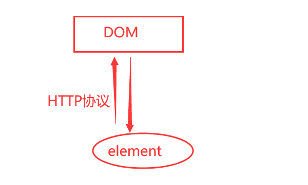
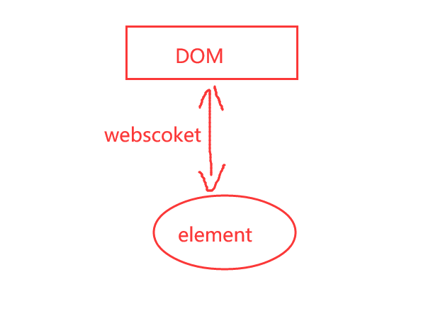

# 前言

ElementHandle 表示页内 DOM 元素。ElementHandles 可以使用page.query\_selector()方法创建。  
Locator和ElementHandle之间的区别在于后者指向特定元素，而 Locator 捕获如何检索该元素的逻辑。  
如果你能理解ElementHandle 和 Locator 定位机制，那也就明白了selenium的定位方式 和 playwright 定位方式的本质区别。

# ElementHandle 元素句柄

ElementHandle 表示页内 DOM 元素，ElementHandle 实例可以用作page.eval\_on\_selector()和page.evaluate()方法中的参数。  
可以使用page.query\_selector()方法创建。

```makefile
href_element = page.query_selector("a")
href_element.click()
```

在下面的示例中，句柄指向页面上的特定 DOM 元素。如果那个元素改变了文本或者被 React 用来渲染一个完全不同的组件，句柄仍然指向那个 DOM 元素。这可能会导致意外行为。

```makefile
handle = page.query_selector("text=Submit")
handle.hover()
handle.click()
```

学到这里大家也就明白了，为什么用selenium去循环操作页面元素的时候，只有第一次能操作，当页面刷新时，你定位的对象是上个页面的DOM元素对象。  
所以虽然你定位对了，但是句柄发生了改变，也就无法找到指定的元素了。

如果还是不能理解，再给大家讲下 selenium 采用的是 http 协议，获取的元素句柄是固定的，不能实时去获取页面上的元素



playwright 采用的是webscoket 协议，可以实时去获取页面元素，当DOM结构有更新的时候，也能重新获取到



所以**不鼓励使用 ElementHandle，而是使用Locator对象和网络优先断言**

# Locator 定位器

使用定位器，每次element使用时，最新的 DOM 元素都会使用选择器定位在页面中。所以在下面的代码片段中，底层 DOM 元素将被定位两次。

```css
# 上海悠悠 wx:283340479  
# blog:https://www.cnblogs.com/yoyoketang/

locator = page.get_by_text("Submit")
locator.hover()
locator.click()
```

定位机制不一样，所以 playwright 定位元素的时候比 selenium 更稳定。  
  


