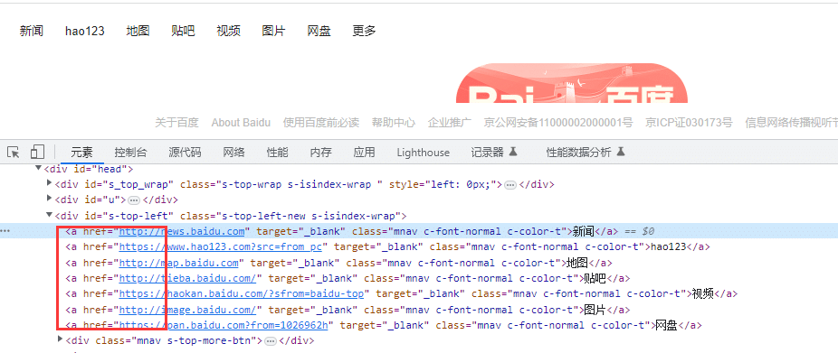

# 前言

locator.filter()方法可以对locator 定位到的元素进行筛选过滤，可以按文本过滤，也可以按locator定位器过滤。  
此方法根据选项缩小现有定位器的范围，例如按文本过滤。它可以链接多次过滤。

# locator.filter() 文本过滤

考虑以下 DOM 结构，我们要在其中单击第二张产品卡的购买按钮。我们有几个选项可以过滤定位器以获得正确的定位器。


可以使用locator.filter()方法按文本过滤定位器。它将在元素内部某处搜索特定字符串，可能在后代元素中不区分大小写。您还可以传递正则表达式。

```python
page.get_by_role("listitem").filter(has_text="Product 2").get_by_role(
    "button", name="Add to cart"
).click()
```

或者使用正则表达式

```python
page.get_by_role("listitem").filter(has_text=re.compile("Product 2")).get_by_role(
    "button", name="Add to cart"
).click()
```

# has\_text 参数使用

locator.filter()此方法根据选项缩小现有定位器的范围，例如按文本过滤。它可以链接多次过滤。



比如百度页面的链接，根据div元素定位到多个a标签的, 继续缩小范围，按文本过滤

```csharp
    page.goto("https://www.baidu.com")

    page.locator('#s-top-left>a').filter(has_text="新闻").click()
```

在locator 定位方法里面也可以传一个 has\_text 参数，示例如下

```csharp
    page.goto("https://www.baidu.com")
    page.locator('#s-top-left>a', has_text="新闻").click()
```

在locator 传 has\_text参数和使用`filter(has_text="新闻")`作用是等价的

# 按另一个 locator 过滤

定位器支持仅选择具有与另一个定位器匹配的后代的元素的选项。因此，您可以按任何其他定位器进行过滤，例如locator.get\_by\_role()、locator.get\_by\_test\_id()、locator.get\_by\_text()等。


```python
page.get_by_role("listitem").filter(
    has=page.get_by_role("heading", name="Product 2")
).get_by_role("button", name="Add to cart").click()
```

我们还可以声明产品卡以确保只有一个

```erlang
expect(
    page.get_by_role("listitem").filter(
        has=page.get_by_role("heading", name="Product 2")
    )
).to_have_count(1)
```

请注意，内部定位器是从外部定位器开始匹配的，而不是从文档根目录开始。

# 链式定位器

您可以链接创建定位器的方法，例如page.get\_by\_text()或locator.get\_by\_role()，以将搜索范围缩小到页面的特定部分。

在此示例中，我们首先通过定位测试 ID 创建一个名为 product 的定位器。然后我们按文本过滤。我们可以再次使用产品定位器来获取按钮的角色并单击它，然后使用断言来确保只有一个产品带有文本“Product 2”。

```css
# 上海悠悠 wx:283340479  
# blog:https://www.cnblogs.com/yoyoketang/

product = page.get_by_role("listitem").filter(has_text="Product 2")

product.get_by_role("button", name="Add to cart").click()
```

  


