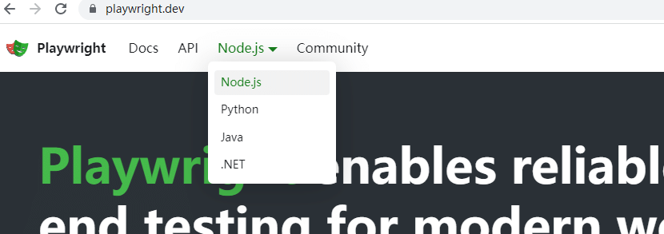
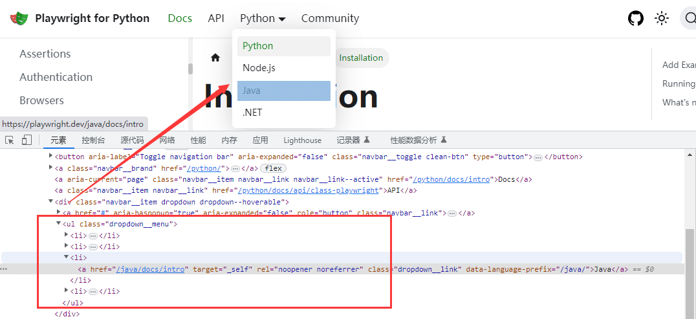

# 前言

鼠标悬停到某个元素上后出现一些选项，这是很常见的操作了，playwright 操作鼠标悬停非常简单，只需调用hover() 方法。

# 鼠标悬停

打开官网[https://playwright.dev/](https://playwright.dev/)

鼠标悬停到按钮上才会出现选项  


代码示例

```css
from playwright.sync_api import sync_playwright
# 上海悠悠 wx:283340479  
# blog:https://www.cnblogs.com/yoyoketang/

with sync_playwright() as p:
    browser = p.chromium.launch(headless=False)
    page = browser.new_page()
    page.goto("https://playwright.dev/")

    dropdown = page.locator('.dropdown--hoverable')
    # 鼠标悬停
    dropdown.hover()
    # 点选项
    dropdown.locator('.dropdown__link >> text=python').click()


    page.pause()
    browser.close()
```

# listitem 定位

对于ul-li的元素，可以用listitem 的角色定位方式

```css
<ul>
  <li>
    <h3>Product 1</h3>
    <button>Add to cart</button>
  </li>
  <li>
    <h3>Product 2</h3>
    <button>Add to cart</button>
  </li>
</ul>
```

配合 locator.filter() 过滤选择器一起使用

```python
page.get_by_role("listitem").filter(has_text="Product 2").get_by_role(
    "button", name="Add to cart"
).click()
```



于是前面的

```bash
    dropdown = page.locator('.dropdown--hoverable')
    # 鼠标悬停
    dropdown.hover()
    # 点选项
    dropdown.locator('.dropdown__link >> text=python').click()
```

可以换成

```css
    # 上海悠悠 wx:283340479  
    # blog:https://www.cnblogs.com/yoyoketang/
    dropdown = page.locator('.dropdown--hoverable')
    # 鼠标悬停
    dropdown.hover()
    # 点选项
    # dropdown.locator('.dropdown__link >> text=python').click()

    dropdown.get_by_role("listitem").filter(has_text="python").click()
```

  


