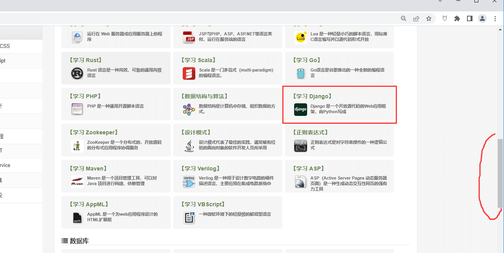

# 前言

当页面超过屏幕的高度时候，需要滚动到元素出现的位置，让元素处于可视的窗口上才能去操作元素。  
playwright 在点击元素的时候，会自动滚动到元素出现的位置，这点是非常人性化的。

# click 点击操作

比如我需要点如下图中的按钮，是需要先滚动右侧滚动条后元素才会出现



playwright 在点击元素的时候，会自动滚动到元素出现的位置

```csharp
from playwright.sync_api import sync_playwright
# 上海悠悠 wx:283340479  
# blog:https://www.cnblogs.com/yoyoketang/

with sync_playwright() as pw:
    browser = pw.chromium.launch(headless=False, slow_mo=2000)
    page = browser.new_page()

    page.goto("https://www.runoob.com/")

    # 点击的时候会自动滚动
    page.get_by_text('【学习 Django】').click()

    browser.close()
```

# 滚动到元素出现位置

如果我们仅仅是让元素出现到窗口的可视范围，可以使用`scroll_into_view_if_needed()` 方法，它会让元素出现在屏幕的正中间

```csharp
from playwright.sync_api import sync_playwright
# 上海悠悠 wx:283340479  
# blog:https://www.cnblogs.com/yoyoketang/

with sync_playwright() as pw:
    browser = pw.chromium.launch(headless=False, slow_mo=2000)
    page = browser.new_page()

    page.goto("https://www.runoob.com/")

    # 滚动元素到屏幕可视窗口
    page.get_by_text('【学习 Django】').scroll_into_view_if_needed()
```

# hover 方法

hover 方法是把鼠标放到元素上，它也会自动去页面上找到元素，让它出现在可视窗口

```csharp
from playwright.sync_api import sync_playwright
# 上海悠悠 wx:283340479  
# blog:https://www.cnblogs.com/yoyoketang/

with sync_playwright() as pw:
    browser = pw.chromium.launch(headless=False, slow_mo=2000)
    page = browser.new_page()

    page.goto("https://www.runoob.com/")

    # 鼠标放到元素上
    page.get_by_text('【学习 Django】').hover()
```

playwright 在操作元素的时候，都会自动去让元素出现在可视窗口。大部分情况不需要我们去操作滚动条。  
  


