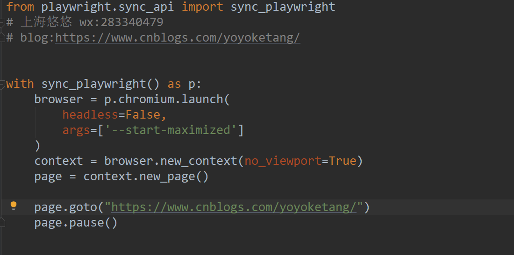
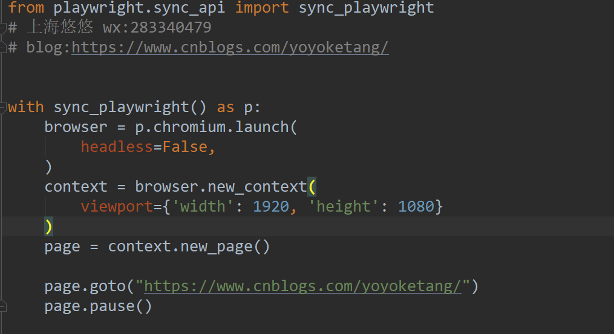
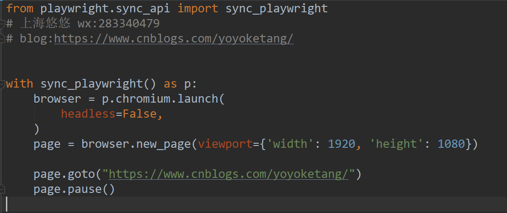
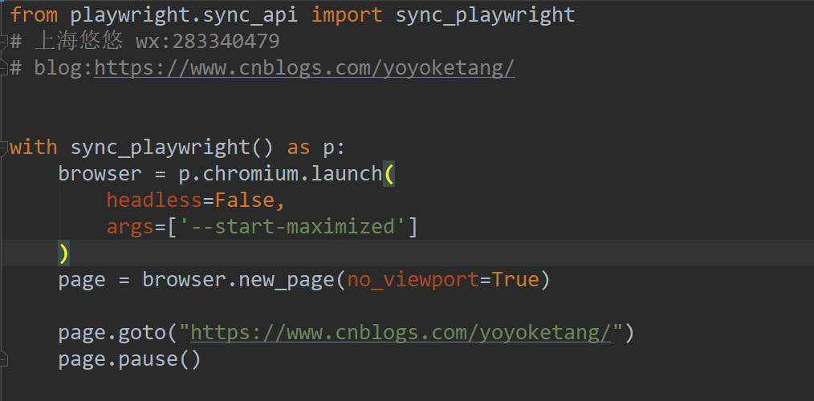

# 前言

playwright 默认启动的浏览器窗口大小是1280x720， 我们可以通过设置no\_viewport参数来禁用固定的窗口大小

# no\_viewport 禁用窗口大小

设置args参数`--start-maximized` 并且设置`no_viewport=True`



```mipsasm
from playwright.sync_api import sync_playwright
# 上海悠悠 wx:283340479
# blog:https://www.cnblogs.com/yoyoketang/


with sync_playwright() as p:
    browser = p.chromium.launch(
        headless=False,
        args=['--start-maximized']
    )
    context = browser.new_context(no_viewport=True)
    page = context.new_page()

    page.goto("https://www.cnblogs.com/yoyoketang/")
    page.pause()
```

# viewport 指定窗口大小

viewport 参数可以设置固定的窗口



# 2种方式

如果你不是通过context 上下文创建的page对象，直接通过browser创建的page，那么参数直接写到new\_page位置



最大化

  
  


