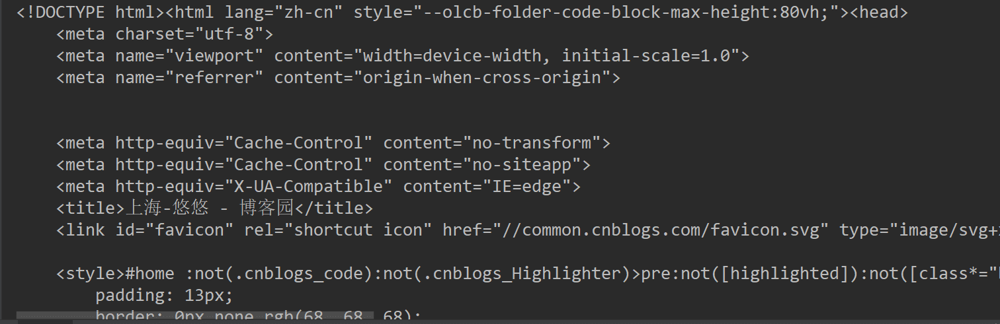
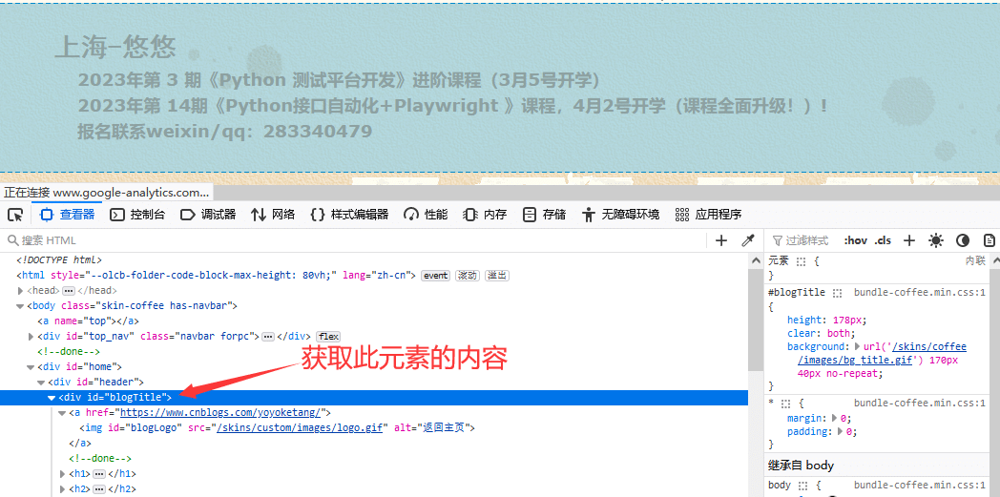
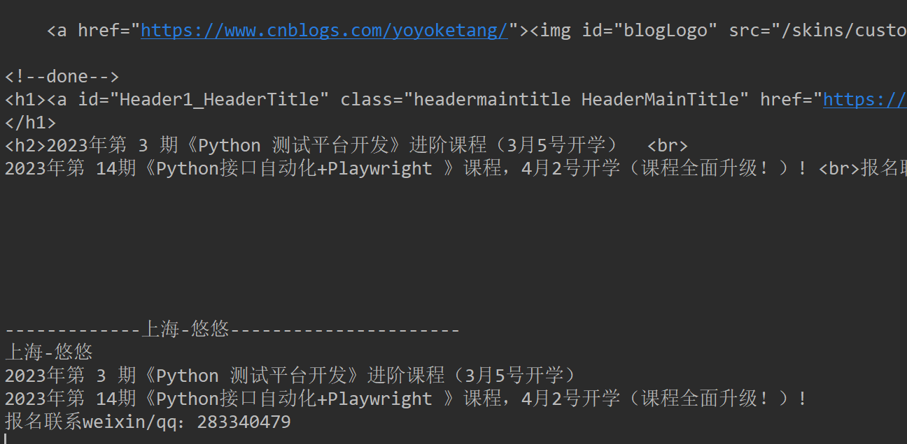
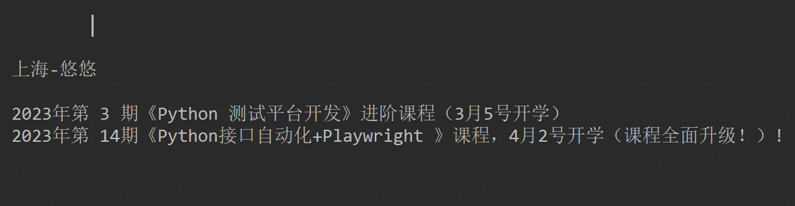
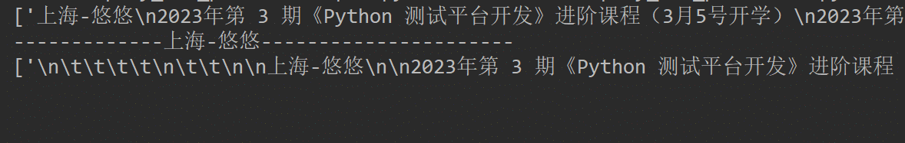

# 前言

selenium 里面有个driver.page\_source 可以获取整个html页面的内容，playwright里面也有类似的方法 使用 page.content()

# page.content() 获取html内容

使用示例

```mipsasm
from playwright.sync_api import sync_playwright
# 上海悠悠 wx:283340479
# blog:https://www.cnblogs.com/yoyoketang/


with sync_playwright() as p:
    browser = p.chromium.launch(headless=False)
    context = browser.new_context()
    page = context.new_page()

    page.goto("https://www.cnblogs.com/yoyoketang/")
    print(page.content())
```



对于喜欢爬虫的小伙伴就可以去抓取页面上的内容了。

# inner\_html() 与 inner\_text()

page.content() 是获取整个页面的HTML,如果我们只需获取某个元素的HTML，如下图  


可以使用locator().inner\_html() 方法获取

*   inner\_html() 获取元素的整个html源码内容
*   inner\_text() 获取元素的文本内容

```css
from playwright.sync_api import sync_playwright
# 上海悠悠 wx:283340479
# blog:https://www.cnblogs.com/yoyoketang/


with sync_playwright() as p:
    browser = p.chromium.launch(headless=False)
    context = browser.new_context()
    page = context.new_page()

    page.goto("https://www.cnblogs.com/yoyoketang/")
    # print(page.content())
    # 获取某个元素的HTML
    blog = page.locator('#blogTitle')
    print(blog.inner_html())
    print('-------------上海-悠悠----------------------')
    print(blog.inner_text())
```



# text\_content() 与 inner\_text() 获取页面文本

text\_content() 用来获取某个元素内所有文本内容，包含子元素内容，隐藏元素也能获取。  
inner\_text() 的返回值会被格式化 ,但是text\_content()的返回值不会被格式化  
最重要的区别 inner\_text()返回的值, 依赖于页面的显示, text\_content()依赖于代码的内容

```css
from playwright.sync_api import sync_playwright
# 上海悠悠 wx:283340479
# blog:https://www.cnblogs.com/yoyoketang/


with sync_playwright() as p:
    browser = p.chromium.launch(headless=False)
    context = browser.new_context()
    page = context.new_page()

    page.goto("https://www.cnblogs.com/yoyoketang/")
    # print(page.content())
    # 获取某个元素的HTML
    blog = page.locator('#blogTitle')
    # print(blog.inner_html())
    # print('-------------上海-悠悠----------------------')
    # print(blog.inner_text())
    print(blog.text_content())
```



# all\_inner\_texts() 与 all\_text\_contents()

all\_inner\_texts() 和 all\_text\_contents() 也是用于获取页面上的文本，但是返回的是list列表

```css
from playwright.sync_api import sync_playwright
# 上海悠悠 wx:283340479
# blog:https://www.cnblogs.com/yoyoketang/


with sync_playwright() as p:
    browser = p.chromium.launch(headless=False)
    context = browser.new_context()
    page = context.new_page()

    page.goto("https://www.cnblogs.com/yoyoketang/")
    # print(page.content())
    # 获取某个元素的HTML
    blog = page.locator('#blogTitle')
    # print(blog.inner_html())
    # print('-------------上海-悠悠----------------------')
    # print(blog.inner_text())
    # print(blog.text_content())

    print(blog.all_inner_texts())
    print('-------------上海-悠悠----------------------')
    print(blog.all_text_contents())
```

  
  


