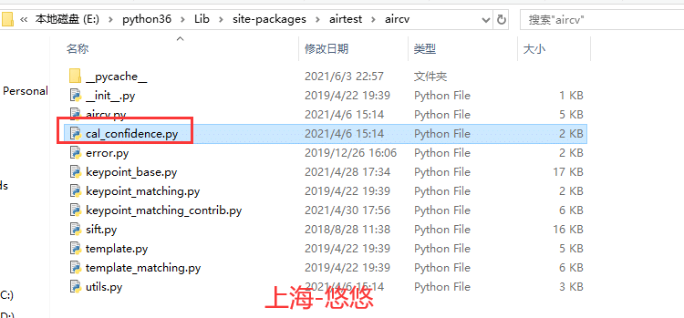
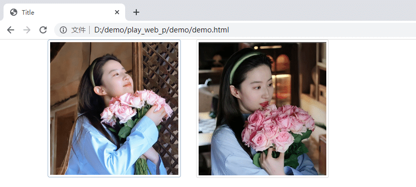
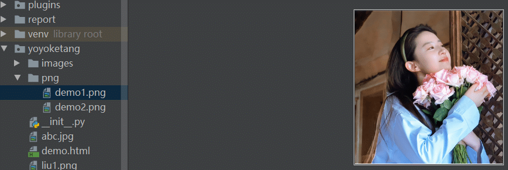
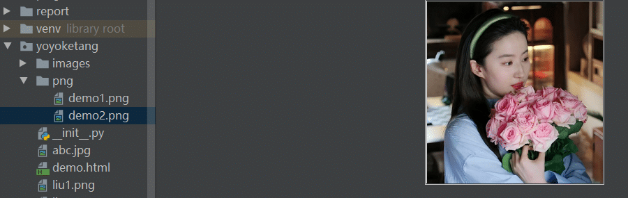
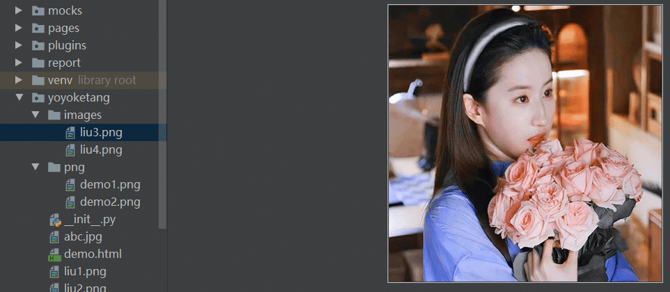
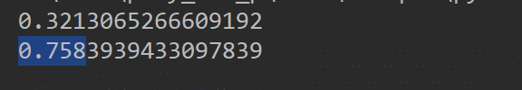

# 前言

在做 web 自动化的时候，有些场景需要去判断页面上的图片与预期的图片是否一样，或者判断图片有没正确的加载出来，需用到图片对比。  
如果你之前接触过airtest，那么你应该知道它是专业搞图片对比的，所以我们应该去那借点代码过来！

# 借代码

找到`Lib\site-packages\airtest\aircv` 目录下的 cal\_confidence.py 文件，就是我们要借的代码了  


```python
#!/usr/bin/env python
# -*- coding: utf-8 -*-

"""These functions calculate the similarity of two images of the same size."""


import cv2
from .utils import img_mat_rgb_2_gray


def cal_ccoeff_confidence(im_source, im_search):
    """求取两张图片的可信度，使用TM_CCOEFF_NORMED方法."""
    # 扩展置信度计算区域
    im_search = cv2.copyMakeBorder(im_search, 10,10,10,10,cv2.BORDER_REPLICATE)
    
    im_source, im_search = img_mat_rgb_2_gray(im_source), img_mat_rgb_2_gray(im_search)
    res = cv2.matchTemplate(im_source, im_search, cv2.TM_CCOEFF_NORMED)
    min_val, max_val, min_loc, max_loc = cv2.minMaxLoc(res)

    return max_val


def cal_rgb_confidence(img_src_rgb, img_sch_rgb):
    """同大小彩图计算相似度."""
    # 扩展置信度计算区域
    img_sch_rgb = cv2.copyMakeBorder(img_sch_rgb, 10,10,10,10,cv2.BORDER_REPLICATE)
    # 转HSV强化颜色的影响
    img_src_rgb = cv2.cvtColor(img_src_rgb, cv2.COLOR_BGR2HSV)
    img_sch_rgb = cv2.cvtColor(img_sch_rgb, cv2.COLOR_BGR2HSV)
    src_bgr, sch_bgr = cv2.split(img_src_rgb), cv2.split(img_sch_rgb)

    # 计算BGR三通道的confidence，存入bgr_confidence:
    bgr_confidence = [0, 0, 0]
    for i in range(3):
        res_temp = cv2.matchTemplate(src_bgr[i], sch_bgr[i], cv2.TM_CCOEFF_NORMED)
        min_val, max_val, min_loc, max_loc = cv2.minMaxLoc(res_temp)
        bgr_confidence[i] = max_val

    return min(bgr_confidence)
```

# 对比2张图片

当我们在浏览器上看到如下2个图片  


html 部分代码如下

```javascript
<div class="container">
    <div class="row">
        <div class="col-xs-6 col-sm-3  col-md-3">
            <a href="#" class="thumbnail" id="imag1">
                
            </a>

        </div>
        <div class="col-xs-6 col-sm-3 col-md-3">
            <a href="#" class="thumbnail" id="imag2">
                
            </a>
        </div>
    </div>
</div>
```

先使用playwright保存2张图片

```css
# 上海悠悠 wx:283340479
# blog:https://www.cnblogs.com/yoyoketang/
from playwright.sync_api import sync_playwright


with sync_playwright() as p:
    browser = p.chromium.launch(headless=False)
    page = browser.new_page()
    page.goto("file:///D:/demo/play_web_p/demo/demo.html")

    # 截图
    page.locator('#imag1').screenshot(path="png/demo1.png")
    page.locator('#imag2').screenshot(path="png/demo2.png")
    page.close()
    browser.close()
```

保存到png 目录  
图片1  


图片2  


那么我们本地images目录可以放2张图片  
图片3  


图片4  


接下来对比图片1和图片3的相似度，图片2和图片4的相似度

```css
# 上海悠悠 wx:283340479
# blog:https://www.cnblogs.com/yoyoketang/
    img1 = cv2.resize(cv2.imread('png/demo1.png'), (100, 100))
    img3 = cv2.resize(cv2.imread('images/liu3.png'), (100, 100))
    res1 = cal_ccoeff_confidence(img1, img3)
    print(res1)  # 0.32
    img2 = cv2.resize(cv2.imread('png/demo2.png'), (100, 100))
    img4 = cv2.resize(cv2.imread('images/liu4.png'), (100, 100))
    res2 = cal_ccoeff_confidence(img2, img4)
    print(res2)  # 0.75
```

运行结果  


从对比的结果可以看出2张图片越相似，得到的结果相似度越高。

# cv2.resize() 使用

使用语法：`cv2.resize(src, dsize, dst=None, fx=None, fy=None, interpolation=None)`

*   src 源图像
*   dsize 输出图像的大小
*   fx width方向的缩放比例
*   fy height方向的缩放比例
*   interpolation 这个是指定插值的方式

因为对比2张图片先要把图片大小设置为一致，使用cv2.resize()方法处理原始的图片，用于对比。  
  


