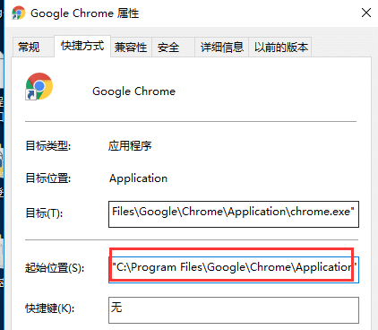
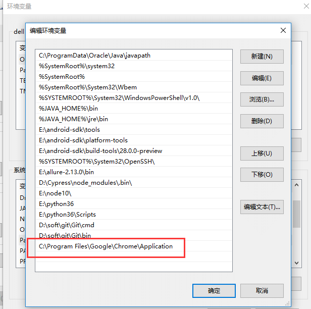
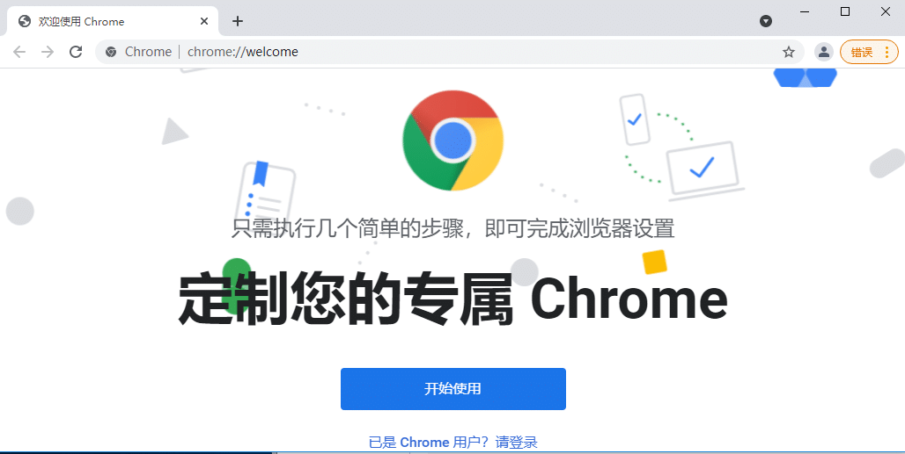
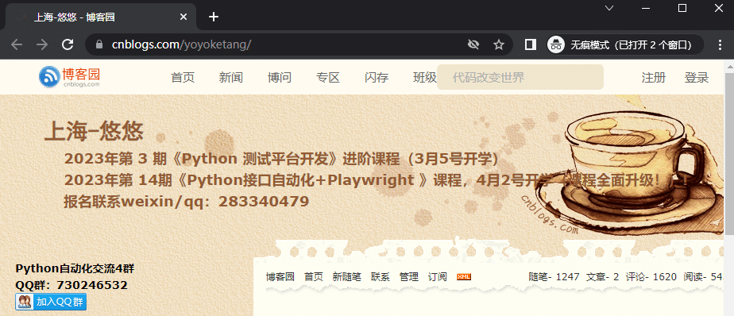

# 前言

有些网站的安全级别比较高，你可能想绕过登录验证，先手工打开浏览器操作登录，让playwright继续在你已经打开的浏览器上操作。  
selenium是可以做到这点，那么playwright也可以实现此功能。

# 环境准备

首先右键 Chrome 浏览器桌面图标，找到 chrome.exe 的安装路径  


复制地址`C:\Program Files\Google\Chrome\Application` 添加到环境变量Path下  


打开cmd输入命令启动chrome浏览器

*   \--remote-debugging-port 是指定运行端口，只要没被占用就行
*   \--user-data-dir 指定运行浏览器的运行数据，新建一个干净目录，不影响系统原来的数据

```kotlin
> chrome.exe --remote-debugging-port=12345 --user-data-dir="D:\playwright_chrome"
```

执行后会启动chrome浏览器  


# 参数配置

在启动浏览器的时候，我们还可以带上一些其它参数

*   \--incognito 隐私模式打开
*   \-–start-maximized：窗口最大化
*   \--new-window：直接打开网址

使用示例，用隐私模式打开我的博客

```javascript
chrome.exe --remote-debugging-port=12345 --incognito --start-maximized --user-data-dir="D:\demo" --new-window https://www.baidu.com
```



在你已经打开的浏览器页面，手工操作登录，登录成功后，让playwright 继续操作。

# playwright 接管页面

当页面打开后，可以使用connect\_over\_cdp()方法接管前面已经打开的浏览器，获取到context 上下文，通过上下文再获取到page对象

```python
from playwright.sync_api import sync_playwright
# 上海悠悠 wx:283340479
# blog:https://www.cnblogs.com/yoyoketang/


with sync_playwright() as p:
    browser = p.chromium.connect_over_cdp('http://localhost:12345/')
    # 获取page对象
    page = browser.contexts[0].pages[0]
    print(page.url)
    print(page.title())
    page.get_by_text('新随笔').click()
```

后面的操作，就跟操作page方法一样了  
  


