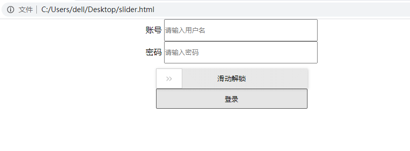
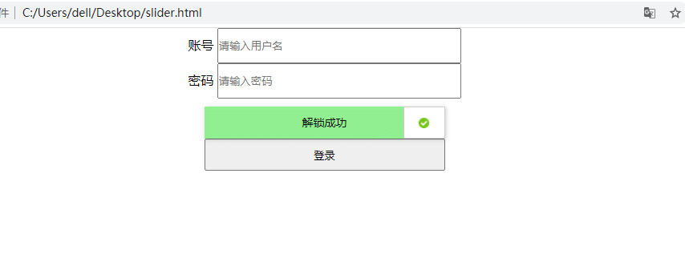

# 前言

登录页面会遇到滑块解锁，滑动解锁的目的就是为了防止别人用代码登录（也就是为了防止你自动化登录），有些滑动解锁是需要去拼图这种会难一点。  
有些直接拖到最最右侧就可以了，本篇讲下最简单的直接滑动最右侧的滑块解锁。

# 滑动解锁场景

看下图，是我本地写的一个 slider.html 网页



除了输入账号和密码，还需将滑块拖动到最右端才能解锁



最后才去点登陆按钮

# 操作滑块

操作滑块，需用到mouse 方法

*   mouse.move() 起点或终点坐标位置
*   mouse.down() 按住鼠标
*   mouse.up() 释放鼠标

示例代码

```css
from playwright.sync_api import sync_playwright
# 上海悠悠 wx:283340479
# blog:https://www.cnblogs.com/yoyoketang/


with sync_playwright() as p:
    browser = p.chromium.launch(headless=False, slow_mo=1000)
    context = browser.new_context()
    page = context.new_page()

    page.goto('file:///C:/Users/dell/Desktop/slider.html')

    # 滑块
    slider = page.locator('.slider').bounding_box()
    page.mouse.move(x=slider['x'], y=slider['y']+slider['height']/2)
    page.mouse.down()   # 按住
    page.mouse.move(x=slider['x']+240, y=slider['y']+slider['height']/2)
    page.mouse.up()     # 释放
    page.pause()
```

  


