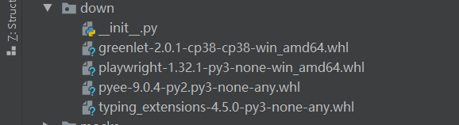
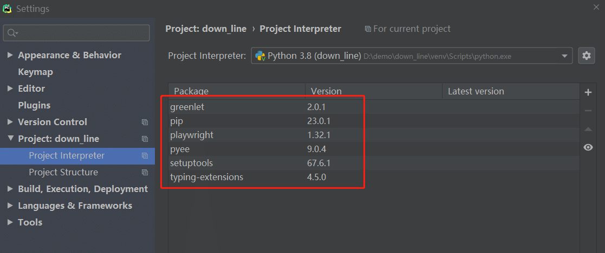
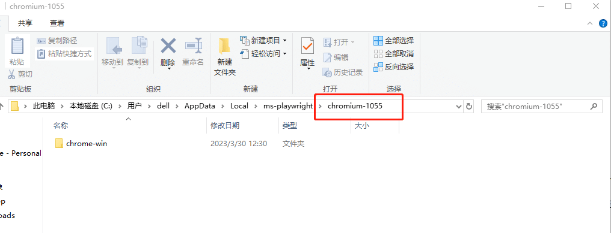
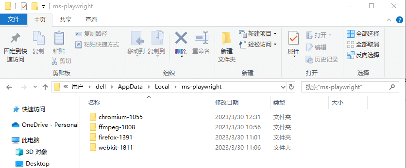

# 前言

有些同学可能是在公司局域网办公，无法连到外网去在线下载，本篇教大家在本地局域网部署好 playwright 环境

# playwright 本地下载

先找个有网络的电脑，下载playwright，不要去pypi库单独下载这一个包，它在安装过程中还会下载其他依赖包。  
如果你只下载一个`playwright-1.32.1-py3-none-win_amd64.whl`，然后pip安装肯定会失败。  
正确的方法是通过`pip download playwright` 下载安装包

```bash
pip download playwright -d ./down
```

\-d 参数是指定下载安装到本地down目录

正常情况下会下载以下四个包  


如果你还需要有其他的包需要下载，也可以按上面方式下载，比如pytest，allure-pytest 等包

# 多个包批量下载

如果你本地已经安装了一些依赖包了，可以通过`pip freeze > requirements.txt`， 导出本地的全部依赖包到requirements.txt文件

```undefined
pip freeze > requirements.txt
```

requirements.txt 内容格式如下

```ini
greenlet==2.0.1
playwright==1.32.1
pyee==9.0.4
typing-extensions==4.5.0
```

再通过download命令下载全部

```bash
pip download -r requirements.txt -d ./down
```



# 离线安装

你把前面下载的down文件下全部包，以及requirements.txt文件上传到你局域网的电脑上。  
本地离线批量安装依赖包

```perl
pip install --no-index  --find-links=./ -r requirements.txt
```

只要你 requirements.txt 文件的包和下载的包是一一对应的，上面的安装就不会报错了。



到这一步playwright 的基本环境就已经安装完成了。

# 启动本地 chrome 浏览器

如果你仅仅只需要在chrome浏览器上运行你的代码，那么是不需要执行`playwright install`下载 chromium,firefox 和 webkit。  
首先你确保在你自己本机电脑上安装了chrome浏览器，并且安装是按默认的安装路径  
那么在启动的时候，只需指定`channel='chrome'` 就可以启动本地chrome 浏览器了。

```csharp
# 上海悠悠 wx:283340479
# blog:https://www.cnblogs.com/yoyoketang/

from playwright.sync_api import sync_playwright


with sync_playwright() as p:
    browser = p.chromium.launch(channel='chrome', headless=False)
    context = browser.new_context()
    page = context.new_page()
    page.goto('http://xxx.xx.com')
```

如果遇到以下报错，说明你浏览器没正确安装,重新安装一次chrome浏览器，按默认的路径安装即可。

```vbnet
playwright._impl._api_types.Error: Chromium distribution 'chrome' is not found at C:\Users\dell\AppData\Local\Google\Chrome\Application\chrome.exe
Run "playwright install chrome"
```

# 离线安装chromium,firefox 和 webkit

如果你有安装chromium,firefox 和 webkit 这3个官方提供的内置浏览器的需求，那么接着往下看。  
我们先看去哪里下载到这3个浏览器, 在终端执行以下命令

```css
>playwright install --dry-run
```

它会根据你当前安装的playwright （我当前版本是1.32.1）版本，给出对应的浏览器最近匹配版本，以及下载地址

```bash
(venv) D:\demo\down_line\down>playwright install --dry-run
browser: chromium version 112.0.5615.29
  Install location:    C:\Users\dell\AppData\Local\ms-playwright\chromium-1055
  Download url:        https://playwright.azureedge.net/builds/chromium/1055/chromium-win64.zip
  Download fallback 1: https://playwright-akamai.azureedge.net/builds/chromium/1055/chromium-win64.zip
  Download fallback 2: https://playwright-verizon.azureedge.net/builds/chromium/1055/chromium-win64.zip

browser: firefox version 111.0
  Install location:    C:\Users\dell\AppData\Local\ms-playwright\firefox-1391
  Download url:        https://playwright.azureedge.net/builds/firefox/1391/firefox-win64.zip
  Download fallback 1: https://playwright-akamai.azureedge.net/builds/firefox/1391/firefox-win64.zip
  Download fallback 2: https://playwright-verizon.azureedge.net/builds/firefox/1391/firefox-win64.zip

browser: webkit version 16.4
  Install location:    C:\Users\dell\AppData\Local\ms-playwright\webkit-1811
  Download url:        https://playwright.azureedge.net/builds/webkit/1811/webkit-win64.zip
  Download fallback 1: https://playwright-akamai.azureedge.net/builds/webkit/1811/webkit-win64.zip
  Download fallback 2: https://playwright-verizon.azureedge.net/builds/webkit/1811/webkit-win64.zip

browser: ffmpeg
  Install location:    C:\Users\dell\AppData\Local\ms-playwright\ffmpeg-1008
  Download url:        https://playwright.azureedge.net/builds/ffmpeg/1008/ffmpeg-win64.zip
  Download fallback 1: https://playwright-akamai.azureedge.net/builds/ffmpeg/1008/ffmpeg-win64.zip
  Download fallback 2: https://playwright-verizon.azureedge.net/builds/ffmpeg/1008/ffmpeg-win64.zip
```

以 chromium 安装为例，先下载[https://playwright.azureedge.net/builds/chromium/1055/chromium-win64.zip](https://playwright.azureedge.net/builds/chromium/1055/chromium-win64.zip)  
下载后是一个chromium-win64.zip压缩包。  
接着看Install location 安装位置：`C:\Users\dell\AppData\Local\ms-playwright\chromium-1055` 按照这个路径依次创建文件夹，把压缩包放到chromium-1055下解压即可



还有个 ffmpeg 包也需要按上面的路径正确解压，此包跟录制视频有关。  
这样你本地就有了对应的chromium,firefox 和 webkit 环境。

在ms-playwright 目录下有以下四个文件  
  
  


