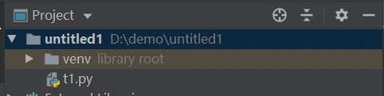
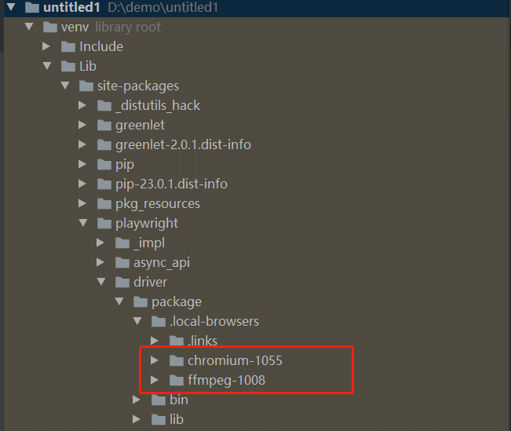

# 前言

playwright 与Pyinstaller结合使用来创建独立的可执行文件。

# 本地化安装

有同学提到说想打成一个exe的独立包，但是执行`playwright install`会默认把 chromium,firefox 和 webkit 三个浏览器安装到系统目录。  
这样打包的时候就找不到启动的浏览器文件。于是就想到把浏览器文件下载到我们代码的项目目录，打到一起。

在playwright 官方文档中有提到相关资料：  
您可以将 Playwright 与Pyinstaller结合使用来创建独立的可执行文件。

```css
# main.py
from playwright.sync_api import sync_playwright

with sync_playwright() as p:
    browser = p.chromium.launch()
    page = browser.new_page()
    page.goto("http://whatsmyuseragent.org/")
    page.screenshot(path="example.png")
    browser.close()
```

如果你想将浏览器与可执行文件捆绑在一起：

```cmake
set PLAYWRIGHT_BROWSERS_PATH=0
playwright install chromium
pyinstaller -F main.py
```

将浏览器与可执行文件捆绑在一起将生成更大的二进制文件。建议只捆绑您使用的浏览器。

上面这段就是官方文档提到的，资料比较少，接下来详细讲解下`set PLAYWRIGHT_BROWSERS_PATH=0` 的作用

# chromium 本地化安装

我们可以先创建一个虚拟环境



在虚拟环境下，安装你需要的包

```mipsasm
pip install playwright
```

先设置环境变量

```bash
set PLAYWRIGHT_BROWSERS_PATH=0
```

设置完成后使用`playwright install --dry-run`查看浏览器安装路径

```bash
(venv) D:\demo\untitled1>playwright install --dry-run
browser: chromium version 112.0.5615.29
  Install location:    d:\demo\untitled1\venv\Lib\site-packages\playwright\driver\package\.local-browsers\chromium-1055
  Download url:        https://playwright.azureedge.net/builds/chromium/1055/chromium-win64.zip
  Download fallback 1: https://playwright-akamai.azureedge.net/builds/chromium/1055/chromium-win64.zip
  Download fallback 2: https://playwright-verizon.azureedge.net/builds/chromium/1055/chromium-win64.zip

browser: firefox version 111.0
  Install location:    d:\demo\untitled1\venv\Lib\site-packages\playwright\driver\package\.local-browsers\firefox-1391
  Download url:        https://playwright.azureedge.net/builds/firefox/1391/firefox-win64.zip
  Download fallback 1: https://playwright-akamai.azureedge.net/builds/firefox/1391/firefox-win64.zip
  Download fallback 2: https://playwright-verizon.azureedge.net/builds/firefox/1391/firefox-win64.zip

browser: webkit version 16.4
  Install location:    d:\demo\untitled1\venv\Lib\site-packages\playwright\driver\package\.local-browsers\webkit-1811
  Download url:        https://playwright.azureedge.net/builds/webkit/1811/webkit-win64.zip
  Download fallback 1: https://playwright-akamai.azureedge.net/builds/webkit/1811/webkit-win64.zip
  Download fallback 2: https://playwright-verizon.azureedge.net/builds/webkit/1811/webkit-win64.zip

browser: ffmpeg
  Install location:    d:\demo\untitled1\venv\Lib\site-packages\playwright\driver\package\.local-browsers\ffmpeg-1008
  Download url:        https://playwright.azureedge.net/builds/ffmpeg/1008/ffmpeg-win64.zip
  Download fallback 1: https://playwright-akamai.azureedge.net/builds/ffmpeg/1008/ffmpeg-win64.zip
  Download fallback 2: https://playwright-verizon.azureedge.net/builds/ffmpeg/1008/ffmpeg-win64.zip
```

如果你只用一个浏览器，那么你就只下载一个，以chromium 为例，执行

```mipsasm
playwright install chromium
```

于是你可以在此目录找到`d:\demo\untitled1\venv\Lib\site-packages\playwright\driver\package\.local-browsers\webkit-1811`



顺着路径，你就会找到chromium-1055 和 ffmpeg 这2个文件。

需注意的是chromium-1055后面的1055 是版本号，此数字不能随便改，让它自己下载匹配的版本，不能直接复制别人下载的包。  
并且安装包的位置不能随便乱放，一定要是先设置环境变量`PLAYWRIGHT_BROWSERS_PATH=0`, 再去安装让它自己去下载后放到指定的目录

# Pyinstaller打包

安装Pyinstaller

```mipsasm
pip install pyinstaller
```

安装完成后执行打包

```css
pyinstaller -F main.py
```

# icon 制作

`-i`参数打包的时候可以自定义icon图标

```vhdl
-i <FILE.ico or FILE.exe,ID or FILE.icns or "NONE">, --icon <FILE.ico or FILE.exe,ID or FILE.icns or "NONE">
                        FILE.ico: apply that icon to a Windows executable.
                        FILE.exe,ID, extract the icon with ID from an exe.
                        FILE.icns: apply the icon to the .app bundle on Mac OS
                        X. Use "NONE" to not apply any icon, thereby making
                        the OS to show some default (default: apply
                        PyInstaller's icon)
```

先找一张icon图片放到项目跟目录（注意并不是每个图片格式都可以，必须是icon格式)

加 `-i` 参数打包

```css
pyinstaller -F yoyoblog.py -i favicon.ico
```

打包完成重新双击运行，会看到左上角有自己的icon了  


icon在线制作[https://www.bitbug.net/](https://www.bitbug.net/)

  


