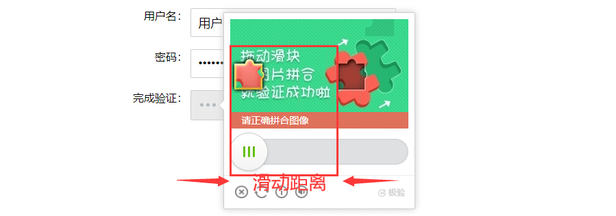
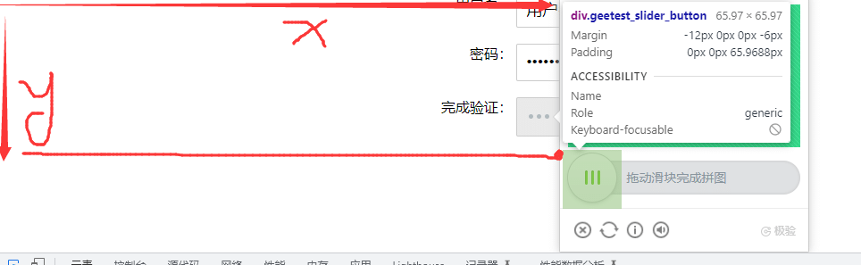

# 前言

有些登录页面经常会遇到滑块验证码，滑块的操作思路基本都差不多，先确定缺口的位置，再滑动过去。  
一般在滑动过去的时候，会有人机识别机制，有时候你准确的滑动位置了，但不一定会解锁成功。

# 滑块示例

以下滑块为例  


需先计算出滑块的缺口位置，也就是我们需要滑动的距离

# 计算缺口位置

计算缺口位置的方法，网上都有现成的解决方案， 我们只需要得到2张图，一个是背景图，另外一个是缺口图  


通过上面2张图，我们就可以计算出缺口的位置了

```csharp
# 上海悠悠 wx:283340479
# blog:https://www.cnblogs.com/yoyoketang/

    def target_position() -> int:
        """
           进行缺口位置计算识别 可以找我wx:283340479有偿解决
        :return: 缺口位置
        """
        slide = ddddocr.DdddOcr(show_ad=False, det=False, ocr=False)
        with open('bg.jpg', 'rb') as f:
            target_bytes = f.read()
        with open('full.jpg', 'rb') as f:
            background_bytes = f.read()
        res = slide.slide_comparison(target_bytes, background_bytes)
        return res.get('target')[0]

    x = target_position()
    print(x)  #
```

也就是说，我们只要从网页上获取到上面2张图，也就得到了缺口位置

# 定位滑动的按钮

定位滑动操作的按钮，计算按钮的x和y轴距离



x 和 y轴距离是以浏览器左上角的位置，横向是x，纵向是y

通过定位到元素，调用bounding\_box() 方法，得到x和y，以及图片的宽高

```bash
    # 滑动按钮
    slider = page.locator('div.geetest_slider_button').bounding_box()
    print(slider)
```

返回结果

```bash
{'x': 811.53125, 'y': 489.875, 'width': 55, 'height': 55}
```

# page.mouse 鼠标操作

page.mouse 鼠标操作的几个方法

*   page.mouse.move 是先把鼠标放到指定的坐标微信，x和y是坐标位置
*   page.mouse.down 是按下鼠标，button="middle" 参数是按住鼠标的中间位置
*   page.wait\_for\_timeout 是滑动的时候加一些等待时间，防止操作太快会被识别到不是人是手动操作
*   page.mouse.up 是释放鼠标

需注意是是page.mouse.move 传的参数是x和y的绝对坐标位置，跟selenium操作不一样，selenium是先定位某个元素，根据该元素的位置坐偏移的计算（相对位置）

```css
    # 鼠标拖动  可以找我wx:283340479有偿解决
    page.mouse.move(x=int(slider['x']), y=slider['y']+slider['height']/2)
    page.mouse.down(button="middle")
    page.wait_for_timeout(300)
    page.mouse.move(x=int(slider['x'])+x+random.randint(2, 8), y=slider['y'] + slider['height'] / 2)
    page.wait_for_timeout(500)
    page.mouse.move(x=int(slider['x']) + x - 2, y=slider['y'] + slider['height'] / 2)
    page.mouse.move(x=int(slider['x']) + x - 6, y=slider['y'] + slider['height'] / 2)
    page.wait_for_timeout(300)
    page.mouse.move(x=int(slider['x'])+x-8, y=slider['y'] + slider['height'] / 2)
    page.mouse.up(button="middle")
```

整体来说滑块的解决需解决以下3个问题：  
1.得到滑块背景图  
2.计算缺口位置  
3.滑动轨迹（绕过防爬机制）  
不同的网站滑块也有区别，特别是某东的网站滑块操作防爬机制级别很高，还需要去自己写个滑动轨迹。  
（滑块问题不是复制粘贴代码就能解决的，还需要根据实际情况去慢慢调试，比较耗时，耗经历，如果你有这方面需求，可以找我wx:283340479有偿解决）

  


