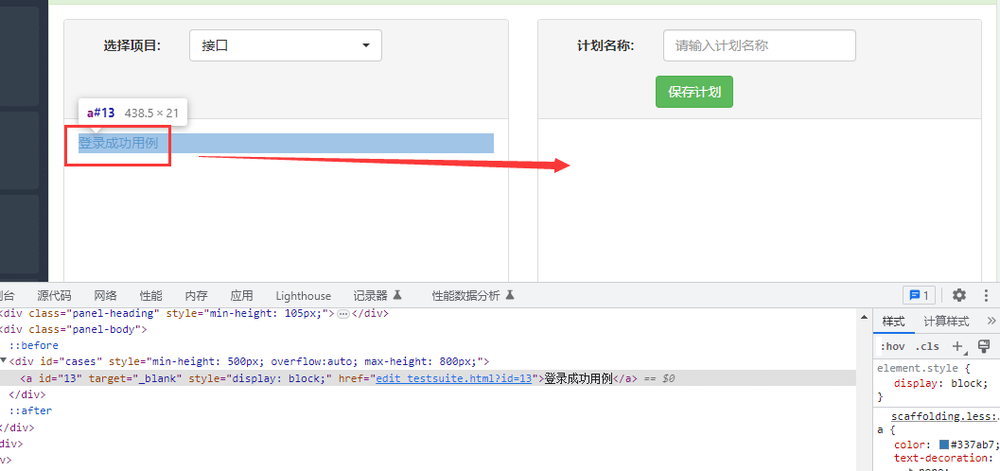
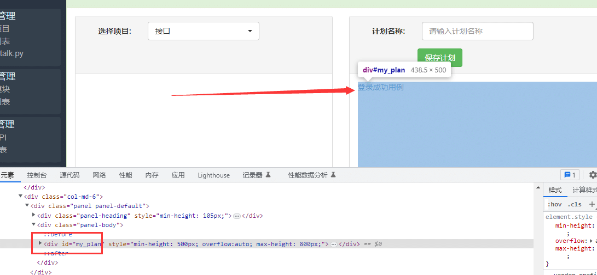

# 前言

按住元素从页面的一个位置拖动到另外一个位置，有2种方式可以实现

*   locator.drag\_to(target: locator) 先定位元素，调用drag\_to方法到目标元素
*   page.drag\_and\_drop(source: str, target: str) page对象直接调用

# 场景

目标元素  


拖动到指定位置  


# locator.drag\_to 拖拽操作

您可以使用locator.drag\_to()执行拖放操作。此方法将：

*   将鼠标悬停在要拖动的元素上。
*   按鼠标左键。
*   将鼠标移动到将接收放置的元素。
*   松开鼠标左键。

使用示例

```python
page.locator("#item-to-be-dragged").drag_to(page.locator("#item-to-drop-at"))
```

先分别定为目标元素和拖动的位置元素，调用drag\_to 方法拖拽操作

```python
    # 目标元素
    source = page.get_by_text('登录成功用例')
    # 终点位置
    target = page.locator('#my_plan')
    # 拖拽操作
    source.drag_to(target)
```

# page.drag\_and\_drop 拖动

通过page对象调用drag\_and\_drop ,部分源码如下

```python
def drag_and_drop(  
    self,  
    source: str,  
    target: str,  
    *,  
    source_position: typing.Optional[Position] = None,  
    target_position: typing.Optional[Position] = None,  
    force: typing.Optional[bool] = None,  
    no_wait_after: typing.Optional[bool] = None,  
    timeout: typing.Optional[float] = None,  
    strict: typing.Optional[bool] = None,  
    trial: typing.Optional[bool] = None  
) -> None:
```

source 和 target 是字符串格式，也就是传selector 选择器的方法

```bash
page.drag_and_drop('text=登录成功用例',  '#my_plan')
```

# 手动拖动

如果您想精确控制拖动操作，请使用较低级别的方法，如locator.hover()、mouse.down()、mouse.move()和mouse.up()。

```python
# 上海悠悠 wx:283340479
# blog:https://www.cnblogs.com/yoyoketang/

    page.get_by_text('登录成功用例').hover()
    page.mouse.down()
    page.locator("#my_plan").hover()
    page.mouse.up()
```

如果您的页面依赖于dragover正在调度的事件，则您至少需要移动两次鼠标才能在所有浏览器中触发它。  
要可靠地发出第二次鼠标移动，请重复mouse.move()或locator.hover()两次。  
操作顺序是：悬停拖动元素，鼠标向下，悬停放置元素，第二次悬停放置元素，鼠标向上。

  


