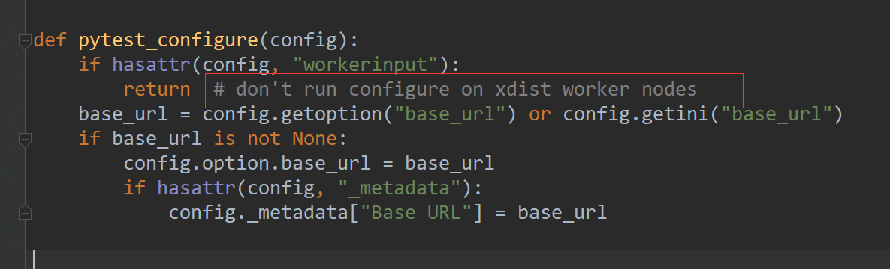

# 前言

在实际工作中项目下的web自动化用例非常多，单进程执行会消耗很长的运行时间，可能运行一次用例得几个小时。  
为了加快用例的运行速度，可以使用pytest-xdist多进程执行用例。但并不是说你写的用例，直接安装插件就能使用，实际使用的过程中还会遇到很多的问题。

# pytest-xdist 多进程执行用例

pytest-xdist 多进程执行用例需遵循以下基本原则：  
1.用例之间是相互独立的，没有依赖关系，每个用例都可以独立运行；  
2.用例执行之间没有顺序要求，随机顺序都能正常执行；  
3.每个用例都能重复执行，运行结果不会影响到其他用例

所以在设计用例的时候，一开始就需要遵循原则，不能等用例全部写完，发现用 pytest-xdist 插件运行的时候一大堆问题，改起来成本就有点大了。

环境准备

先pip 安装pytest-xdist

```mipsasm
pip install pytest-xdist
```

# 设置进程数执行用例

test\_x2.py 用例如下

```python
# 上海悠悠 wx:283340479
# blog:https://www.cnblogs.com/yoyoketang/

url = 'https://www.cnblogs.com'


def test_x1():
    print("case1-----")
    assert url == 'https://www.cnblogs.com'


def test_x2():
    print("case2-----")
    assert url == 'https://www.cnblogs.com'


def test_x3():
    print("case3-----")
    assert url == 'https://www.cnblogs.com'
```

并行执行用例，直接加个-n参数即可，后面num参数就是并行数量，比如num设置为3

```undefined
pytest test_x2.py -n 2
```

也可以使用 -n设置为auto，自动获取系统的CPU核数，缺点是启用该参数CPU占用率会非常高，每个进程执行速度会非常慢

```cpp
pytest test_x2.py -n auto
```

# 测试分布算法配置

测试分布算法配置有--dist命令行选项：  
\--dist load （默认）：将未决测试发送给任何可用的worker，没有任何保证的顺序。可以使用–maxschedchunk选项微调调度，请参阅pytest –help的输出。  
\--dist loadscope：测试按测试功能的模块 和测试方法的类分组。组作为一个整体分配给可用的工人。这保证了组中的所有测试都在同一进程中运行。如果您有模块级或类级固定装置，这将很有用。按类分组优先于按模块分组。  
\--dist loadfile：测试按其包含文件分组。组作为一个整体分配给可用的工人。这保证了文件中的所有测试都在同一个 worker 中运行。  
\--dist loadgroup：测试按标记分组xdist\_group。组作为一个整体分配给可用的工人。这保证了所有具有相同xdist\_group名称的测试都在同一个 worker 中运行。  
\--dist worksteal：最初，测试平均分配给所有可用的工作人员。当一个工作人员完成了大部分分配给它的测试并且没有足够的测试继续进行时（目前，每个工作人员在其队列中至少需要两个测试），就会尝试重新分配（“窃取”）来自某些工作人员的部分测试其他工人的队列。结果应该与该load方法相似，但worksteal应该更好地处理持续时间明显不同的测试，同时，它应该提供相似或更好的 fixture 重用。  
\--dist no: 正常的 pytest 执行模式，一次运行一个测试（根本没有分发）。

测试按标记分组xdist\_group

```less
@pytest.mark.xdist_group(name="group1")
def test1():
    pass


class TestA:
    @pytest.mark.xdist_group("group1")
    def test2():
        pass
```

这将确保test1并将TestA::test2在同一个工作人员中运行。没有标记的测试xdist\_group按模式正常分发--dist=load。

# 与pytest-base-url插件结合使用

pytest-xdist 与 pytest-base-url 结合使用的时候也会有一些问题

pytest.ini

```ini
[pytest]

base_url=https://www.cnblogs.com
```

test\_x.py 内容

```python
# 上海悠悠 wx:283340479
# blog:https://www.cnblogs.com/yoyoketang/

def test_x1(base_url):
    print(base_url)
    assert base_url == 'https://www.cnblogs.com'


def test_x2(base_url):
    print(base_url)
    assert base_url == 'https://www.cnblogs.com'


def test_x3(base_url):
    print(base_url)
    assert base_url == 'https://www.cnblogs.com'
```

你直接输入`pytest test_x.py` 执行是没问题的

```yaml
>pytest test_x.py
=============== test session starts =================
platform win32 -- Python 3.8.5, pytest-7.2.2, pluggy-1.0.0
baseurl: https://www.cnblogs.com
rootdir: D:\demo\untitled3, configfile: pytest.ini
plugins: base-url-2.0.0, xdist-3.2.1
collected 3 items                                                                                                       

test_x.py ...                                                                                                     [100%]

================ 3 passed in 0.03s  ==============================
```

但是加上 -n 参数后就获取不到base\_url地址了

```python
>pytest test_x.py -n 2
================================================= test session starts ==================================================
platform win32 -- Python 3.8.5, pytest-7.2.2, pluggy-1.0.0
baseurl: https://www.cnblogs.com
rootdir: D:\demo\untitled3, configfile: pytest.ini
plugins: base-url-2.0.0, xdist-3.2.1
gw0 [3] / gw1 [3]


......

base_url = None

    def test_x1(base_url):
        print(base_url)
>       assert base_url == 'https://www.cnblogs.com'
E       AssertionError: assert None == 'https://www.cnblogs.com'
```

主要原因是获取的base\_url为空 了

看了下源码，有个地方有注释说`don't run configure on xdist worker nodes`，不适配xdist



解决办法一：

找到原来的 base\_url 这个fixture定义的地方

```python
@pytest.fixture(scope="session")
def base_url(request):
    """Return a base URL"""
    config = request.config
    base_url = config.getoption("base_url")
    if base_url is not None:
        return base_url
```

改成

```python
@pytest.fixture(scope="session")
def base_url(request):
    """Return a base URL"""
    config = request.config
    base_url = config.getoption("base_url") or config.getini("base_url") 
    if base_url is not None:
        return base_url
```

如果不想改源码，也可以换个方式避开上面的问题  
解决方法二：在pytest.ini里面不配置ini参数，配置命令行参数  
pytest.ini修改后如下

```ini
[pytest]

addopts=
    --base-url=https://www.cnblogs.com
```

以上2种方式都可以解决pytest-xdist 与 pytest-base-url 不兼容的问题。

**遇到的一些问题**  
使用-n 参数后，用例里面print的内容不会在控制台输出了，加-s也不会输出

  


