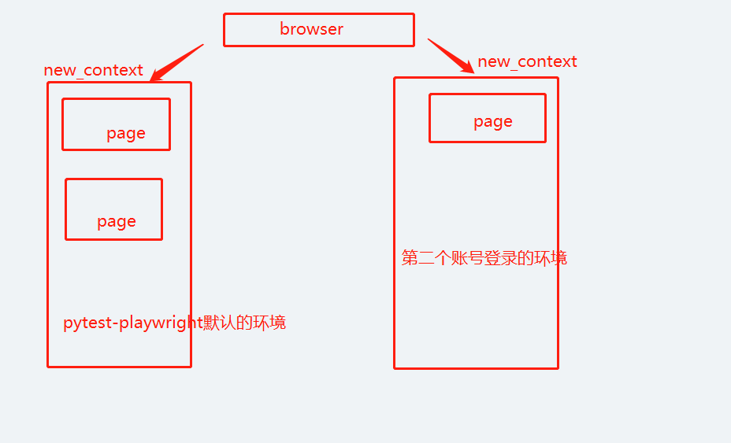
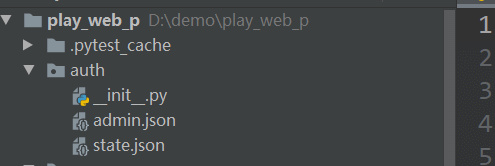
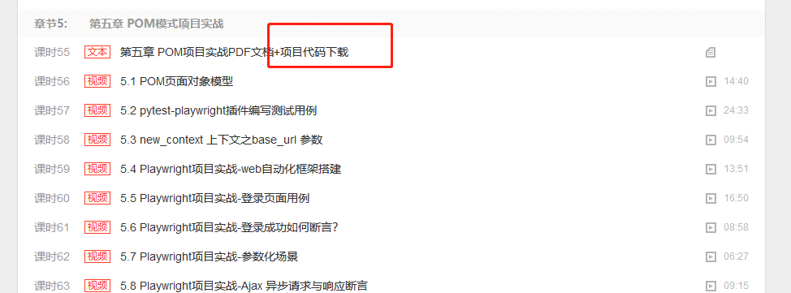

# 前言

pytest-playwright 插件可以让我们快速编写pytest格式的测试用例，它提供了一个内置的page 对象，可以直接打开页面操作。  
但是有时候我们需要2个账号是操作业务流程，比如A账号创建了一个任务，需要用到B账号去操作审批动作等。  
如果需要2个账号同时登录，可以使用context 上下文，它可以做到环境隔离。

# context 上下文环境隔离

使用 Playwright 编写的测试在称为浏览器上下文的隔离的全新环境中执行。这种隔离模型提高了可重复性并防止级联测试失败。

### 什么是测试隔离

测试隔离是指每个测试与另一个测试完全隔离。每个测试都独立于任何其他测试运行。这意味着每个测试都有自己的本地存储、会话存储、cookie 等。Playwright 使用BrowserContext实现了这一点，这相当于隐身式配置文件。它们的创建速度快、成本低，并且完全隔离，即使在单个浏览器中运行也是如此。Playwright 为每个测试创建一个上下文，并在该上下文中提供一个默认页面。

### 为什么测试隔离很重要

*   没有失败结转。如果一个测试失败，它不会影响另一个测试。
*   易于调试错误或不稳定，因为您可以根据需要多次运行单个测试。
*   并行运行、分片等时不必考虑顺序。

测试隔离有两种不同的策略：从头开始或在两者之间进行清理。在测试之间清理的问题是很容易忘记清理，有些东西是不可能清理的，比如“访问过的链接”。来自一个测试的状态可能会泄漏到下一个测试中，这可能会导致您的测试失败并使调试变得更加困难，因为问题来自另一个测试。从头开始意味着一切都是新的，因此如果测试失败，您只需查看该测试即可进行调试。

### Playwright 如何实现测试

Playwright 使用浏览器上下文来实现测试隔离。每个测试都有自己的浏览器上下文。每次运行测试都会创建一个新的浏览器上下文。使用 Playwright 作为测试运行程序时，默认情况下会创建浏览器上下文。否则，您可以手动创建浏览器上下文。

```ini
browser = playwright.chromium.launch()
context = browser.new_context()
page = context.new_page()
```

浏览器上下文还可用于模拟涉及移动设备、权限、区域设置和配色方案的多页面场景

Playwright 可以在一个场景中创建多个浏览器上下文。当您想测试多用户功能（如聊天）时，这很有用。

```python
from playwright.sync_api import sync_playwright
# 上海悠悠 wx:283340479  
# blog:https://www.cnblogs.com/yoyoketang/


def run(playwright):
    # create a chromium browser instance
    chromium = playwright.chromium
    browser = chromium.launch()

    # create two isolated browser contexts
    user_context = browser.new_context()
    admin_context = browser.new_context()

    # create pages and interact with contexts independently

with sync_playwright() as playwright:
    run(playwright)
```

关于context上下文的详细介绍参考这篇[https://www.cnblogs.com/yoyoketang/p/17142642.html](https://www.cnblogs.com/yoyoketang/p/17142642.html)

# 多账号登录解决方案

pytest-playwright 插件默认有一个context 和page 的fixture



可以用pytest-playwright 插件自带的page对象，先登录用户A

用户B的登录，重新创建另外一个上下文环境  
conftest.py

```python
import pytest
from pages.login_page import LoginPage
"""
全局默认账号使用 "yoyo", "******"  在cases 目录的conftest.py 文件下
涉及多个账号切换操作的时候
我们可以创建新的上下文，用其它账号登录
"""
# 上海悠悠 wx:283340479  
# blog:https://www.cnblogs.com/yoyoketang/


@pytest.fixture(scope="session")
def save_admin_cookies(browser, base_url, pytestconfig):
    """
     admin 用户登录后保存admin.json  cookies信息
    :return:
    """
    context = browser.new_context(base_url=base_url, no_viewport=True)
    page = context.new_page()
    LoginPage(page).navigate()
    LoginPage(page).login("admin", "***********")
    # 等待登录成功页面重定向
    page.wait_for_url(url='**/index.html')
    # 保存storage state 到指定的文件
    storage_path = pytestconfig.rootpath.joinpath("auth/admin.json")
    context.storage_state(path=storage_path)
    context.close()


@pytest.fixture(scope="module")
def admin_context(browser, base_url, pytestconfig):
    """
    创建admin上下文, 加载admin.json数据
    :return:
    """
    context = browser.new_context(
        base_url=base_url,
        no_viewport=True,
        storage_state=pytestconfig.rootpath.joinpath("auth/admin.json"),
    )
    yield context
    context.close()
```

运行完成后，会生成第二个账号对应的admin.json数据  


在用例中，我们传admin\_context 参数就可以得到B账号的上下文context对象了，基于context对象创建page页面对象

```python
"""
整个项目中的上下文对象
page  用例中直接传page,默认使用登录后的context上下文创建的page对象
admin_context  针对admin用户登录后的上下文环境
"""
from playwright.sync_api import BrowserContext, Page
import pytest
import uuid
from pages.add_project_page import AddProjectPage
from pages.project_list_page import ProjectListPage
# 上海悠悠 wx:283340479  
# blog:https://www.cnblogs.com/yoyoketang/


class TestMoreAccounts:
    """多账号切换操作示例"""

    @pytest.fixture(autouse=True)
    def start_for_each(self, page: Page, admin_context: BrowserContext):
        print("for each--start: 打开添加项目页")
        # 用户1
        self.user1_project = AddProjectPage(page)
        self.user1_project.navigate()
        # 用户2
        page2 = admin_context.new_page()
        self.user2_project = ProjectListPage(page2)
        self.user2_project.navigate()
        yield
        print("for each--end: 后置操作")
        page.close()
        page2.close()

    def test_delete_project(self):
        """
        测试流程：
        step--A账号登录，创建项目xxx
        step--B账号登录，删除项目xxx
        :return:
        """
        # 账号 1 添加项目
        test_project_name = str(uuid.uuid4()).replace('-', '')[:25]
        self.user1_project.fill_project_name(test_project_name)
        self.user1_project.fill_publish_app("xx")
        self.user1_project.fill_project_desc("xxx")
        # 断言跳转到项目列表页
        with self.user1_project.page.expect_navigation(url="**/list_project.html"):
            # 保存成功后，重定向到列表页
            self.user1_project.click_save_button()

        # 账号 2 操作删除
        self.user2_project.search_project(test_project_name)
        with self.user2_project.page.expect_request("**/api/project**"):
            self.user2_project.click_search_button()
        self.user2_project.page.wait_for_timeout(3000)
        self.user2_project.locator_table_delete.click()
        # 确定删除
        with self.user2_project.page.expect_response("**/api/project**") as resp:
            self.user2_project.locator_boot_box_accept.click()
        # 断言删除成功
        resp_obj = resp.value
        assert resp_obj.status == 200
```




标签: [python+playwright](https://www.cnblogs.com/yoyoketang/tag/python%2Bplaywright/)

[好文要顶](javascript:) [关注我](javascript:) [收藏该文](javascript:) [](javascript: "分享至新浪微博") [](javascript: "分享至微信")

[](https://home.cnblogs.com/u/yoyoketang/)

[上海-悠悠](https://home.cnblogs.com/u/yoyoketang/)  
[粉丝 - 4209](https://home.cnblogs.com/u/yoyoketang/followers/) [关注 - 73](https://home.cnblogs.com/u/yoyoketang/followees/)  

[+加关注](javascript:)

2

0

[«](https://www.cnblogs.com/yoyoketang/p/17293838.html) 上一篇： [python+playwright 学习-49 pytest-xdist 多进程执行用例](https://www.cnblogs.com/yoyoketang/p/17293838.html "发布于 2023-04-06 18:59")  
[»](https://www.cnblogs.com/yoyoketang/p/17302103.html) 下一篇： [python+playwright 学习-51 登录-验证码识别](https://www.cnblogs.com/yoyoketang/p/17302103.html "发布于 2023-04-10 10:19")

posted @ 2023-04-07 13:59  [上海-悠悠](https://www.cnblogs.com/yoyoketang/)  阅读(55)  评论(0)  [编辑](https://i.cnblogs.com/EditPosts.aspx?postid=17295940)  [收藏](javascript:)  [举报](javascript:)