[代码 ​github FaceDetectionComparison](https://link.zhihu.com/?target=https%3A//github.com/Smartuil/OpenCV-Practical-Exercise/tree/master/FaceDetectionComparison)


在本教程中，我们将讨论OpenCV和Dlib中的各种人脸检测方法，并对这些方法进行定量比较。我们将在c++中共享以下人脸检测的代码:

1.  OpenCV中的Haar级联人脸检测器
2.  OpenCV中基于深度学习的人脸检测
3.  Dlib中的HoG Face检测器
4.  Dlib中基于深度学习的人脸检测

我们不讨论它们的理论，只讨论它们的用法。我们还将根据您的应用程序分享一些关于选择哪种模型的经验法则。

> 在整个文章中，我们将假设图像大小为300×300。

## 一、OpenCV中的Haar级联人脸检测器

基于Haar级联的人脸检测技术是自2001年Viola和Jones提出人脸检测技术以来最先进的人脸检测技术。近年来有了许多改进。OpenCV有许多基于Haar的模型，可以在[这里](https://link.zhihu.com/?target=https%3A//github.com/opencv/opencv/tree/master/data/haarcascades)找到。

**代码**

```cpp
faceCascadePath = "./haarcascade_frontalface_default.xml";
faceCascade.load( faceCascadePath )
std::vector<Rect> faces;
faceCascade.detectMultiScale(frameGray, faces);

for ( size_t i = 0; i < faces.size(); i++ )
{
  int x1 = faces[i].x;
  int y1 = faces[i].y;
  int x2 = faces[i].x + faces[i].width;
  int y2 = faces[i].y + faces[i].height;
}
```

上面的代码片段加载haar级联模型文件并将其应用于灰度图像。输出是一个包含检测到的面孔的列表。列表中的每个成员都是一个包含4个元素的列表，这些元素表示左上角的(x, y)坐标和检测到的面的宽度和高度。

**优点**

1.  在CPU上几乎实时工作
2.  架构简单
3.  识别不同尺度的脸

**缺点**

1.  它给出了很多错误的预测。
2.  对非正面图像不起作用。
3.  在遮挡下不起作用

## 二、OpenCV中的DNN人脸检测器

这个模型包含在OpenCV3.3以上中。它以单点多盒探测器为基础，以ResNet-10架构为骨干。该模型是使用从网上获得的图像进行训练的，但其来源没有透露。OpenCV为这种人脸检测器提供了两种模型。

1.  原始caffe实现的浮点16位版本(5.4 MB)
2.  使用Tensorflow的8位量化版本(2.7 MB)

**代码**

```cpp
const std::string caffeConfigFile = "./deploy.prototxt";
const std::string caffeWeightFile = "./res10_300x300_ssd_iter_140000_fp16.caffemodel";

const std::string tensorflowConfigFile = "./opencv_face_detector.pbtxt";
const std::string tensorflowWeightFile = "./opencv_face_detector_uint8.pb";

#ifdef CAFFE
  Net net = cv::dnn::readNetFromCaffe(caffeConfigFile, caffeWeightFile);
#else
  Net net = cv::dnn::readNetFromTensorflow(tensorflowWeightFile, tensorflowConfigFile);
#endif
```

我们使用上面的代码加载所需的模型。如果我们想要使用Caffe的浮点模型，我们可以使用caffemodel和prototxt文件。否则，我们使用TensorFlow模型。还请注意我们阅读Caffe和Tensorflow网络的方式的不同。

```cpp
#ifdef CAFFE
    cv::Mat inputBlob = cv::dnn::blobFromImage(frameOpenCVDNN, inScaleFactor, cv::Size(inWidth, inHeight), meanVal, false, false);
#else
    cv::Mat inputBlob = cv::dnn::blobFromImage(frameOpenCVDNN, inScaleFactor, cv::Size(inWidth, inHeight), meanVal, true, false);
#endif

net.setInput(inputBlob, "data");
cv::Mat detection = net.forward("detection_out");

cv::Mat detectionMat(detection.size[2], detection.size[3], CV_32F, detection.ptr<float>());

for(int i = 0; i < detectionMat.rows; i++)
{
    float confidence = detectionMat.at<float>(i, 2);

    if(confidence > confidenceThreshold)
    {
        int x1 = static_cast<int>(detectionMat.at<float>(i, 3) * frameWidth);
        int y1 = static_cast<int>(detectionMat.at<float>(i, 4) * frameHeight);
        int x2 = static_cast<int>(detectionMat.at<float>(i, 5) * frameWidth);
        int y2 = static_cast<int>(detectionMat.at<float>(i, 6) * frameHeight);

        cv::rectangle(frameOpenCVDNN, cv::Point(x1, y1), cv::Point(x2, y2), cv::Scalar(0, 255, 0),2, 4);
    }
}
```

在上面的代码中，图像被转换成一个blob并使用forward()函数通过网络传递。输出检测为4-D矩阵，其中

*   第三维迭代检测到的面部。(i是面部数的迭代器)
*   第四个维度包含关于边界框和每个面部得分的信息。例如，detections\[0,0,0,2\]给出第一个面部的置信度，detections\[0,0,0,3:6\]给出边界框。

边界框的输出坐标在\[0,1\]之间归一化。因此，坐标应该乘以原始图像的高度和宽度，以得到图像上正确的边界框。

**优点**

1.  四种方法中最精确的
2.  在CPU上实时运行
3.  适用于不同的面部朝向-向上，向下，左，右，侧面等。
4.  即使在遮挡的情况下也能工作
5.  检测不同尺度的脸(检测大脸和小脸)

基于DNN的探测器克服了Haar级联探测器的所有缺点，同时又不损害Haar提供的任何优点。我们看不到这个方法的主要缺点，除了它比下面讨论的基于Dlib HoG的人脸检测器慢。

## 三、Dlib中的HoG Face检测器

这是一种应用广泛的基于HoG特征和SVM的人脸检测模型。你可以在[这篇文章](https://link.zhihu.com/?target=https%3A//www.learnopencv.com/histogram-of-oriented-gradients/)中读到更多关于HoG的信息。该模型由5个HOG过滤器组成——前视、左视、右视、前视但向左旋转，以及前视但向右旋转。模型嵌入在[头文件](https://link.zhihu.com/?target=https%3A//github.com/davisking/dlib/blob/master/dlib/image_processing/frontal_face_detector.h)本身中。

**代码**

```cpp
frontal_face_detector hogFaceDetector = get_frontal_face_detector();

// Convert OpenCV image format to Dlib's image format
cv_image<bgr_pixel> dlibIm(frameDlibHogSmall);

// Detect faces in the image
std::vector<dlib::rectangle> faceRects = hogFaceDetector(dlibIm);

for ( size_t i = 0; i < faceRects.size(); i++ )
{
  int x1 = faceRects[i].left();
  int y1 = faceRects[i].top();
  int x2 = faceRects[i].right();
  int y2 = faceRects[i].bottom();
  cv::rectangle(frameDlibHog, Point(x1, y1), Point(x2, y2), Scalar(0,255,0), (int)(frameHeight/150.0), 4);
}
```

在上面的代码中，我们首先加载面部检测器。然后我们将图像通过检测器。第二个参数是我们想upscale图像的次数。upscale越大，越有可能发现较小的脸。然而，图像的upscale将对计算速度产生实质性的影响。输出的形式是带有对角角(x, y)坐标的面部列表。

**优点**

1.  CPU上最快的方法
2.  非常适合正面和稍微不正面的脸
3.  重量轻的模型相比，其他三个
4.  在轻微遮挡下工作

基本上，除了下面讨论的几种情况外，这种方法在大多数情况下都是有效的。

**缺点**

1.  主要缺点是它不能检测小的脸，因为它是训练最小的脸尺寸为80×80。因此，您需要确保在您的应用程序中，面部大小应该大于这个值。然而，你可以训练你自己的脸探测器来检测较小的脸
2.  边界框通常会排除部分额头，有时甚至会排除部分下巴
3.  在大量遮挡的情况下效果不是很好
4.  不适合侧脸和极端非正面脸，如向下或向上看

## 四、Dlib中的CNN人脸检测器

该方法使用基于CNN的[最大边缘对象检测器(MMOD)](https://link.zhihu.com/?target=https%3A//arxiv.org/pdf/1502.00046.pdf)。此方法的训练过程非常简单，您不需要大量数据来训练自定义对象检测器。更多信息，请访问[网站](https://link.zhihu.com/?target=http%3A//blog.dlib.net/2016/10/easily-create-high-quality-object.html)。

**代码**

```cpp
String mmodModelPath = "./mmod_human_face_detector.dat";
net_type mmodFaceDetector;
deserialize(mmodModelPath) >> mmodFaceDetector;

// Convert OpenCV image format to Dlib's image format
cv_image<bgr_pixel> dlibIm(frameDlibMmodSmall);
matrix<rgb_pixel> dlibMatrix;
assign_image(dlibMatrix, dlibIm);

// Detect faces in the image
std::vector<dlib::mmod_rect> faceRects = mmodFaceDetector(dlibMatrix);

for ( size_t i = 0; i < faceRects.size(); i++ )
{
  int x1 = faceRects[i].rect.left();
  int y1 = faceRects[i].rect.top();
  int x2 = faceRects[i].rect.right();
  int y2 = faceRects[i].rect.bottom();
  cv::rectangle(frameDlibMmod, Point(x1, y1), Point(x2, y2), Scalar(0,255,0), (int)(frameHeight/150.0), 4);
}
```

代码类似于HoG检测器，除了在本例中，我们加载的是cnn人脸检测模型。同样，坐标也存在于一个rect对象中。

**优点**

1.  适用于不同的面部朝向
2.  遮挡下工作
3.  在GPU上工作非常快
4.  非常简单的训练过程

**缺点**

1.  CPU上速度很慢
2.  不检测小的脸，因为它是训练的最小脸尺寸为80×80。因此，您需要确保在您的应用程序中，面部大小应该大于这个值。然而，你可以训练你自己的脸探测器来检测较小的脸。
3.  bounding box甚至比HoG检测器还要小。

**五、准确度对比**

我尝试使用FDDB数据集，使用[用于评估OpenCV-DNN模型的脚本](https://link.zhihu.com/?target=https%3A//github.com/opencv/opencv/blob/master/modules/dnn/misc/face_detector_accuracy.py)来评估这4个模型。然而，我发现了令人惊讶的结果。Dlib的结果比Haar差，尽管Dlib的输出在视觉上看起来要好得多。以下是4种方法的精度得分。

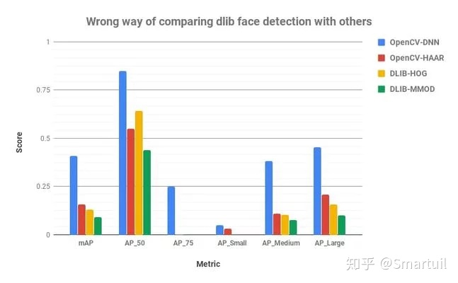

> AP\_50 = Precision when overlap between Ground Truth and predicted bounding box is at least 50% ( IoU = 50% )  
> AP\_75 = Precision when overlap between Ground Truth and predicted bounding box is at least 75% ( IoU = 75% )  
> AP\_Small = Average Precision for small size faces ( Average of IoU = 50% to 95% )  
> AP\_medium = Average Precision for medium size faces ( Average of IoU = 50% to 95% )  
> AP\_Large = Average Precision for large size faces ( Average of IoU = 50% to 95% )  
> mAP = Average precision across different IoU ( Average of IoU = 50% to 95% )

仔细观察后，我发现这个评价对Dlib是不公平的。

**1.以错误的方式评估准确性!**

根据我的分析，dlib数值偏低的原因如下:

主要原因是dlib是使用标准数据集训练的，但是没有它们的注释。这些图像是由作者注释的。因此，我发现即使检测到人脸，边界框也与Haar或OpenCV-DNN有很大的不同。他们更小，经常修剪前额和下巴的部分如下图所示。

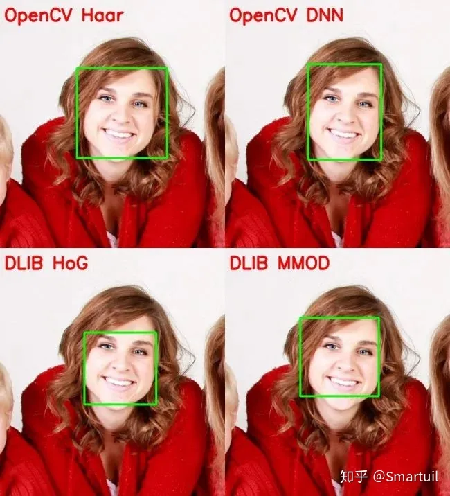

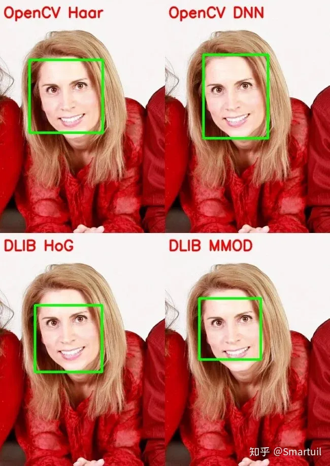

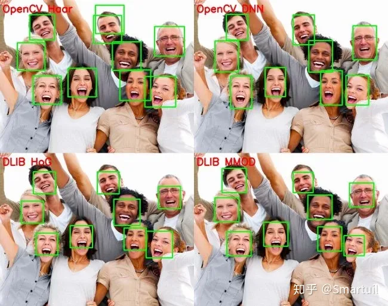

这可以从上面图中的AP\_50和AP\_75分数得到进一步的解释。AP\_X表示在ground truth和检测到的box之间有X%的重叠时的精度。dlib模型的AP\_75得分为0，但AP\_50得分高于Haar。这仅仅意味着Dlib模型能够检测到比Haar模型更多的面，但是Dlib的较小的边界框降低了它们的AP\_75和其他数字。

第二个原因是dlib无法检测到小脸，这进一步降低了数字。

因此，OpenCV和Dlib之间公平比较的惟一相关度量是AP\_50(甚至小于50，因为我们主要是比较检测到的面孔的数量)。所以，在使用Dlib人脸检测器时，应该始终记住这一点。

## 六、速度对比

我们用一张300×300的图像来比较这两种方法。MMOD探测器可以在GPU上运行，但是在OpenCV中对NVIDIA GPU的支持仍然不存在。因此，我们评估的方法只对CPU，并报告结果的MMOD对GPU以及CPU。

硬件

处理器:英特尔酷睿i7 6850K

RAM: 32 GB

GPU: NVIDIA GTX 1080 Ti, 11 GB内存

操作系统:Linux 16.04 LTS

编程语言:Python

我们在给定的图像上运行每个方法10000次，然后进行10次这样的迭代，并平均所花费的时间。以下是结果。

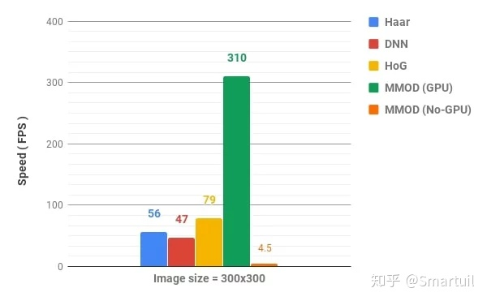

可以看到，对于这个大小的图像，除了MMOD之外，所有方法都是实时执行的。MMOD检测器在GPU上非常快，但在CPU上非常慢。

还应该注意，这些数字在不同的系统上可能是不同的。

## 七、不同条件下的比较

除了准确性和速度之外，还有其他一些因素帮助我们决定使用哪一个。在本节中，我们将根据其他各种重要的因素来比较这些方法。

**1.检测规模**

我们将会看到一个例子，在同一个视频中，一个人来回n次，使得脸变得又小又大。我们注意到OpenCV DNN检测所有的面，而Dlib只检测那些较大的面。我们还显示了检测到的面和边界框的大小。


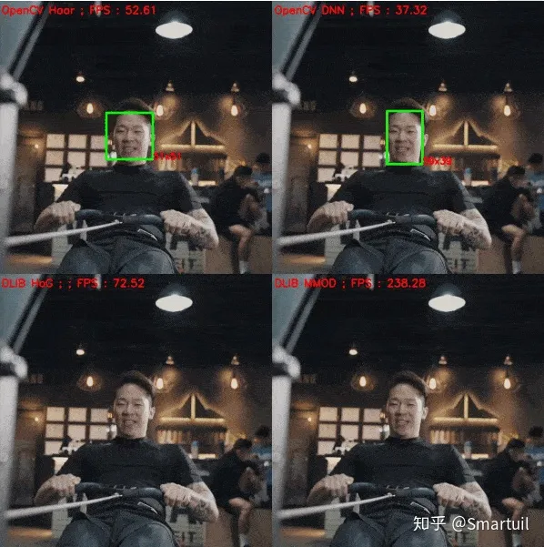

可以看出，基于dlib的方法能够检测到尺寸为~(70×70)的人脸，之后无法检测到。如前所述，我认为这是基于Dlib方法的主要缺点。因为在大多数情况下不可能事先知道脸的大小。我们可以通过升级图像来解决这个问题，但是dlib相对于OpenCV-DNN的速度优势就消失了。

**2.非正脸**

非正面的人可以朝右、左、上、下看。同样，为了公平对待dlib，我们要确保面尺寸大于80×80。下面是一些例子。

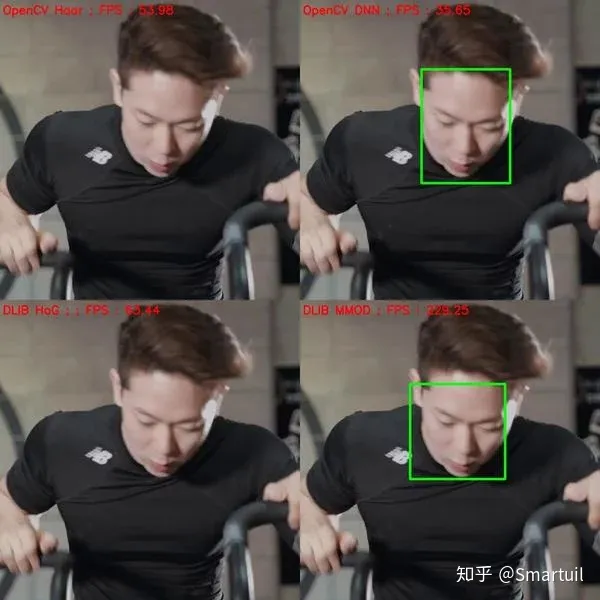

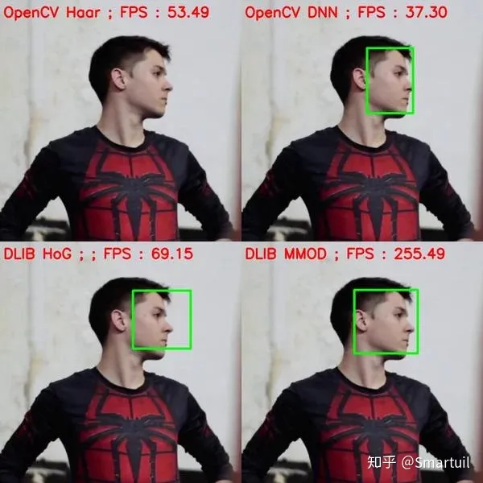

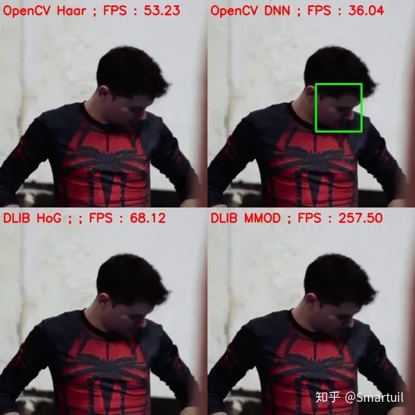

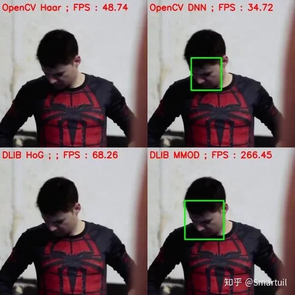

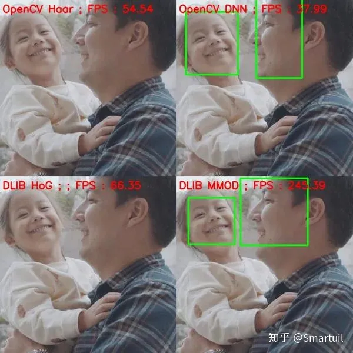

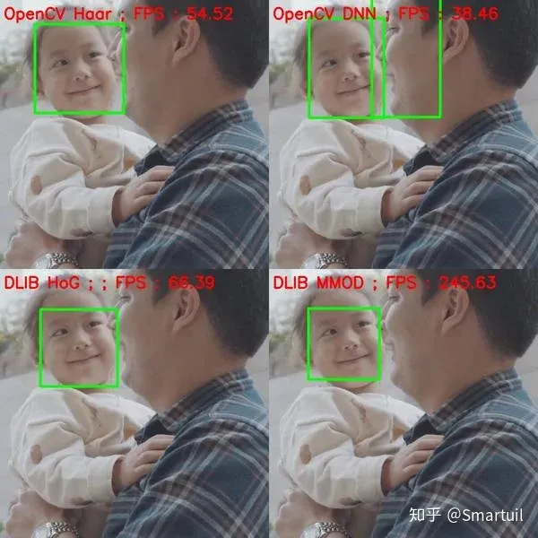

与预期一样，基于Haar的检测器完全失效。HoG检测器确实可以检测出左脸或右脸的人脸(因为它是针对这些人脸进行训练的)，但其准确性不如基于DNN的OpenCV和Dlib检测器。

**3.遮挡**

让我们看看这些方法在遮挡下的表现如何。

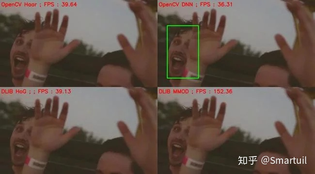

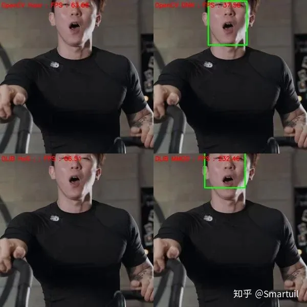

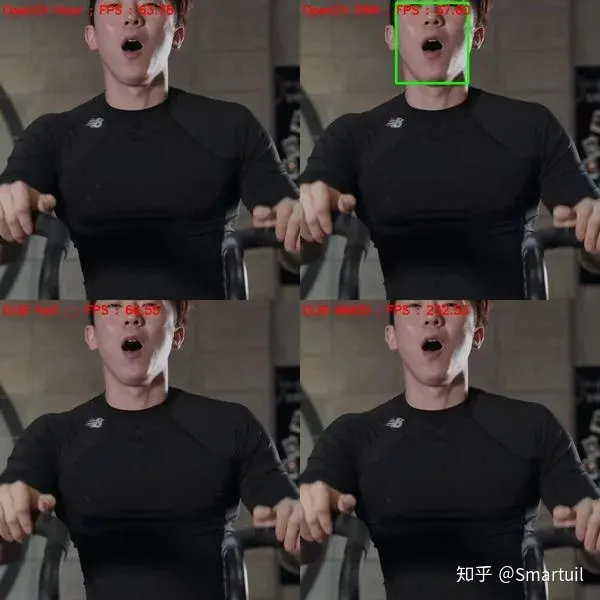

同样，DNN方法优于其他两种方法，OpenCV-DNN稍微优于Dlib-MMOD。这主要是因为CNN的特征比HoG或Haar的特征要健壮得多。

## 八、结论

我们在各自的小节中讨论了每种方法的优缺点。我建议对您的应用程序同时尝试OpenCV-DNN和HoG方法，并据此做出决定。我们分享一些开始的技巧。

一般情况

在大多数应用程序中，我们事先不知道图像中人脸的大小。因此，最好使用OpenCV - DNN方法，因为它是非常快速和非常准确的，即使是小尺寸的脸。它还能探测不同角度的人脸。我们建议在大多数情况下使用OpenCV-DNN

对于中、大型图像尺寸

Dlib HoG是CPU上最快的方法。但它不能检测到小脸(< 70x70)。因此，如果您知道您的应用程序将不会处理非常小的面孔(例如自拍照应用程序)，那么基于HoG的面孔检测器是一个更好的选择。此外，如果你可以使用GPU，那么MMOD人脸检测是最好的选择，因为它在GPU上非常快，还提供各种角度的检测。

高分辨率照片

由于向这些算法(为了提高计算速度)提供高分辨率图像是不可能的，所以当您缩小图像时，HoG / MMOD检测器可能会失败。另一方面，OpenCV-DNN方法可以用于这些，因为它可以检测小的面孔。

**参考**

[Face Detection - OpenCV, Dlib and Deep Learning](https://link.zhihu.com/?target=https%3A//www.learnopencv.com/face-detection-opencv-dlib-and-deep-learning-c-python/)