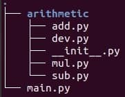

## \_\_init\_\_.py

在Python工程里，当python检测到一个目录下存在\_\_init\_\_.py文件时，python就会把它当成一个模块(module)。Module跟C＋＋的命名空间和Java的Package的概念很像，都是为了科学地组织化工程，管理命名空间。

\_\_init\_\_.py可以是一个空文件，也可以有非常丰富的内容。本文将举一个非常简单的例子，来介绍\_\_init\_\_.py的用法；在本文的最后，我将会再简单介绍\_\_init\_\_.py的设计理念。

## 一个普通的四则运算模块

在不利用\_\_init\_\_.py的情况下，我们来看一个四则运算的例子。我们的工程目录结构如下图所示：



四则运算例子的工程目录结构

如上图，其中，main.py是程序入口，我们用了不同的方式来import四则运算的各个子模块。arithmetic模块实现四则运算；为了展示需要，我们将加减乘除四种运算分别放在不同的代码中。

每个文件的代码如下:

```python
#
# @file main.py
#

import arithmetic.add
import arithmetic.sub as sub

from arithmetic.mul import mul
from arithmetic import dev

def letscook(x, y, oper):
    r = 0
    if oper == "+":
        r = arithmetic.add.add(x, y)
    elif oper == "-":
        r = sub.sub(x, y)
    elif oper == "*":
        r = mul(x, y)
    else:
        r = dev.dev(x, y)

    print("{} {} {} = {}".format(x, oper, y, r))

x, y = 3, 8

letscook(x, y, "+")
letscook(x, y, "-")
letscook(x, y, "*")
letscook(x, y, "/")
```

  

```python
#
# @file add.py
#

def add(a, b):
    return a + b
```

  

```python
#
# @file sub.py
#

def sub(a, b):
    return a - b
```

  

```python
#
# @file mul.py
# 

def mul(a, b):
    return a * b
```

  

```python
#
# @file dev.py
#

def dev(a, b):
    return a / b
```

从代码可以看出，为了使用arithmetic中的某个子模块（main.py中我们展示了四种不同的方式），我们必须使用非常繁琐的import语句；在使用的时候，也有可能需要使用非常繁琐的表达式。如果我们在不同的地方使用arithmetic的子模块，都需要写这么繁琐的import或者使用表达式，你可能会觉得心累。这就是为什么我们需要利用\_\_init\_\_.py来简化我们的使用。

## 利用\_\_init\_\_.py

还是第1小节中的工程目录结构，实现同样的功能，我们在\_\_init\_\_.py中编写了一些代码；同样，我们对main.py进行了一些适当的修改。

修改后\_\_init\_\_.py和main.py的代码如下：

```python
#
# @file main.py
#

import arithmetic as a4

def letscook(x, y, oper):
    r = 0
    if oper == "+":
        r = a4.add(x, y)
    elif oper == "-":
        r = a4.sub(x, y)
    elif oper == "*":
        r = a4.mul(x, y)
    else:
        r = a4.dev(x, y)

    print("{} {} {} = {}".format(x, oper, y, r))

x, y = 3, 8

letscook(x, y, "+")
letscook(x, y, "-")
letscook(x, y, "*")
letscook(x, y, "/")
```

  

```python
#
# @file __init__.py
#

import arithmetic.add
import arithmetic.sub
import arithmetic.mul
import arithmetic.dev

add = arithmetic.add.add
sub = arithmetic.sub.sub
mul = arithmetic.mul.mul
dev = arithmetic.dev.dev
```

在\_\_init\_\_.py中， 我们import了arithmetic下的所有子模块，并在\_\_init\_\_.py中给各个子模块的核心功能取了新的名字，作为arithmetic模块的变量。所以我们在main.py中import了arithmetic模块之后，就可以直接进行使用了。如果你使用from arithmetic import \* 语句，那么我们就可以使用add、sub、mul、dev，连a4都省了。

  

## \_\_init\_\_.py的设计原则

\_\_init\_\_.py的原始使命是声明一个模块，所以它可以是一个空文件。在\_\_init\_\_.py中声明的所有类型和变量，就是其代表的模块的类型和变量，第2小节就是利用这个原理，为四则运算的4个子模块声明了新的变量。我们在利用\_\_init\_\_.py时，应该遵循如下几个原则：

- 不要污染现有的命名空间。模块一个目的，是为了避免命名冲突，如果你在种用\_\_init\_\_.py时违背这个原则，是反其道而为之，就没有必要使用模块了。

- 利用\_\_init\_\_.py对外提供类型、变量和接口，对用户隐藏各个子模块的实现。一个模块的实现可能非常复杂，你需要用很多个文件，甚至很多子模块来实现，但用户可能只需要知道一个类型和接口。就像我们的arithmetic例子中，用户只需要知道四则运算有add、sub、mul、dev四个接口，却并不需要知道它们是怎么实现的，也不想去了解arithmetic中是如何组织各个子模块的。由于各个子模块的实现有可能非常复杂，而对外提供的类型和接口有可能非常的简单，我们就可以通过这个方式来对用户隐藏实现，同时提供非常方便的使用。

- 只在\_\_init\_\_.py中导入有必要的内容，不要做没必要的运算。像我们的例子，import arithmetic语句会执行\_\_ini\_\_.py中的所有代码。如果我们在\_\_init\_\_.py中做太多事情，每次import都会有额外的运算，会造成没有必要的开销。一句话，\_\_init\_\_.py只是为了达到B中所表述的目的，其它事情就不要做啦。

