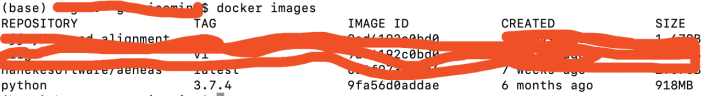
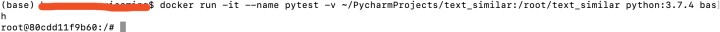
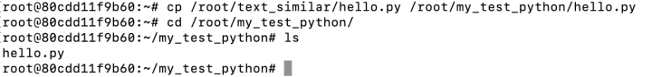
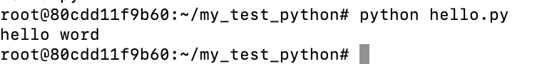
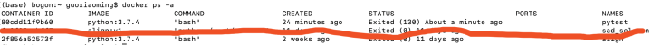
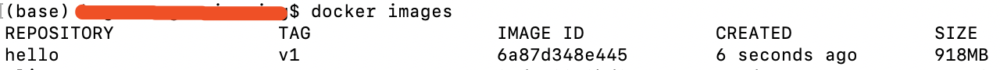
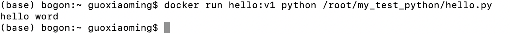

# docker python_Docker极简实战之python项目安装部署


## 前言

docker问世多年，上手尝试，发现这的确是个好东西啊。应用简单明了、同一系统中部署多个docker环境分离互不干扰（python不同版本应用放到不同的docker），迁移方便。

本文从docker安装、python镜像、应用部署、镜像上传等方面，用最简洁的路径记录一个完整应用过程，算是做个笔记吧，毕竟命令容易忘。

**docker入门视频教程，简单明了**

【2020新课程】Docker构建Python web环境-NEXT学院×腾讯云大学\_哔哩哔哩 (゜-゜)つロ 干杯~-bilibili

**docker命令行大全，忘了就查查**

Docker 命令大全 | 菜鸟教程

## 1、Docker安装

**（1）docker下载地址**

Docker Hub官网下载docker

直接下载、双击、拖动安装。实在不明白，下边有安装和配置教程。

（2）详细安装教程

MacOS Docker 安装 | 菜鸟教程

## 2、python3.7.4镜像

（1）双击docker启动应用（小鲸鱼图标）  
（2）拉取python镜像（这里默认外网，速度慢，详细教程有加速方法）

```bash
1docker pull python:3.7.4
2
```

（3）查看镜像，可以看到自己的镜像了

```bash
1docker images
2
```



## 3、运行容器

容器就是应用所在的系统了，这就是能够运行一个python应用程序的完整环境。在这个容器中利用pip安装依赖包，放入开发好的python程序，然后将这个容器导出为image，就能够四处迁移了。

**（1）运行容器**

\-it：-i和-t的结合，感觉就是如下图，直接进入容器的命令行模式。

–name：自定义容器名称，不用的话会自动分配一个名称。

\-v： 将本地文件夹~/PycharmProjects/text\_similar与容器文件夹/root/text\_similar共享。

python:3.7.4：要运行的镜像名+TAG

bash：进入容器命令行。

```bash
1docker run -it --name pytest -v ~/PycharmProjects/text_similar:/root/text_similar python:3.7.4 bash
2
```

执行上面命令后，就像进入了一个linux系统了，这里的所有操作都是在当前docker容器中。当然如果用rm -rf删除共享文件夹里边内容，那本地电脑里边的也就真删了。



**（2）开始安装需要的python包**  
\-i命令是指定pip拉取python包的位置，默认是外网，太慢了。

```bash
1pin install numpy -i https://pypi.tuna.tsinghua.edu.cn/simple
2
```

**（3）看一眼容器文件夹内容**


**（4）创建一个文件夹**

这个文件夹放要运行的python文件。容器打包成镜像，这个文件夹一起打包进去，就能作为执行文件直接使用了。

```bash
1mkdir my_test_python
2
```

**(5) 创建测试python程序**

本地text\_similar文件夹创建hello.py，由于共享，可以直接在docker容器复制到my\_test\_python文件夹下



**（6）执行以下看看**

里边只有一行代码，打印hello word



**(7) exit 命令推出docker容器**

## 4、容器打包成镜像

**(1) 看一下容器信息**

看到下图第一条容器信息，就是刚才创建的，已经退出了。

```bash
1docker ps -a
2
```



**（2）把容器打包成镜像**

用到容器ID，hello是镜像名称，v1是镜像TAG（版本号）

```bash
1docker commit -a "eric" -m "my python test" 80cdd11f9b60  hello:v1
2
```

\-a :提交的镜像作者；

\-c :使用Dockerfile指令来创建镜像；

\-m :提交时的说明文字；

\-p :在commit时，将容器暂停。

**(3) 查看一下新的镜像**



**(4)可以容器直接运行刚才hello.py，运行完退出**

docker run 命令后边直接跟着python+容器内容要执行的程序文件



## 5、docker上传image到docker hub

这块具体细节不太清晰了，大概这么个流程，给个链接吧

Docker中上传镜像到docker hub中

（1）docker hub官网注册隔热你账号

（2）本地登录

```bash
1docker login -u 用户名 -p 密码
2
```

（3）docker hub网站创建镜像信息

（4）本地tag关联

<existing-image>：本地镜像，例如hello:v1

<hub-usr>：你的hub名字

<repo-name>\[:<tag>\]：你指定的docker hub的那个库的名字和版本号

```bash
1docker tag <existing-image>  <hub-user>/<repo-name>[:<tag>]
2
```

（5）push上去

都是docker hub上面已填写好的信息，外网，比较慢。

```bash
1docker push <hub-user>/<repo-name>:<tag>
2
```

## 6、常用命令

**（1）删除容器**

先用docker ps -a，查看存在的容器，然后根据名字删除。

还在运行的用docker stop停止后，再删除

```bash
1docker rm keen_poitras
2
```

**（2）删除镜像**

需要先删除运行该镜像的容器。

删除前先用docker images查看镜像ID，然后直接删除

```bash
1docker rmi 6a87d348e445
2
```

**（3）后台运行容器**

\-d：命令让容器后台运行，关闭命令窗口，容器不关闭。

docker run -d …

（4）还有好一堆命令：端口映射、镜像本地存储和加载、这分配那分配，这里只是用一下运行python脚本程序，感觉简单了。真的运维部署，有点像linux系统配置，哈哈哈。

## 7、总结

docker还是不错的，记录一下笔记吧。