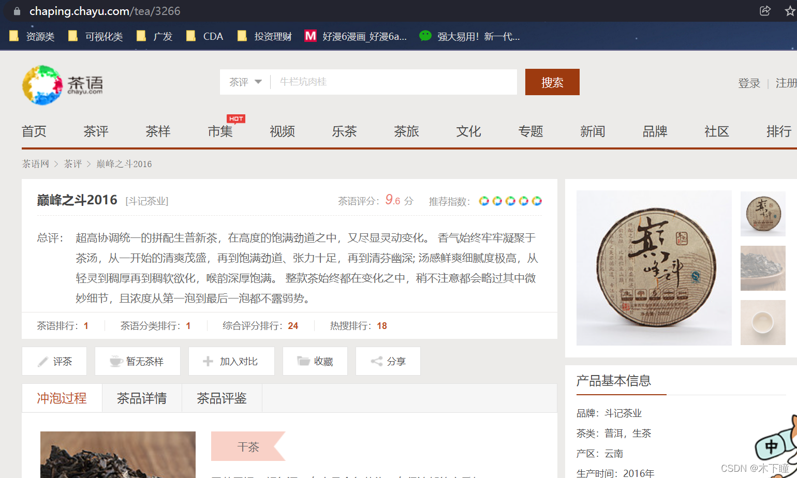
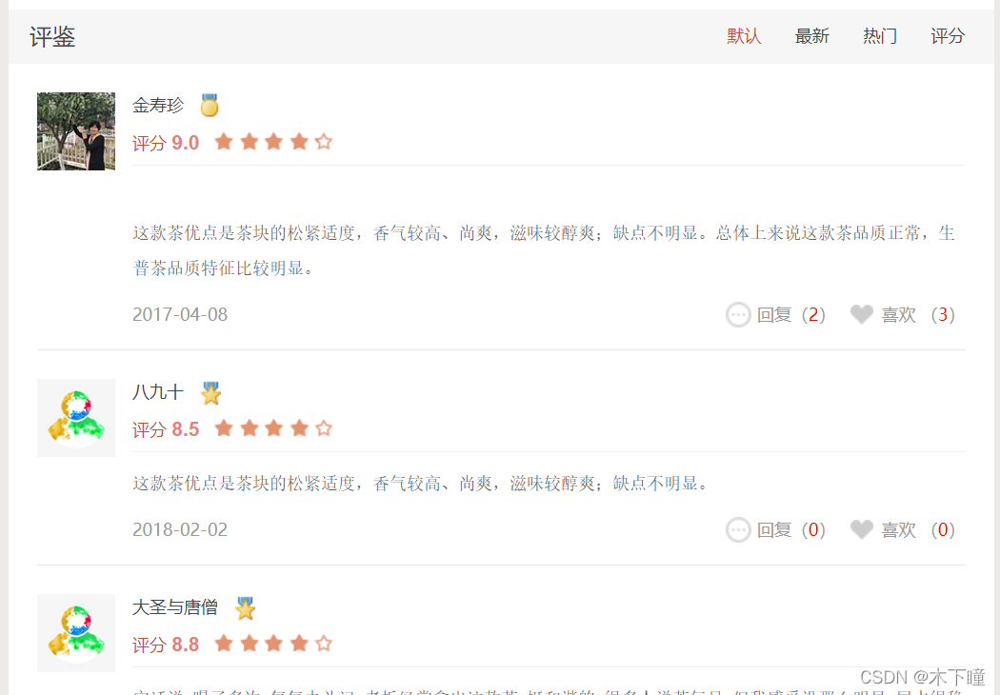

官方文档：[Getting started | Playwright Python](https://playwright.dev/python/docs/intro "Getting started | Playwright Python")

参考链接：[强大易用！新一代爬虫利器 Playwright 的介绍](https://mp.weixin.qq.com/s/LBjf2natwOPhvhpKYIrlvw "强大易用！新一代爬虫利器 Playwright 的介绍")


## 安装

Playwrigth 会安装 Chromium, Firefox and [WebKit](https://so.csdn.net/so/search?q=WebKit&spm=1001.2101.3001.7020) 浏览器并配置一些驱动，我们不必关心中间配置的过程，Playwright 会为我们配置好。

```python
pip install playwright
 
# 安装完后初始化
playwright install
```

## 基本使用

打开浏览器，跳转到百度网页，打印标题；设置了 headless 参数为 False，代表显示浏览器界面。

```python
from playwright.sync_api import Playwright, sync_playwright
 
with sync_playwright() as p:
    rowser = playwright.chromium.launch(headless=False)
    page = browser.new_page()
    page.goto('https://www.baidu.com')
    print(page.title())
    browser.close()
```

## 代码生成

可以录制我们在浏览器中的操作并将代码自动生成出来，在爬虫中对于一些点击，跳转，鼠标移动等自动化操作，可以使用。

方便在一些步骤不知道怎么写时，可以自动生成代码参考。

在指定路径下输入命令，会弹出对应窗口，就可以开始人工操作，会生成代码，但对于有点复杂的操作好像自动生成不成功。

```undefined
playwright codegen -o script.py 
```

启动一个谷歌浏览器，然后将操作结果输出到 script.py 文件，下面生成一个代码看看。

下面这段代码，打开茶语网，点击【茶评】，会打开一个新窗口跳转过去。

```python
from playwright.sync_api import Playwright, sync_playwright
 
 
def run(playwright: Playwright) -> None:
    browser = playwright.chromium.launch(headless=False)
    context = browser.new_context()
 
    # Open new page
    page = context.new_page()
 
    # Go to https://www.chayu.com/
    page.goto("https://www.chayu.com/")
 
    # Click #sub-nav >> text=茶评
    # 由于弹出新窗口，需要等待，这里就是自动等待页面加载
    # 点击茶评，等待页面加载
    with page.expect_popup() as popup_info:
        # 就页面的操作都可以在这里面继续加
        page.click("#sub-nav >> text=茶评")
    page1 = popup_info.value # 赋值新窗口对象
 
    # Close page
    page.close()
 
    # Close page
    page1.close()
 
    # ---------------------
    context.close()
    browser.close()
 
 
with sync_playwright() as playwright:
    run(playwright)
```

## AJAX 动态加载数据获取

对于获取动态加载的数据，需要及其注意的一点，需要浏览器把动态加载的页面显示在上面，才能提取，例如：[https://chaping.chayu.com/tea/3266](https://chaping.chayu.com/tea/3266 "https://chaping.chayu.com/tea/3266")，获取评论数据，ajax 加载的，打开页面：



 如果打开页面直接提取评论数据，是提取不到的，需要吧数据滑动到页面上后，再提取（坑死了）



## 事件监听

Page 对象提供了一个 on 方法，它可以用来监听页面中发生的各个事件，比如 close、console、load、request、response 等等。

可以监听 response 事件，response 事件可以在每次网络请求得到响应的时候触发，我们可以设置对应的回调方法。

可以结合 ajax 获取数据使用 ，截获 Ajax 请求，输出对应的 JSON 结果。

```python
from playwright.sync_api import sync_playwright
 
def on_response(response):
    if '/api/movie/' in response.url and response.status == 200:
        print(response.json())
 
with sync_playwright() as p:
    browser = p.chromium.launch(headless=False)
    page = browser.new_page()
    page.on('response', on_response)
    page.goto('https://spa6.scrape.center/')
    page.wait_for_load_state('networkidle')
    browser.close()
```

## 不加载图片

调用了 route 方法，第一个参数通过正则表达式传入了匹配的 URL 路径，这里代表的是任何包含 `.png` 或 `.jpg`  的链接，遇到这样的请求，会回调 cancel\_request 方法处理，cancel\_request 方法可以接收两个参数，一个是 route，代表一个 CallableRoute 对象，另外一个是 request，代表 Request 对象。这里我们直接调用了 route 的 abort 方法，取消了这次请求，所以最终导致的结果就是图片的加载全部取消了

```python
from playwright.sync_api import sync_playwright
import re
 
with sync_playwright() as p:
    browser = p.chromium.launch(headless=False)
    page = browser.new_page()
    
    # 不加载图片
    def cancel_request(route, request):
        route.abort()
    page.route(re.compile(r"(\.png)|(\.jpg)"), cancel_request)
 
    page.goto("https://spa6.scrape.center/")
    page.wait_for_load_state('networkidle')
    page.screenshot(path='no_picture.png')
    browser.close()
```

## CSS 选择器、文本选择器、click()

click 方法里面接选择器表达式，提取后点击，可设置 timeout 超时时间，默认 30秒，设置以毫秒为单位，如等待 5 秒未点击成功，这报错 timeout=5000

```python
# 选择文本是 Log in 的节点，并点击
page.click("text=Log in",timeout=5000)
 
# 选择 id 为 nav-bar 子孙节点 class 属性值为 contact-us-item，并点击
page.click("#nav-bar .contact-us-item")
 
# 选择文本中包含 Playwright 的 article 节点
page.click("article:has-text('Playwright')")
 
# 选择 id 为 nav-bar 节点中文本值等于 Contact us 的节点
page.click("#nav-bar :text('Contact us')")
 
# 选择 class 为 item-description 的节点，且该节点还要包含 class 为 item-promo-banner 的子节点
page.click(".item-description:has(.item-promo-banner)")
 
# 择的就是一个 input 节点，并且该 input 节点要位于文本值为 Username 的节点的右侧
page.click("input:right-of(:text('Username'))")
```

## xpath 选择器

需要在开头指定 `xpath=` 字符串，代表后面是一个 XPath 表达式

```python
page.click("xpath=//button")
```

## 获取网页源代码

这里获取的网页源代码，不管网页是 ajax 加载的，都是获取最终的 html。

凡是需要对 html 中的元素进行操作的 page.wait\_for\_load\_state('networkidle') 必写，用于等待 html 加载。

```python
page.wait_for_load_state('networkidle')
html = page.content()
```

## 文本输入

一般文本输入会先清空原来的，但 playwright 没有像 selenium 一样的方法，只能先定位到文本框，然后填充空字符串后再输入

在 input 标签 name 属性为 wd 的输入 nba

```python
page.fill("input[name=\"wd\"]", "")
page.fill("input[name=\"wd\"]", "nba")
```

## 选择提取标签

提取所有 div 标签 class 属性为 list 的 

```python
elements = page.query_selector_all('div.list')
```

提取 span 标签 class 属性为 score 的，如匹配到多个，则取第一个

```python
score = element.query_selector('span.score')
```

## 提取文本

提取文本为【品牌：】的标签，在提取标签下的所有文本

```python
brand = element.query_selector('text=品牌：').text_content()
```

## 提取标签中的属性

提取 h5 标签下的 a 标签，获取 a 标签中的 href 属性取值

```python
 link = element.query_selector('h5 a').get_attribute('href')
```

## 鼠标滚动

向右滚动 0，向下滚动 7000，可用于下拉滚动条功能

```python
page1.mouse.wheel(0,7000)
```

## 下拉滚动条

执行 js 代码，下拉滚动条，15000 可以根据情况设置

```python
page1.evaluate("var q=document.documentElement.scrollTop=15000")
```

## cookie 登录

参考：[crawler – 逸飞的技术日志](https://yifei.me/category/computer-science/search/crawler/ "crawler – 逸飞的技术日志")

登录获得保存 cookie

```python
from playwright.sync_api import Playwright, sync_playwright
import json
 
 
def run(playwright: Playwright) -> None:
    browser = playwright.chromium.launch(headless=False)
    context = browser.new_context()
 
    # Open new page
    page = context.new_page()
 
    # Go to http://www.glidedsky.com/login
    page.goto("http://www.glidedsky.com/login")
 
    # Click input[name="email"]
    page.click("input[name=\"email\"]")
 
    # Fill input[name="email"]
    page.fill("input[name=\"email\"]", "账号")
 
    # Click input[name="password"]
    page.click("input[name=\"password\"]")
 
    # Fill input[name="password"]
    page.fill("input[name=\"password\"]", "密码")
 
    # Click button:has-text("Login")
    page.click("button:has-text(\"Login\")")
    # assert page.url == "http://www.glidedsky.com/"
 
    # 获得登录后 cookie
    storage = context.storage_state()
    with open("state.json", "w") as f:
        f.write(json.dumps(storage))
 
    # Close page
    page.close()
 
    # ---------------------
    context.close()
    browser.close()
 
 
with sync_playwright() as playwright:
    run(playwright)
```

使用 cookie 进行登录

```python
from playwright.sync_api import Playwright, sync_playwright
import json
 
 
def run(playwright: Playwright) -> None:
    browser = playwright.chromium.launch(headless=False)
 
    # 加载状态
    with open("state.json") as f:
        storage_state = json.loads(f.read())
    context = browser.new_context(storage_state=storage_state)
 
    # Open new page
    page = context.new_page()
 
    # Go to http://www.glidedsky.com/login
    page.goto("http://www.glidedsky.com/")
 
 
    # Close page
    page.close()
 
    # ---------------------
    context.close()
    browser.close()
 
 
with sync_playwright() as playwright:
    run(playwright)
```