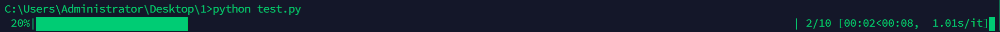
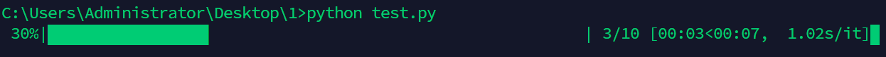
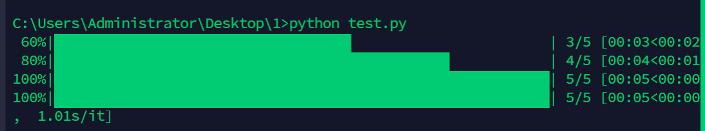
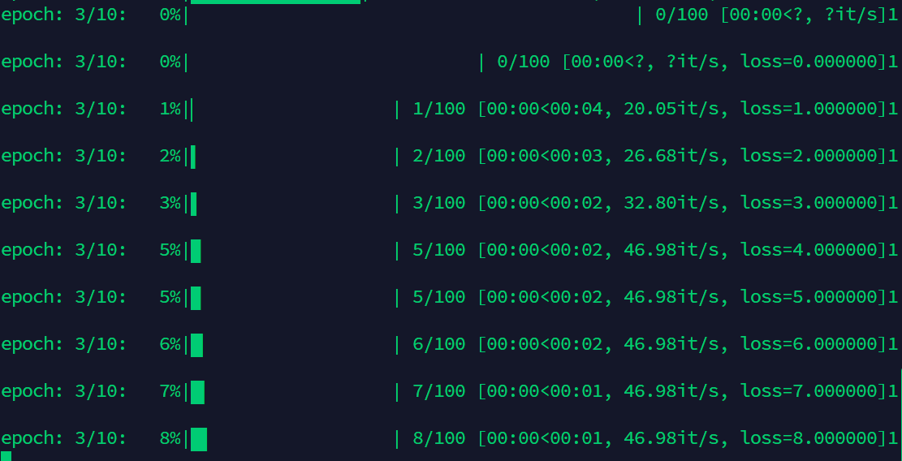
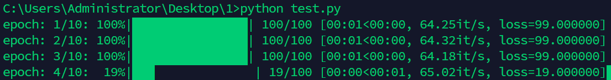
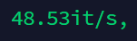
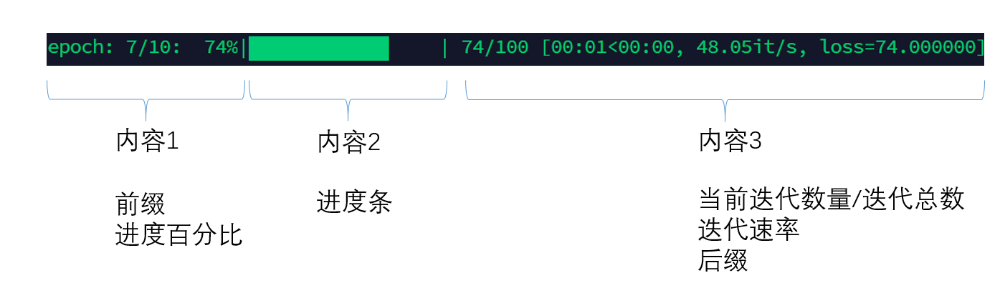
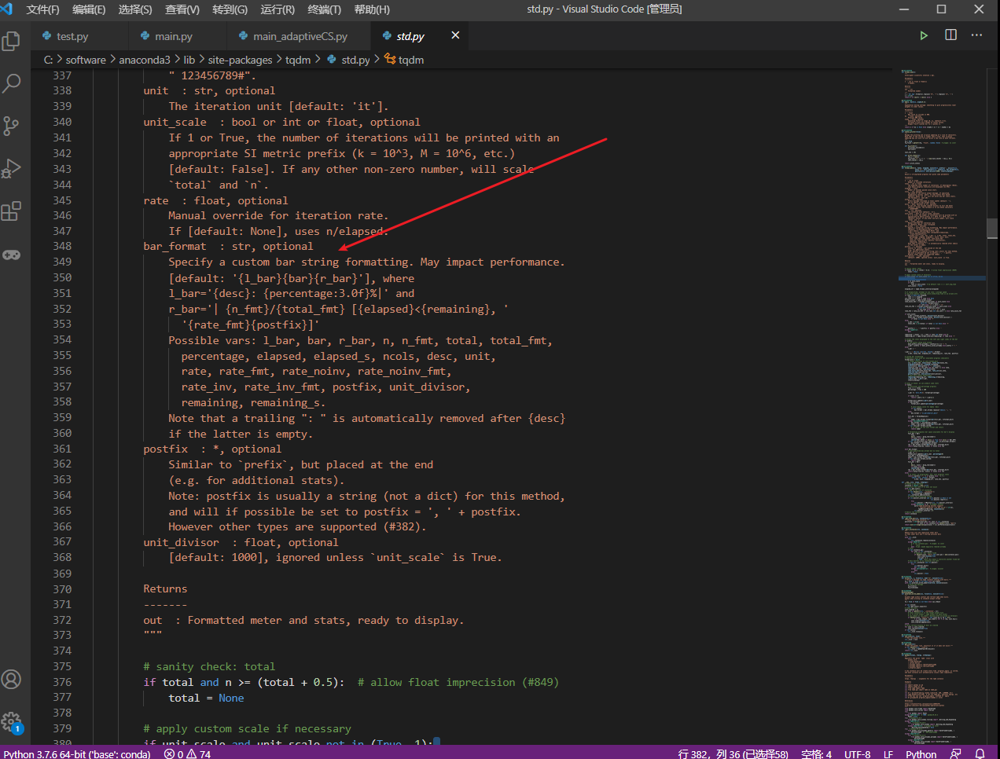
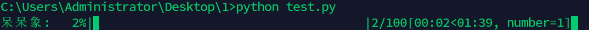
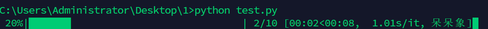

# 1、`tqdm`包安装

```python
pip install tqdm
```

# 2、引用

引用包的时候注意细节，不是直接引用，而是引用里面的一个类

```python
from tqdm import tqdm
或者
from tqdm import trange
```

# 3、使用方法1：`tpdm`和`trange`最简单方法

## 主要方式1：使用`tqdm`

是使用`tqdm`封装任意[迭代器](https://so.csdn.net/so/search?q=%E8%BF%AD%E4%BB%A3%E5%99%A8&spm=1001.2101.3001.7020)

**代码1演示如下**（包装range）

```python
import time
from tqdm import tqdm
for i in tqdm(range(10)):
    time.sleep(1)
```

**代码2演示如下**（包装list）

```python
import time
from tqdm import tqdm
for i in tqdm([1,2,3,4,5,6]):
    time.sleep(1)
```

**运行结果如下**

具体的信息含义

```python
进度百分比|进度条| 当前迭代数/总迭代个数，[消耗时间<剩余时间，迭代的速度]
```



## 主要方式2：使用`trange`

同时也可以使用`trange`，这个封装是`tqdm`针对`range`所做的封装，代码演示如下

```python
import time
from tqdm import trange
for i in trange(10):
    time.sleep(1)
```



# 4、使用方法2：`tqdm`进度条固定长度设置

## 讲解说明：

可以看到使用方法一种的例子会出现如下情况

> 自适应进度条的长度会占据整个终端的长度
> 
> 并且当你改变终端长度的时候，长度变小就会出现串行，长度变大就会自适应的到新的最长终端长度（虽然没啥大问题，但是很难受）
> 
> 

## 代码案例：

发现了一个参数`ncols`，大家可以使用如下设置（在之后的所有方法5,6,7…中都可以这么设置，设置这个参数只是对[tqdm](https://so.csdn.net/so/search?q=tqdm&spm=1001.2101.3001.7020)类进行初始化的时候传入进去），tqdm总长度就会固定，代码案例如下

```python
import time
from tqdm import tqdm
for i in tqdm(range(10),ncols=50):
    time.sleep(1)
```


## 备注说明：

在`ncols`参数控制的时候，代表的是字符数量，如果想要显示的字符数比你设置的多，就会出现显示不全，结果如下（设置为10的时候），如果想要显示的字符数小于你的设置，就会用进度条的拉长补全，结果如下（设置为80的时候）

设置为10时候


设置为80时候


# 5、`tqdm`设置自定义的更新步长和前后缀显示（主要适用于深度学习训练中的监督，具体见举例）

## 主要目标：

*   主要目标1：实现tpdm的前缀后缀显示为自己想要的信息
    
*   主要目标2：实现按照自己设置的步长进行进度条更新
    
*   主要目标3：如果想要在迭代过程中打印某个数值的时候，避免进度条串行（如下）
    

> 

## 代码案例：

为了可以运行，我抽象了dataloader和epoch

```python
import time
from tqdm import tqdm
total_epoch = 10 
data_loader = range(100)
for epoch in range(total_epoch):
    with tqdm(total= len(data_loader)) as _tqdm: # 使用需要的参数对tqdm进行初始化
        _tqdm.set_description('epoch: {}/{}'.format(epoch + 1, total_epoch))# 设置前缀 一般为epoch的信息
        for data in data_loader:    
            time.sleep(0.01)
            _tqdm.set_postfix(loss='{:.6f}'.format(data)) # 设置你想要在本次循环内实时监视的变量  可以作为后缀打印出来
            _tqdm.update(1)  # 设置你每一次想让进度条更新的iteration 大小
```



## 实际使用中的代码案例：

```python
for epoch in range(opt.total_epoch):
    with tqdm(total=(len(dataset) - len(dataset) % opt.batch_size) , ncols=80) as _tqdm:#总长度是data的长度
        _tqdm.set_description('epoch: {}/{}'.format(epoch + 1, opt.total_epoch))#前缀设置一些想要的更新信息

        model.train()
        for data in dataloader:
            inputs, labels = data
            inputs = inputs.to(device)
            labels = labels.to(device)

            preds = model(inputs)

            loss = criterion(preds, labels)
            optimizer.zero_grad()
            loss.backward()
            optimizer.step()

            _tqdm.set_postfix(loss='{:.6f}'.format(loss.item()))#后缀设置一些想要的监控信息
            _tqdm.update(len(inputs))#更新步长为一个batchsize长度
```

# 6、`tqdm`的自定义显示信息设置

## 问题的起因：

我需要监控的信息比较多，一行有的时候显示不下，在显示信息中有一个我不需要的信息就是单位时间迭代数量，我就想把他去掉，找了所有的网站我都没有找到怎么去掉，并没有这个开关，这一部分主要解决这个问题，完成tqdm进度条所有信息的自定义显示（就是你想显示啥显示啥hhh）



## 源码分析：

太长我就不放全部的代码了 大家看一下截图我只显示部分的源码 整理一下他的注释解释一下

*   这一个属性主要用来定义显示的内容，为可选参数，不定义的时候自动初始化为`'{l_bar}{bar}{r_bar}'`分为三个内容
    
*   可以选的显示内容有很多可先随便选择你想要的内容放进去作为一个控制字符串，传给`bar_format`即可
    
    
    

```python
bar_format  : str, optional
    Specify a custom bar string formatting. May impact performance.
    [default: '{l_bar}{bar}{r_bar}'], where
    l_bar='{desc}: {percentage:3.0f}%|' and
    r_bar='| {n_fmt}/{total_fmt} [{elapsed}<{remaining}, {rate_fmt}{postfix}]'
    
    Possible vars: l_bar, bar, r_bar, n, n_fmt, total, total_fmt,
        percentage, elapsed, elapsed_s, ncols, desc, unit,
        rate, rate_fmt, rate_noinv, rate_noinv_fmt,
        rate_inv, rate_inv_fmt, postfix, unit_divisor,
        remaining, remaining_s.
        Note that a trailing ": " is automatically removed after {desc}
        if the latter is empty.
```



## 代码案例：

```python
bar_format = '{desc}{percentage:3.0f}%|{bar}|{n_fmt}/{total_fmt}[{elapsed}<{remaining}{postfix}]'
total = 100
ncols = 80
with tqdm(total=total,ncols = ncols,bar_format = bar_format) as _tqdm:
    _tqdm.set_description('{}'.format("呆呆象"))
    for i in range(100):
        time.sleep(1)
        _tqdm.set_postfix(number = i)
        _tqdm.update(1)
```



# 7、关于后缀的两种设置方式

## 方法1：不可变后缀（字符串输入）

在初始化的时候进行设置这个就跟设置前缀一样，传入的是一个字符串，但是在所有的迭代过程中是固定显示这个后缀的

代码举例

```python
import time
from tqdm import tqdm
for i in tqdm(range(10),ncols=80,postfix="呆呆象"):
    time.sleep(1)
```



## 方法2：可变化后缀（字典输入）（因为更实用所以在第5点和第6点中已经讲解过）

需要强调的是，在迭代过程中使用`tpdm.set_postfix()`设置需要传入的是一个字典，在显示的时候会把字典的每一个关键字和内容都显示出来