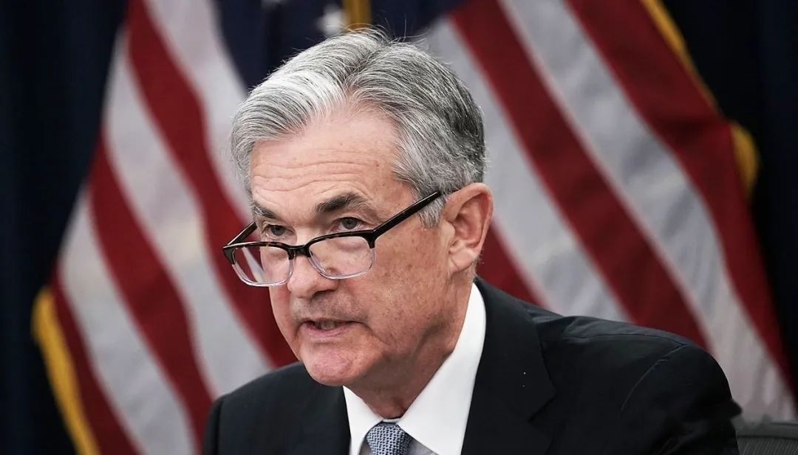
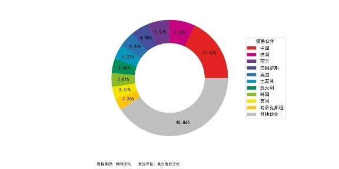
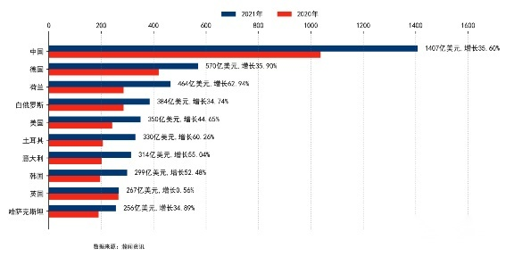
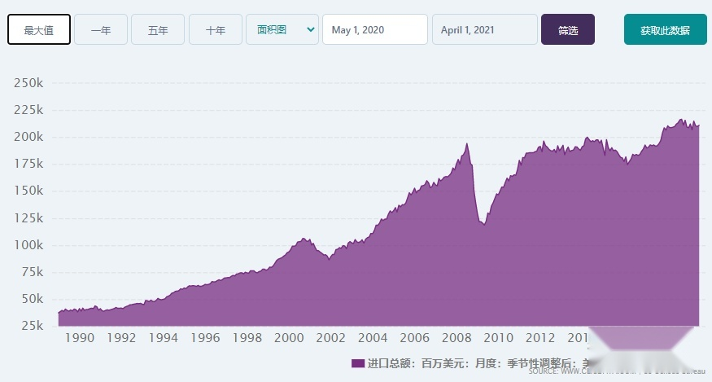
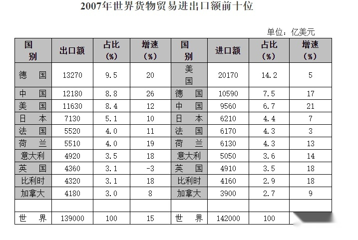
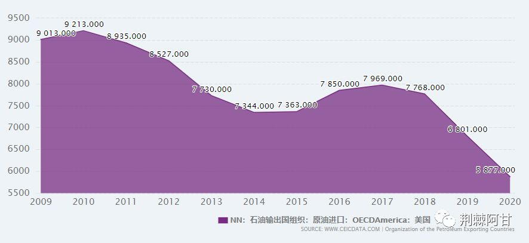
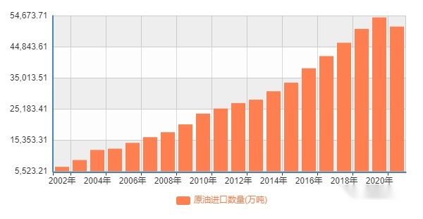
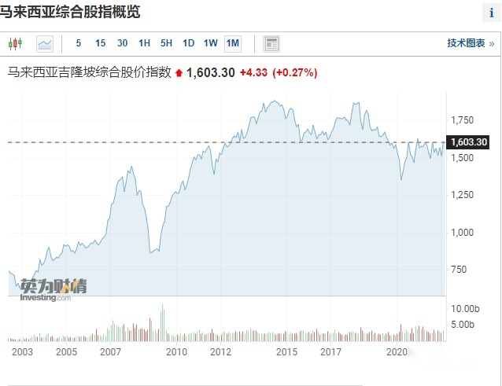
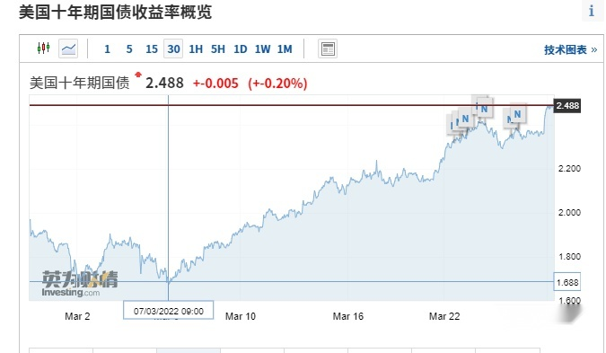

为什么美国加息就能收割世界？  

  

这是一个很重要的问题，但是很多人都没说清楚，或者根本就不说。  

  

所有人都机械的抄袭老话：美国加息，资本回流，导致世界其他国家股市下跌，货币贬值，美国的收割就完成了。  

  

  

可是这里面有一个关键问题：**为什么美国加息资本就一定要回流美国？**美联储加息25个基点，可是其他国家加息50个基点甚至100个基点，资金干嘛抛弃加息更多的国家，跑去美国？  

  

这个问题我还没见到一个人讲清楚过。高人不会讲，不是高人讲不清。

  

这个问题之所以这么重要，因为这个问题就是就涉及到美国以前进行金融收割的核心，也是美国赖以活到现在的核心。  

  

如果没有把这个问题说明白，就无法理解为什么美国现在无法进行收割。  

  

  

做生意，无非就是两个词：**客随主便，主随客便**，谁大，谁就能占据主导权。

  

这次乌克兰战争，普京为什么肆无忌惮，因为现在俄罗斯的第一大客户是中国，而且增长速度还很快。

  

  

  

  
俄罗斯就是一个矿老板，中国现在是它的大客户，去年占比就接近2成，今年估计要超过3成，只要中国不反对，那普京当然可以放手干，用各种措施去搞死欧盟。  

  

20多年前可不一样，当时我们进口很少，就算尽最大努力支持俄罗斯，对他们来说也是杯水车薪。  

  

**普京收割欧洲是这种逻辑，美国收割世界其实也是这种逻辑。  
**

  

美国加息，可是在全世界其他国家也加息，甚至加息的幅度还超过美国，为什么资本还要回流美国？如果单纯的从利率的角度是解释不了这个问题的。  

  

还是要从需求的角度来说，这个逻辑链条就完整了。

  

美国进口额在2008年进口额创下历史新高的2.17万亿美元，占世界总进口量接近15%，第二名的德国和第三名的中国加一起才和它相当。  

  

  

  

  

美国是世界最大的进口国，而且比第二名多很多，这种局面就造成全世界都要围着美国转，**美国给谁订单，谁就能起来，抽掉订单，就要完蛋。苹果对欧菲光不就是这样干的嘛**

  

就拿原油来说，美国这十年进口量打了6折，从2010年高峰时期的920万桶/天下降到了去年的580万桶/天。不但如此，美国还出口原油，现在是原油净出口国，在国际市场上和沙特阿联酋抢生意。

  

  

  

而同期中国的原油进口量节节攀升，相比于2010年增长了120%，中国现在是沙特最大的客户。我们和沙特的关系完全是互补，没有竞争。

  

  

如果你是沙特国王，你是会巴结最大的客户中国，还是巴结竞争对手美国？

  

只要不是蠢货，就绝对会和美国越走越远，和中国越走越近。**用人民币结算石油就是早晚的事情，一定会发生。**  

  

这种情况不仅发生在俄罗斯和沙特，还发生在东南亚，世界其他地方也是如此。  

  

说完这些，我们再回头说以前美联储加息为什么能让资金回流美国。  

  

以前的美国是世界第一大零售市场，也是第一大进口国，世界各国都要照顾好这个最大的主顾。

  

美国降息扩表，会导致美国经济消费能力增强，于是给世界其他国家的订单就会增加，那世界各国当然就一片繁荣。**一旦美国加息缩表，意味着美国自身消费能力减弱，继而导致对各种产品的需求减弱，**

  

用手机来举例说明就是：美国加息缩表，美国人要过苦日子，于是对手机的需求也会减少，导致富士康的订单不足，继而引发相关上游产业链订单也在减少，从削减机械订单，到减少工人，再到铜等金属的订单减少。订单减少，就让全产业链都要降价，这是自然竞争的结果。

  

产业萎靡，作为生产国和资源国的世界各国当然就面临企业利润下滑，GDP增长缓慢甚至倒退的情况，于是，股票价格下跌，世界各国相互竞争又导致他们的货币贬值，美国加息收割世界的游戏就是这么来的。

  

**这个链条最重要的一个要素就是美国是最大的需求国**。  

  

**一旦美国不是最大的买方市场，那世界各国对它就越来越没兴趣。**

  

说到这里，大家应该明白为什么我们这几年举办进口博览会了吧，而且每年的进博会都是最高规格，**我们就是要告诉全世界，我们才是最大市场！**  

  

如果美国加息缩表，让美国人给马来西亚的订单减少了，可是中国扩大内需，加大进口，给马来西亚的订单更多，那马来西亚企业的利润此消彼长，企业更加繁荣，资金还会从马来西亚的股市逃离去美国吗？

  

再逃离，那不是有病吗？

  

马来西亚通胀只有2.2%，利率高达1.75%，美国官方通胀7.9%，利率只有区区0.5%。钱在马来西亚不香，一定要跑去美国享受每年缩水7.4%？这不是有病是什么。  

  

  

看看马来西亚的股票，2008年美国在世界独霸的时候，发生经济危机，马来西亚股票大跌。到了2015年，美国再次加息之时已经是小跌。2020那次是因为疫情，不是因为美国。

  

现在美国已经开启了加息周期，可是马来西亚股票不跌，3月份还在上涨，你说奇怪吧，和马来西亚一样奇怪的还有越南，泰国，印度，都不跌。  

  

**这种现象其实就说明一个问题，如果中国成了他们最大的贸易伙伴，那美国不管怎么加息，都没多大的意义，因为中国不加息。**

  

最大的主顾不加息，还降息，那第二大的顾客加息也没多大用了。  

  

  

如果美国这次加息缩表，没有引发世界资本回流美国，就会导致美国国债收益率急速飙升。

  

  

看看这一个月十年期美债收益率的涨幅，美联储这个月只是加息了**25**个基点，可是十年期美债收益率上涨了**80**个基点，这完全美联储持续加息预期之下，并没有吸引到世界资本的接盘导致的。  

  

也就是说现在全世界的资本对回流美国没多大的兴趣，当然了，还是有一些有兴趣的，比如说日本，韩国，还有欧洲。

  

为什么？因为美国是日本和欧洲的主要贸易顺差来源国，也就是美国是日本和欧洲最大的客户，那自然美国需求减弱，日本欧洲经济就会疲软。

  

**现在日元持续贬值，主要原因就是美国经济疲软，日本需要和欧洲在美国市场惨烈厮杀，只要欧元和英镑贬值，日元也会贬值。**

  

日本在汽车，机械，半导体这些领域和欧洲高度同质化，美国人多买一辆大众，就会少买一两丰田。  

  

美国加息越快，美国的需求也会越弱，最终会导致日元和欧元更加持续的贬值。如果美国不是德国第一大顺差来源国，那德国估计会更加远离美国。  

  

  

所以说，美国这次加息其实就是自杀，很多人总是谈1980年代沃克尔如何如何，格里斯潘如何，其实这都是刻舟求剑。  

  

当年的美国可没有30万亿的债务，还经常是贸易顺差，更关键的是它还是最大的零售消费品市场。所以当年美国可以说一不二，可是现在说话已经没分量了。

  

背景不同，还想用同样的套路获得相同的结果，这怎么可能，鲍威尔不是不想立刻加息几百个基点，是真的不敢。  

  

这次美国疯狂加息，但是大宗商品价格还是会居高不下，通胀不降，利率走高，工资不涨，美国加息不是自杀才怪。

  

想明白这个逻辑，再去理解黄金和大宗商品，以及股票市场，是不是更清晰？

  

  

END
