市场有自己的时间观念。股票投资就如同任何人类互动一样，耐心是一项美德。——罗伯特·D·爱德华《股市趋势技术分析》

  

**引言**

**TA-Lib**，全称“Technical Analysis Library”, 即技术分析库，是Python金融量化的高级库，涵盖了150多种股票、期货交易软件中常用的技术分析指标，如MACD、RSI、KDJ、动量指标、布林带等等。TA-Lib可分为10个子板块：Overlap Studies(重叠指标)，Momentum Indicators(动量指标)，Volume Indicators(交易量指标)，Cycle Indicators(周期指标)，Price Transform(价格变换)，Volatility Indicators(波动率指标)，Pattern Recognition(模式识别)，Statistic Functions(统计函数)，Math Transform(数学变换)和Math Operators(数学运算)，见下图。本公众号将以系列的形式详细介绍talib技术指标的实现和应用，而本文作为开篇，主要介绍Overlap Studies内容。

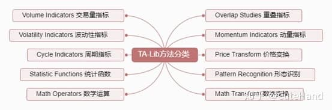

  

**安装与使用**

**安装**：在cmd上使用“pip install talib”命令一般会报错，正确安装方法是，进入_[https://www.lfd.uci.edu/~gohlke/pythonlibs/](https://www.lfd.uci.edu/~gohlke/pythonlibs/)_，下拉选择TA\_Lib-0.4.17-cp37-cp37m-win\_amd64.whl（win系统64位，python3.7版本，根据自己系统和python版本选择相应的安装包），将下载包放在当前工作路径中，然后在Anaconda Prompt（或windows的cmd）里面输入命令：pip install TA\_Lib-0.4.17-cp27-cp27m-win\_amd64.whl。

**使用**：import talib as ta

Overlap Studies Functions重叠指标

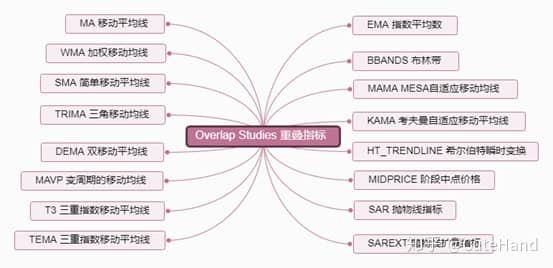

01移动平均线系列

移动平均线是技术分析理论中应用最普遍的指标之一，主要用于确认、跟踪和判断趋势，提示买入和卖出信号，在单边市场行情中可以较好的把握市场机会和规避风险。但是，移动平均线一般要与其他的技术指标或基本面相结合来使用，特别是当市场处于盘整行情时，其买入卖出信号会频繁出现，容易失真。

**通用函数名**：MA

**代码**：ta.MA(close,timeperiod=30,matype=0)

移动平均线系列指标包括：SMA简单移动平均线、EMA指数移动平均线、WMA加权移动平均线、DEMA双移动平均线、TEMA三重指数移动平均线、TRIMA三角移动平均线、KAMA考夫曼自适应移动平均线、MAMA为MESA自适应移动平均线、T3三重指数移动平均线。

其中，close为收盘价，时间序列，timeperiod为时间短，默认30天，指标类型matype分别对应：0=SMA, 1=EMA, 2=WMA, 3=DEMA, 4=TEMA, 5=TRIMA, 6=KAMA, 7=MAMA, 8=T3 (Default=SMA)

不同类型的移动均线也有各自相应的调用函数：

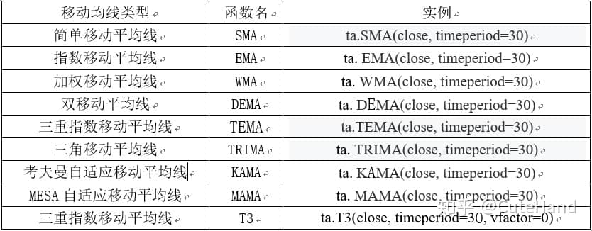

```python
#先引入后面可能用到的包（package）
import pandas as pd  
import numpy as np
import matplotlib.pyplot as plt
%matplotlib inline   

#正常显示画图时出现的中文和负号
from pylab import mpl
mpl.rcParams['font.sans-serif']=['SimHei']
mpl.rcParams['axes.unicode_minus']=False

#引入TA-Lib库
import talib as ta

#查看包含的技术指标和数学运算函数
#print(ta.get_functions())
#print(ta.get_function_groups())

ta_fun=ta.get_function_groups()
ta_fun.keys()

#使用tushare获取上证指数数据作为示例
import tushare as ts
df=ts.get_k_data('sh',start='2000-01-01')
df.index=pd.to_datetime(df.date)
df=df.sort_index()

types=['SMA','EMA','WMA','DEMA','TEMA',
'TRIMA','KAMA','MAMA','T3']
df_ma=pd.DataFrame(df.close)
for i in range(len(types)):
    df_ma[types[i]]=ta.MA(df.close,timeperiod=5,matype=i)
df_ma.tail()
df_ma.loc['2018-08-01':].plot(figsize=(16,6))
ax = plt.gca()  
ax.spines['right'].set_color('none') 
ax.spines['top'].set_color('none')   
plt.title('上证指数各种类型移动平均线',fontsize=15)
plt.xlabel('')
plt.show()
```

  

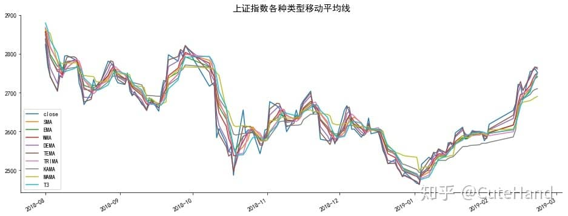

  

数据来源：tushare

```python
#画5、30、120、250指数移动平均线
N=[5,30,120,250]
for i in N:
    df['ma_'+str(i)]=ta.EMA(df.close,timeperiod=i)
df.tail()

df.loc['2014-01-01':,['close','ma_5','ma_30','ma_120','ma_250']].plot(figsize=(16,6))
ax = plt.gca()  
ax.spines['right'].set_color('none') 
ax.spines['top'].set_color('none')   
plt.title('上证指数走势',fontsize=15)
plt.xlabel('')
plt.show()
```

  

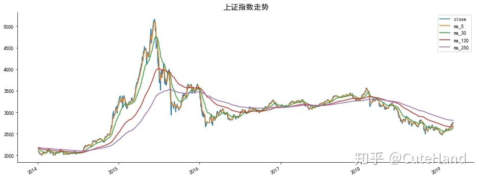

数据来源：tushare

  

02布林带

**布林带**(Bollinger Band)，由压力线、支撑线价格平均线组成，一般情况价格线在压力线和支撑线组成的上下区间中游走，区间位置会随着价格的变化而自动调整。布林线的理论使用原则是：当股价穿越最外面的压力线（支撑线）时，表示卖点（买点）出现。当股价延着压力线（支撑线）上升（下降）运行，虽然股价并未穿越，但若回头突破第二条线即是卖点或买点。在实际应用中，布林线有其滞后性，相对于其他技术指标在判断行情反转时参考价值较低，但在判断盘整行情终结节点上成功率较高。

  

**计算方法：**首先计出过去 N 日收巿价的标准差 SD(Standard Deviation) ，通常再乘 2 得出 2 倍标准差， Up 线为 N日平均线加 2 倍标准差， Down 线则为 N日平均线减 2 倍标准差。

**代码：**ta.BBANDS(close, timeperiod=5, nbdevup=2, nbdevdn=2, matype=0)

  

```python
H_line,M_line,L_line=ta.BBANDS(df.close, timeperiod=20, nbdevup=2, nbdevdn=2, matype=0)
df1=pd.DataFrame(df.close,index=df.index,columns=['close'])
df1['H_line']=H_line
df1['M_line']=M_line
df1['L_line']=L_line
df1.tail()
```

  

```python
df1.loc['2013-01-01':'2014-12-30'].plot(figsize=(16,6))
ax = plt.gca()  
ax.spines['right'].set_color('none') 
ax.spines['top'].set_color('none')   
plt.title('上证指数布林线',fontsize=15)
plt.xlabel('')
plt.show()
```

  

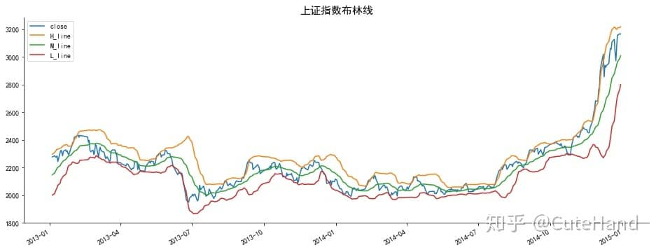

数据来源：tushare

03其他指标

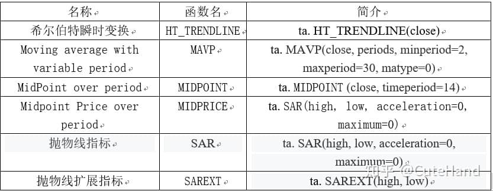

```python
df2=pd.DataFrame(df.close)
df2['HT']=ta.HT_TRENDLINE(df.close)
periods =np.array([3]*len(df), dtype=float)
df2['MAVP']=ta. MAVP(df.close,periods)
df2['MIDPOINT']=ta.MIDPOINT(df.close)
df2['MIDPRICE']=ta.MIDPRICE(df.high,df.low)
df2['SAR']=ta.SAR(df.high,df.low)
df2['SAREXT']=ta.SAREXT(df.high,df.low)
df2.tail()
```

  

```python
df2.loc['2018-01-01':'2019-02-21',['close','HT','MAVP','MIDPOINT','MIDPRICE','SAR']].plot(figsize=(16,6))
ax = plt.gca()  
ax.spines['right'].set_color('none') 
ax.spines['top'].set_color('none')   
plt.title('上证指数的其他趋势指标线',fontsize=15)
plt.xlabel('')
plt.show()
```

  

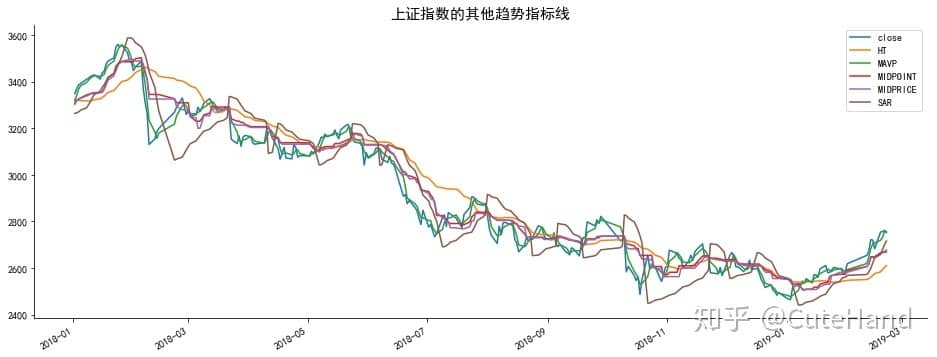

数据来源：tushare

  

```python
df2.loc['2018-01-01':'2019-02-21','SAREXT'].plot(figsize=(16,6))
ax = plt.gca()  
ax.spines['right'].set_color('none') 
ax.spines['top'].set_color('none')   
plt.title('上证指数的抛物线扩展走势',fontsize=15)
plt.xlabel('')
plt.show()
```

  

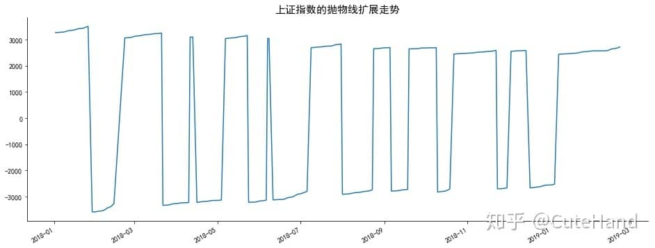

数据来源：tushare

**均线策略回测**

双均线策略：分别选择L天和S天的移动平均线（L>S），如L=20，S=5，当短周期S均线（5日均线）向上突破长周期L均线（20日均线）时，为买入点；反之，当S均线向下击穿L均线时为卖出点。

标的：中国平安（601318），期间：2014.1-2019.1，回测结果：

  

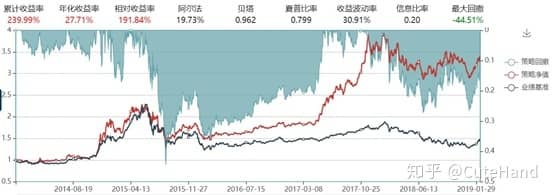

  

数据来源：万矿

**布林线策略回测**

**标的：**黄金期货

**策略：**下穿布林线上边界做空，上穿布林线下边界做多

（1）timeperiod=10,回测期间：2017.01.01-2019.02.21

  

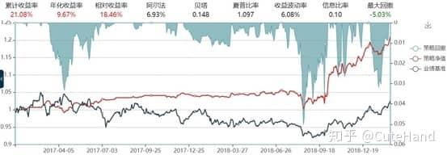


（2）timeperiod=10,回测期间：2016.01.01-2017.02.21


  

