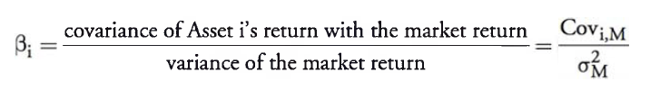
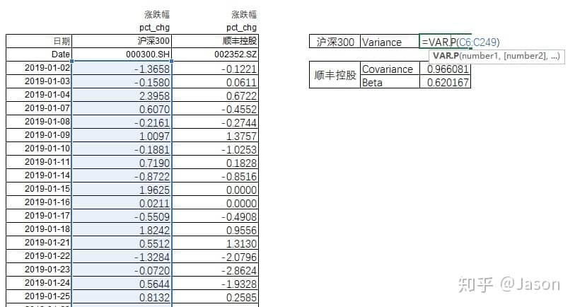
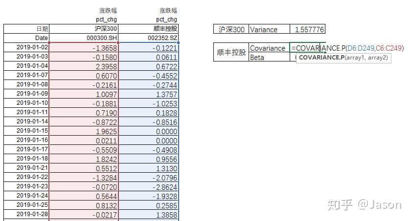
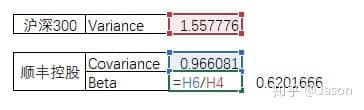
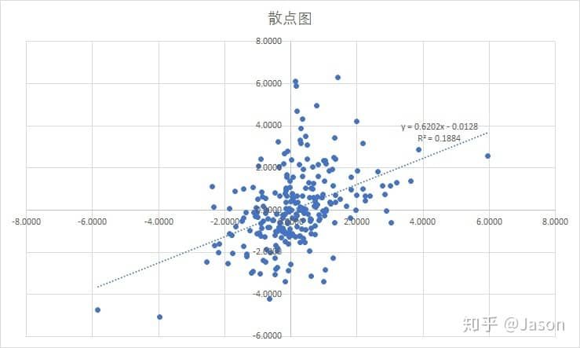

> β系数，是一种风险指数，用来衡量个别股票或股票基金相对于整个股市的价格波动情况。β系数是一种评估证券系统性风险的工具，用以度量一种证券或一个投资证券组合相对总体市场的波动性，在股票、基金等投资术语中常见。

计算公式：

市场收益率（market return）：选取对标指数收益率

**标的资产收益率(Asset i's return)：选取该对标指数内成分股的收益率**

例：顺丰控股(002352.SZ)相对于沪深300指数(000300.SH)的beta系数计算

## 一、基础数据

一定周期的沪深300指数(000300.SH)与顺丰控股(002352.SZ)的每日涨跌幅，如：2019年全年。

## 二、计算

1、计算沪深300指数每日收益率的方差（Variance）

Excel公式：=VAR.P(沪深300指数每日涨跌幅数据)

图中涨跌幅是指当日简单收益率（去掉%），即（当日收盘价-前日收盘价）/前日收盘价。

计算沪深300指数的方差

2、计算沪深300指数(000300.SH)与顺丰控股(002352.SZ)每日收益率的协方差（Covariance）

Excel公式：=COVARIANCE.P(沪深300指数每日涨跌幅数据,顺丰控股每日涨跌幅数据)

计算沪深300指数(000300.SH)与顺丰控股(002352.SZ)每日收益率的协方差

3、计算Beta

Beta= 协方差/方差

计算Beta

## 三、Beta意义

beta 小于1，代表顺丰控股的波动（可以简单理解为风险）小于沪深300指数（可以简单理解为市场）的波动。

beta 大于1，代表标的股票的波动大于指数的波动。

beta<0，代表标的的涨跌幅与市场的涨跌幅有负相关关系。  

横轴：沪深300日涨跌幅，纵轴：顺丰控股日涨跌幅

