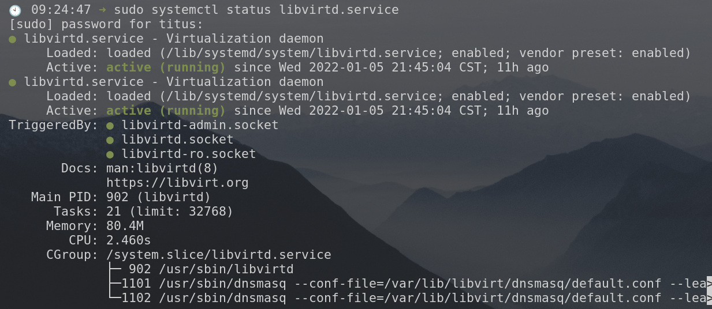

**Check Virtualization Extension**   

Run this command to make sure you've enabled virtualization in on your computer. It should be above 0

```plain
titus@debian:~$  egrep -c '(vmx|svm)' /proc/cpuinfo
12
```

_If the output is zero then go to bios settings and enable VT-x (Virtualization Technology Extension) for Intel processor and AMD-V for AMD processor._

  

**Install QEMU and Virtual Machine Manager**

  

```plain
titus@debian:~$ sudo apt install qemu-kvm libvirt-clients libvirt-daemon-system bridge-utils virtinst libvirt-daemon virt-manager -y
```

Verify that Libvirtd service is started

```plain
titus@debian:~$ sudo systemctl status libvirtd.service
```

[](https://coachtestprep.s3.amazonaws.com/direct-uploads/user-68790/9830c4ad-fd61-4c73-bf43-17f3c6bb368a/2022-01-06_09-26.png)

**  
Start Default Network for Networking  
**  

VIRSH is a command to directly interact with our VMs from terminal. We use it to list networks, vm-status and various other tools when we need to make tweaks. Here is how we start the default and make it auto-start after reboot. 

```plain
titus@debian:~$ sudo virsh net-start default
Network default started
titus@debian:~$ sudo virsh net-autostart default
Network default marked as autostarted
```

Check status with:

```plain
titus@debian:~$ sudo virsh net-list --all
 Name      State      Autostart   Persistent
----------------------------------------------
 default   active       yes          yes
```

  
**Add User to libvirt to Allow Access to VMs**  
  

```plain
titus@debian:~$ sudo adduser titus libvirt
titus@debian:~$ sudo adduser titus libvirt-qemu
```

  
Reboot and you are Finished!